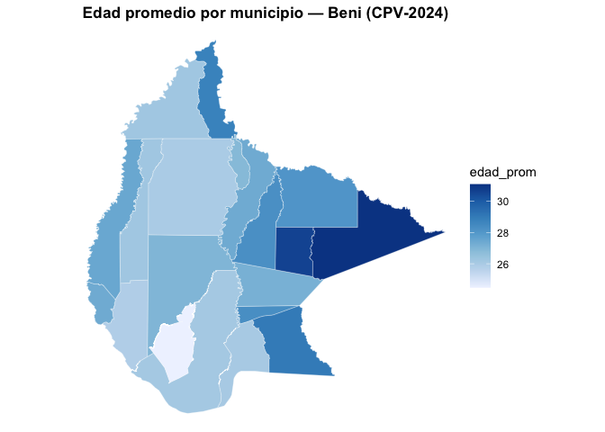

<!-- README.md is generated from README.Rmd. Please edit that file -->

# censosbo 

<!-- badges: start -->

[](https://lifecycle.r-lib.org/articles/stages.html#stable)
[](https://opensource.org/licenses/MIT)
[](https://github.com/lab-tecnosocial/censosbo/actions/workflows/R-CMD-check.yaml)
<!-- badges: end -->

**censosbo** proporciona acceso programático a los microdatos de los
**censos de población de Bolivia**: 1976, 1992, 2001, 2012 y 2024. Los
datos se descargan bajo demanda, se guardan en caché local y se pueden
consultar con `dplyr`, Apache Arrow o DuckDB. Contiene además
diccionarios de datos, funciones para comparación temporal entre censos,
los datos agregados del CPV-2024 por manzano y comunidad, y generación
de mapas.

## Instalación

``` r
# install.packages("remotes")
remotes::install_github("lab-tecnosocial/censosbo")
```

El paquete se desarrolla continuamente (mejoras, corrección de errores),
si lo instalaste anteriormente te recomendamos volver a ejecutar el
anterior código y borrar el caché para actualizar a la versión 1.5.0 o
usar la siguiente función:

``` r
update_censosbo()
```

## Censos disponibles

| Año | Función | Registros | Columnas | Disco (Parquet) | RAM (aprox.)¹ |
|:--:|----|---:|---:|---:|---:|
| **1976** | `get_poblacion_1976()` | 4,613,419 | 48 | 46 MB | ~890 MB |
| **1976** | `get_viviendas_1976()` | 1,158,482 | 29 | 5 MB | ~135 MB |
| **1992** | `get_personas_1992()` | 6,420,792 | 58 | 99 MB | ~1,5 GB |
| **1992** | `get_viviendas_1992()` | 1,706,107 | 47 | 20 MB | ~330 MB |
| **1992** | `get_mortalidad_1992()` | 1,706,107 | 17 | 11 MB | ~125 MB |
| **2001** | `get_personas_2001()` | 8,274,325 | 70 | 135 MB | ~2,5 GB |
| **2001** | `get_viviendas_2001()` | 2,290,414 | 42 | 21 MB | ~390 MB |
| **2012** | `get_personas_2012()` | 10,059,856 | 41 | 120 MB | ~1,7 GB |
| **2012** | `get_viviendas_2012()` | 3,172,321 | 35 | 26 MB | ~455 MB |
| **2012** | `get_emigracion_2012()` | 489,559 | 9 | 4 MB | ~20 MB |
| **2012** | `get_discapacidad_2012()` | 342,929 | 11 | 3 MB | ~17 MB |
| **2024**² | `get_personas_2024()` | 11,365,333 | 119 | 282 MB | ~5,6 GB |
| **2024**² | `get_viviendas_2024()` | 4,490,488 | 48 | 55 MB | ~1,0 GB |
| **2024**² | `get_emigracion_2024()` | 500,914 | 8 | 2 MB | ~39 MB |
| **2024**² | `get_mortalidad_2024()` | 382,731 | 10 | 2 MB | ~33 MB |
| **2024**³ | `get_unidades_2024()` | 268,604 | 9 | 2 MB | ~16 MB |
| **2024**³ | `get_fichas_2024()` | 150,744 | 199 | 15 MB | ~230 MB |

¹ Tamaño al cargar la tabla **completa** con `collect()` sin filtros.
Por eso el formato Arrow es el predeterminado: para el país entero,
`get_personas_2024()` no cabe cómodamente en RAM, pero sí se puede
filtrar y agregar sobre el Parquet. ² Persona 2024 está particionada en
9 archivos por departamento (4–77 MB cada uno). Disco y RAM muestran el
total; en la práctica se descarga solo el/los departamentos necesarios.
³ Datos **agregados** por manzano urbano y comunidad rural (no
microdatos), del geoportal del INE. Ver la sección siguiente.

El formato **Arrow** (por defecto) mantiene los datos en el disco hasta
que ejecutas `collect()`. Las tablas del CPV-2024 se pueden unir por la
clave `idep + iprov + imun + i00` (identificador de hogar).

## Uso rápido — CPV-2024

``` r
library(dplyr)
library(censosbo)

# Grupos quinquenales de edad por sexo, Pando
get_personas_2024(departamento = "Pando", verbose = FALSE) |>
  filter(!is.na(p26_edad), !is.na(p25_sexo)) |>
  mutate(grupo_edad = (p26_edad %/% 5) * 5) |>
  count(grupo_edad, p25_sexo) |>
  collect() |>
  etiquetar_valores() |>
  arrange(grupo_edad) |>
  head(6)
#> # A tibble: 6 × 3
#>   grupo_edad p25_sexo     n
#>        <dbl> <fct>    <int>
#> 1          0 Hombre    6090
#> 2          0 Mujer     6091
#> 3          5 Hombre    7894
#> 4          5 Mujer     7522
#> 5         10 Hombre    7937
#> 6         10 Mujer     7590
```

## Manzanos y comunidades — el nivel más fino del CPV-2024

Los microdatos llegan hasta el municipio (343 unidades). El geoportal
del INE publica además una **ficha resumen por unidad censal**: 268.604
manzanos urbanos y comunidades rurales, con 194 indicadores cada una.

``` r
# Universo de unidades: población, viviendas y si tienen ficha
get_unidades_2024(departamento = "Pando", as = "tibble", verbose = FALSE) |>
  select(codigo, nombre, area, personas, viviendas, ficha) |>
  head(4)
#> # A tibble: 4 × 6
#>   codigo        nombre                   area personas viviendas ficha
#>   <chr>         <chr>                   <int>    <int>     <int> <lgl>
#> 1 10003180138-D HACIENDA/FINCA/ESTANCIA     2      108        25 TRUE 
#> 2 10037547105-D LA TRIBU                    2      175        64 TRUE 
#> 3 10086625097-D PALMAR                      2      136        40 TRUE 
#> 4 10117934728-D HACIENDA/FINCA/ESTANCIA     2      290        62 TRUE
```

``` r
# Los 194 indicadores, y un mapa a nivel de manzano
get_fichas_2024(municipio = "Sucre", as = "tibble") |>
  mutate(pct_internet = 100 * tic_internet / tic_total) |>
  mapa_man("pct_internet", municipio = "Sucre",
           titulo = "Hogares con internet (%) — Sucre, 2024")
```

El INE **no libera la ficha de las unidades con poca población**, por
reserva estadística: eso afecta al 47 % de los manzanos, pero la ficha
cubre igualmente el 92 % de la población. La columna `ficha` indica
cuáles la tienen.

Detalles en `vignette("manzanos-comunidades")`.

## Diccionario de variables

``` r
# Buscar variables del CPV-2024
codebook(buscar = "educa") |> select(variable, tabla) |> as_tibble()
#> # A tibble: 23 × 2
#>    variable       tabla  
#>    <chr>          <chr>  
#>  1 p38_asiste     persona
#>  2 p39_tipoest    persona
#>  3 p40_lee        persona
#>  4 p41a_nivel     persona
#>  5 p41b_curso     persona
#>  6 p41a_nivel_act persona
#>  7 p41b_curso_act persona
#>  8 nivel_edu      persona
#>  9 aestudio       persona
#> 10 asiste         persona
#> # ℹ 13 more rows

# Ver códigos de una variable
codebook_valores("p25_sexo")          # CPV-2024
#>   codigo etiqueta
#> 1      1    Mujer
#> 2      2   Hombre
codebook_valores("P24", anio = 2012)  # Censo 2012
#> # A tibble: 2 × 2
#>   codigo etiqueta
#> * <chr>  <chr>   
#> 1 1      Mujer   
#> 2 2      Hombre
```

``` r
# Codebook para censos históricos
codebook_2012(buscar = "instruccion")
codebook_1992(buscar = "sexo")
```

### Buscar por tema

Las 809 variables de los cinco censos están agrupadas en 21 temas,
tomados del catálogo oficial del INE. `vars_tema()` devuelve los nombres
listos para descargar:

``` r
censo_temas(tabla = "persona") |> select(tema, etiqueta, n_variables) |> head(5)
#>                     tema                    etiqueta n_variables
#> 1   ubicacion_geografica        Ubicación geográfica           4
#> 2         identificacion Identificación de registros           1
#> 3              poblacion                   Población           7
#> 4             ciudadania                  Ciudadanía           2
#> 5 salud_seguridad_social    Salud y seguridad social           9

vars_tema("educacion", tabla = "persona")
#>  [1] "p38_asiste"     "p39_tipoest"    "p40_lee"        "p41a_nivel"    
#>  [5] "p41b_curso"     "p41a_nivel_act" "p41b_curso_act" "aestudio"      
#>  [9] "asiste"         "gedadedu"       "nivel_edu"
```

``` r
get_personas_2024(
  departamento = "Cochabamba",
  variables = vars_tema("educacion", tabla = "persona")
)
```

### A quién se le preguntó cada cosa

La columna `universo` evita el error más común en análisis censal: usar
el denominador equivocado. `nivel_edu`, por ejemplo, está construida
sobre las personas de 19 años o más, no sobre toda la población.

``` r
codebook(c("p40_lee", "p54_hvtot", "nivel_edu"), tabla = "persona") |>
  select(variable, universo) |> as_tibble()
#> # A tibble: 3 × 2
#>   variable  universo       
#>   <chr>     <chr>          
#> 1 p40_lee   personas_5_mas 
#> 2 p54_hvtot mujeres_12_mas 
#> 3 nivel_edu personas_19_mas
```

Y como está en los cinco censos, `get_temporal()` avisa cuando una
variable armonizada no se preguntó a la misma población en todos los
años pedidos:

``` r
get_temporal(variables = "sabe_leer", anios = c(1992, 2001, 2024))
#> ! `sabe_leer` no se preguntó a la misma población en todos los censos:
#>     1992: personas de 6 años o más
#>     2001: personas de 4 años o más
#>     2024: personas de 5 años o más
#>   i Añade "edad" a `variables` y filtra `edad >= 6` antes de comparar.

# Hacerle caso: pedir `edad` es lo que permite igualar el universo
get_temporal(variables = c("sabe_leer", "edad"), anios = c(1992, 2001, 2024)) |>
  filter(edad >= 6, !is.na(sabe_leer)) |>
  group_by(anio) |>
  summarise(pct_alfabetizado = round(100 * mean(sabe_leer == 1), 1))
```

Más en `vignette("temas")`.

## Etiquetas en los resultados

``` r
get_personas_2024(departamento = "Pando", verbose = FALSE) |>
  count(p25_sexo, p40_lee) |>
  collect() |>
  etiquetar_valores() |>    # 1 → "Mujer", 2 → "Hombre"
  etiquetar_variables()     # "p25_sexo" → "25. Es mujer u hombre"
#> # A tibble: 8 × 3
#>   `25. Es mujer u hombre` `40. Sabe leer y escribir`     n
#>   <fct>                   <fct>                      <int>
#> 1 Hombre                  Sí                         60578
#> 2 Mujer                   Sí                         52972
#> 3 Mujer                   No                          2843
#> 4 Hombre                  Sin especificar             1503
#> 5 Hombre                  <NA>                        6090
#> 6 Mujer                   <NA>                        6091
#> 7 Hombre                  No                          2668
#> 8 Mujer                   Sin especificar             1449
```

## Censos históricos

``` r
# Sexo en el censo 2012, Pando
get_personas_2012(departamento = "Pando", verbose = FALSE) |>
  count(P24) |>
  collect() |>
  etiquetar_valores()
#> # A tibble: 2 × 2
#>   P24        n
#>   <fct>  <int>
#> 1 Mujer  50685
#> 2 Hombre 59751
```

``` r
# API genérica: el mismo argumento `anio` cubre 1976–2024
get_censo(2012, "persona", departamento = "07")
get_censo(2024, "persona", departamento = "07")  # = get_personas_2024()

# Censo 1976
get_poblacion_1976(departamento = "Cochabamba")
```

## Análisis temporal

``` r
# Variables comparables entre censos
variables_armonizadas() |>
  select(variable, tabla, v1976, v1992, v2001, v2012, v2024) |>
  as_tibble() |>
  head(8)
#> # A tibble: 8 × 7
#>   variable           tabla   v1976  v1992 v2001  v2012         v2024       
#>   <chr>              <chr>   <chr>  <chr> <chr>  <chr>         <chr>       
#> 1 sexo               persona p03    P03   P28    P24           p25_sexo    
#> 2 edad               persona p04    P04   P29    P25           p26_edad    
#> 3 grupo_edad         persona p04    P04   P29    P25           p26_edad    
#> 4 parentesco         persona p02    P02   P31    P23           p24_parentes
#> 5 estado_civil       persona p05    P05   P48    P45           p53_ecivil  
#> 6 sabe_leer          persona p10    P10   P36    P35           p40_lee     
#> 7 nivel_edu          persona nivela P12   P39NIV P37A_NIVELNUE nivel_edu   
#> 8 asistencia_escolar persona p11    P11   P37    P36           p38_asiste
```

``` r
# Nivel educativo en todo el país, 1976–2024 (descarga ~400 MB)
edu <- get_temporal(
  variables = c("sexo", "nivel_edu"),
  anios     = c(1976, 1992, 2001, 2012, 2024)
)
edu |> count(anio, nivel_edu)
```

## Geografía y mapas

``` r
departamentos()
#> # A tibble: 9 × 2
#>   idep  nombre_dep
#>   <chr> <chr>     
#> 1 01    Chuquisaca
#> 2 02    La Paz    
#> 3 03    Cochabamba
#> 4 04    Oruro     
#> 5 05    Potosí    
#> 6 06    Tarija    
#> 7 07    Santa Cruz
#> 8 08    Beni      
#> 9 09    Pando
provincias("Pando")
#> # A tibble: 5 × 4
#>   idep  nombre_dep iprov nombre_prov   
#>   <chr> <chr>      <chr> <chr>         
#> 1 09    Pando      01    Nicolás Suárez
#> 2 09    Pando      02    Manuripi      
#> 3 09    Pando      03    Madre de Dios 
#> 4 09    Pando      04    Abuná         
#> 5 09    Pando      05    Federico Román
municipios(departamento = "Pando") |> head(5)
#> # A tibble: 5 × 6
#>   idep  nombre_dep iprov nombre_prov    imun  nombre_mun 
#>   <chr> <chr>      <chr> <chr>          <chr> <chr>      
#> 1 09    Pando      01    Nicolás Suárez 01    Cobija     
#> 2 09    Pando      01    Nicolás Suárez 02    Porvenir   
#> 3 09    Pando      01    Nicolás Suárez 03    Bolpebra   
#> 4 09    Pando      01    Nicolás Suárez 04    Bella Flor 
#> 5 09    Pando      02    Manuripi       01    Puerto Rico
```

`departamento`, `provincia` y `municipio` aceptan **código o nombre** en
las funciones `get_*`. Y `etiquetar_geografia()` agrega los nombres
legibles a los microdatos sin `left_join` manual:

``` r
# Filtrar por nombre (el departamento se infiere si hace falta)
get_personas_2024(departamento = "Cochabamba", municipio = "Cochabamba")

# Agregar nombre_dep / nombre_prov / nombre_mun a partir de los códigos
get_personas_2024(departamento = "Cochabamba") |>
  count(idep, iprov, imun) |>
  collect() |>
  etiquetar_geografia()
```

El paquete incluye geometrías sf para los 9 departamentos
(`geo_departamentos`) y 339 de los 343 municipios (`geo_municipios`) de
Bolivia. Las funciones `mapa_dep()` y `mapa_mun()` generan mapas
coropléticos a partir de cualquier agregación de datos del censo, y
`mapa_man()` baja hasta el manzano y la comunidad dentro de un municipio
(sus geometrías se descargan al caché la primera vez).

``` r
# mapa_mun(): nivel municipal — geometrías incluidas en el paquete
personas_beni <- get_personas_2024(departamento = "Beni", variables = "p26_edad",
                                   verbose = FALSE) |>
  group_by(idep, iprov, imun) |>
  summarise(edad_prom = mean(p26_edad, na.rm = TRUE), .groups = "drop") |>
  collect()

mapa_mun(personas_beni, "edad_prom", departamento = "Beni",
         titulo = "Edad promedio por municipio — Beni (CPV-2024)")
#> Warning: 1 municipio(s) en los datos no tienen geometría disponible.
#> ℹ Aparecerán como áreas grises en el mapa.
#> ℹ Son los 4 municipios del CPV-2024 sin cobertura cartográfica en la fuente.
```



## Gestión del caché

``` r
censosbo_cache_dir()    # dónde está el caché
#> [1] "/Users/alexojeda/Library/Caches/org.R-project.R/R/censosbo"
```

``` r
censosbo_cache_info()   # qué archivos están descargados
censosbo_cache_clear()  # liberar espacio en disco
update_censosbo()       # actualizar paquete y limpiar caché
```

## Fuentes de datos

Los microdatos originales fueron publicados por el **Instituto Nacional
de Estadística (INE) de Bolivia**:

- **CPV-2024**:
  <https://cpv2024.ine.gob.bo/index.php/principal/descargas/>
- **Censos históricos 1976–2012**:
  <https://www.ine.gob.bo/index.php/censos-y-banco-de-datos/censos/>
- **Fichas por manzano y comunidad (CPV-2024)**:
  <https://geoportal.ine.gob.bo/>

### Nota metodológica

Los archivos originales fueron transformados a formato **Parquet** para
una mejor distribución. El proceso de conversión varía por censo:

| Censo | Formato original | Herramienta de conversión |
|----|----|----|
| 1976 | SPSS (`.sav`) | `haven` + `arrow` (R) |
| 1992 | REDATAM (`.dic` binario + `.rbf`) | `open-redatam` CLI → CSV → `arrow` (R) |
| 2001 | REDATAM (`.wxp` → `.dicX`) | conversión `.wxp`→`.dicX` + `open-redatam` CLI → CSV → `arrow` (R) |
| 2012 | REDATAM (`.dic`/`.dicx` binario + `.ptr`) | `open-redatam` CLI → CSV → `arrow` (R) |
| 2024 | CSV delimitado por `;` (~3.6 GB total) | `readr` + `arrow` (R); persona particionada por departamento |

El formato Parquet conserva todos los registros y variables originales
sin modificación de valores.

## Citar

``` r
citation("censosbo")
#> To cite package 'censosbo' in publications use:
#> 
#>   Ojeda Copa A (2026). _censosbo: Paquete de R para el acceso, análisis
#>   y visualización de datos censales en Bolivia (1976-2024)_. Lab
#>   TecnoSocial, Cochabamba, Bolivia. R package version 1.5.0,
#>   <https://lab-tecnosocial.github.io/censosbo/>.
#> 
#> A BibTeX entry for LaTeX users is
#> 
#>   @Manual{,
#>     title = {censosbo: Paquete de R para el acceso, análisis y visualización de datos censales en Bolivia (1976-2024)},
#>     author = {Alex {Ojeda Copa}},
#>     organization = {Lab TecnoSocial},
#>     address = {Cochabamba, Bolivia},
#>     year = {2026},
#>     note = {R package version 1.5.0},
#>     url = {https://lab-tecnosocial.github.io/censosbo/},
#>   }
```

> Ojeda Copa A (2026). *censosbo: Paquete de R para el acceso, análisis
> y visualización de datos censales en Bolivia (1976-2024)*. Lab
> TecnoSocial, Cochabamba, Bolivia. R package version 1.5.0.
> <https://lab-tecnosocial.github.io/censosbo/>
