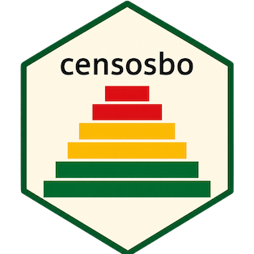

<!-- README.md is generated from README.Rmd. Please edit that file -->

# censosbo 

<!-- badges: start -->

[](https://lifecycle.r-lib.org/articles/stages.html#experimental)
[](https://opensource.org/licenses/MIT)
[](https://github.com/lab-tecnosocial/censosbo/actions/workflows/R-CMD-check.yaml)
<!-- badges: end -->

**censosbo** proporciona acceso programático a los microdatos de todos los **censos de población de Bolivia**: 1976, 1992, 2001, 2012 y el CPV-2024. Los datos se descargan bajo demanda desde GitHub Releases, se guardan en caché local y se pueden consultar con `dplyr`, Apache Arrow o DuckDB.

## Instalación

``` r
# install.packages("remotes")
remotes::install_github("lab-tecnosocial/censosbo")
```

## Censos disponibles

| Año | Función | Registros | Variables | Disco (Parquet) | RAM (aprox.)¹ |
|:---:|---------|----------:|----------:|----------------:|--------------:|
| **1976** | `get_poblacion_1976()` | 4,613,419 | 46 | 63 MB | 83 MB |
| **1976** | `get_viviendas_1976()` | 1,158,482 | 28 | 7 MB | 9 MB |
| **1992** | `get_personas_1992()` | 6,420,792 | 54 | 135 MB | 238 MB |
| **1992** | `get_viviendas_1992()` | 1,706,107 | 44 | 29 MB | 43 MB |
| **1992** | `get_mortalidad_1992()` | 1,706,107 | 14 | 17 MB | 36 MB |
| **2001** | `get_personas_2001()` | 8,274,325 | 66 | 136 MB | 316 MB |
| **2001** | `get_viviendas_2001()` | 2,290,414 | 39 | 20 MB | 37 MB |
| **2012** | `get_personas_2012()` | 10,059,856 | 33 | 146 MB | 279 MB |
| **2012** | `get_viviendas_2012()` | 3,172,321 | 32 | 38 MB | 58 MB |
| **2012** | `get_emigracion_2012()` | 489,559 | 6 | 5 MB | 11 MB |
| **2012** | `get_discapacidad_2012()` | 342,929 | 8 | 4 MB | 8 MB |
| **2024**² | `get_personas_2024()` | 11,365,333 | 118 | 283 MB | ~490 MB |
| **2024**² | `get_viviendas_2024()` | 4,490,488 | 48 | 55 MB | ~111 MB |
| **2024**² | `get_emigracion_2024()` | 500,914 | 8 | 2 MB | ~7 MB |
| **2024**² | `get_mortalidad_2024()` | 382,731 | 10 | 2 MB | ~5 MB |

¹ Tamaño al cargar la tabla completa con `collect()` sin filtros, medido desde metadatos Parquet.
² Persona 2024 está particionada en 9 archivos por departamento (4–77 MB cada uno). Disco y RAM muestran el total; en la práctica se descarga solo el/los departamentos necesarios.

El formato **Arrow** (por defecto) mantiene los datos en el disco hasta que ejecutas `collect()`. Las tablas del CPV-2024 se pueden unir por la clave `idep + iprov + imun + i00` (identificador de hogar).

## Uso rápido — CPV-2024

``` r
library(censosbo)
library(dplyr)

# Grupos quinquenales de edad por sexo, Santa Cruz
# Nota: usar %/% en lugar de cut() — cut() no es compatible con Arrow
get_personas_2024(departamento = "Santa Cruz") |>
  filter(!is.na(p26_edad), !is.na(p25_sexo)) |>
  mutate(grupo_edad = (p26_edad %/% 5L) * 5L) |>
  count(grupo_edad, p25_sexo) |>
  collect() |>
  etiquetar_valores()
```

``` r
# Consulta SQL con DuckDB
library(DBI)
con <- get_personas_2024(departamento = "Santa Cruz", as = "duckdb")
DBI::dbGetQuery(con, "
  SELECT p25_sexo, COUNT(*) AS total, ROUND(AVG(p26_edad), 1) AS edad_prom
  FROM personas
  GROUP BY p25_sexo
  ORDER BY p25_sexo
") |> etiquetar_valores()
DBI::dbDisconnect(con)
```

## Censos históricos

``` r
# Personas de Santa Cruz en el censo 2012
get_personas_2012(departamento = "Santa Cruz")

# API genérica — equivalente
get_censo(2012, "persona", departamento = "07")

# Censo 1976 (estructura directa, sin REDATAM)
get_poblacion_1976(departamento = "03")  # Cochabamba
```

## Análisis longitudinal

``` r
# Variables comparables entre censos
variables_armonizadas()

# Nivel educativo en todo el país, 1976–2024
edu <- get_longitudinal(
  variables = c("sexo", "nivel_edu"),
  anios     = c(1976, 1992, 2001, 2012, 2024)
)
edu |> count(anio, nivel_edu)
```

## Diccionario de variables

``` r
# Buscar variables del CPV-2024
codebook(buscar = "educa")

# Codebook para censos históricos
codebook_2012(buscar = "instruccion")
codebook_1992(buscar = "sexo")

# Ver códigos de una variable
codebook_valores("p25_sexo")          # CPV-2024
codebook_valores("P24", anio = 2012)  # Censo 2012
```

## Etiquetas en los resultados

``` r
library(dplyr)

get_personas_2024(departamento = "Santa Cruz") |>
  count(p25_sexo, nivel_edu) |>
  collect() |>
  etiquetar_valores() |>    # 1 → "Mujer", 2 → "Hombre"
  etiquetar_variables()     # "p25_sexo" → "25. Es mujer u hombre"
```

## Geografía

``` r
departamentos()
provincias("La Paz")
municipios(departamento = "Santa Cruz") |> head(5)
```

## Gestión del caché

``` r
# Guardar caché dentro del proyecto (recomendado)
options(censosbo.cache_dir = "data/censosbo")

censosbo_cache_dir()    # dónde está el caché
censosbo_cache_info()   # qué archivos están descargados
censosbo_cache_clear()  # liberar espacio en disco
```

## Fuente de datos

Los microdatos originales son publicados por el **Instituto Nacional de Estadística (INE) de Bolivia**:

- **CPV-2024**: <https://cpv2024.ine.gob.bo/index.php/principal/descargas/>
- **Censos históricos 1976–2012**: <https://www.ine.gob.bo/index.php/censos-y-banco-de-datos/censos/>

### Nota metodológica

Los archivos originales fueron transformados a formato **Parquet** (compresión zstd nivel 6) para distribución eficiente. El proceso de conversión varía por censo:

| Censo | Formato original | Herramienta de conversión |
|-------|-----------------|--------------------------|
| 1976 | SPSS (`.sav`) | `pyreadstat` + `pyarrow` |
| 1992 | REDATAM (`.dic` binario + `.rbf`) | `open-redatam` CLI → CSV → Parquet |
| 2001 | REDATAM (`.wxp` → `.dicX`) | conversión `.wxp`→`.dicX` + `open-redatam` → CSV → Parquet |
| 2012 | REDATAM (`.dic` binario + `.ptr`) | `open-redatam` CLI → CSV → Parquet |
| 2024 | CSV delimitado por `;` (~3.6 GB total) | `pandas` + `pyarrow`; persona particionada por departamento |

El formato Parquet conserva todos los registros y variables originales sin modificación de valores.

## Citar

``` r
citation("censosbo")
```

> Ojeda Copa, A. (2025). *censosbo: Acceso y análisis de los censos de Bolivia (1976–2024)*. R package version 0.2.0. <https://github.com/lab-tecnosocial/censosbo>
