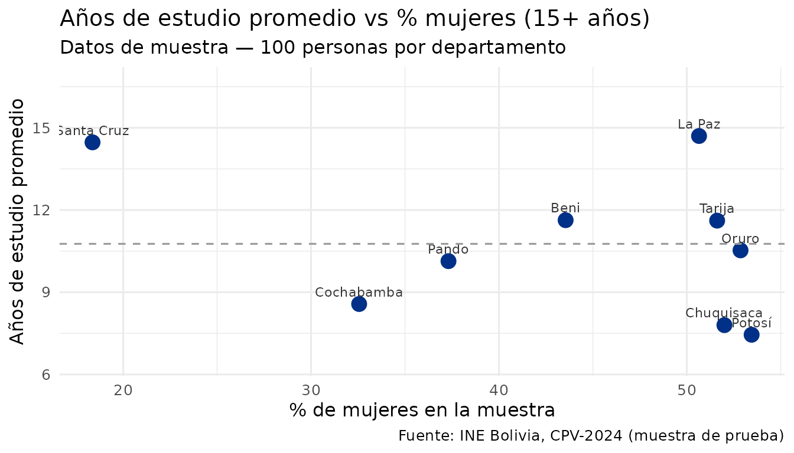

# Análisis avanzado con DuckDB y Arrow

## ¿Por qué usar Arrow o DuckDB?

Con 11 millones de personas, los datos del CPV-2024 pueden ser difíciles
de manejar en RAM. `censosbo` resuelve esto con:

- **Arrow**: permite aplicar filtros y agregaciones *antes* de cargar
  datos en RAM. Compatible con `dplyr`.
- **DuckDB**: motor SQL columnar en memoria, extremadamente rápido para
  datos analíticos. Ideal para queries complejas.

## Demostración con datos de muestra

Los siguientes ejemplos funcionan directamente con `sample_personas`
(incluido en el paquete) y muestran cómo se verían los resultados con
los datos reales.

``` r

library(censosbo)
library(dplyr)
#> 
#> Attaching package: 'dplyr'
#> The following objects are masked from 'package:stats':
#> 
#>     filter, lag
#> The following objects are masked from 'package:base':
#> 
#>     intersect, setdiff, setequal, union

# Arrow Dataset a partir de los datos de muestra
# (En producción: ds <- get_personas(departamento = "07"))
ds <- arrow::as_arrow_table(sample_personas)

# Pipeline dplyr lazy: filtra antes de traer a RAM
resultado <- ds |>
  filter(p26_edad >= 15) |>
  group_by(idep, p25_sexo) |>
  summarise(
    personas    = n(),
    edad_prom   = mean(p26_edad, na.rm = TRUE),
    anios_edu   = mean(aestudio, na.rm = TRUE),
    .groups = "drop"
  ) |>
  collect() |>
  mutate(sexo = ifelse(p25_sexo == 1, "Mujer", "Hombre"))

head(resultado, 10)
#> # A tibble: 10 × 6
#>    idep  p25_sexo personas edad_prom anios_edu sexo  
#>    <chr>    <int>    <int>     <dbl>     <dbl> <chr> 
#>  1 01           1       31      35.2      6.42 Mujer 
#>  2 01           2       27      34.4      9.29 Hombre
#>  3 02           2       43      42.4     14.8  Hombre
#>  4 02           1       40      42.8     14.6  Mujer 
#>  5 03           2       65      36.1      8.91 Hombre
#>  6 03           1       30      35.7      7.86 Mujer 
#>  7 04           2       35      39.6     10.8  Hombre
#>  8 04           1       39      41.0     10.3  Mujer 
#>  9 05           1       38      43.8      6.42 Mujer 
#> 10 05           2       34      36.2      8.63 Hombre
```

``` r

# DuckDB: SQL directamente sobre los datos
library(DBI)

con <- DBI::dbConnect(duckdb::duckdb(), dbdir = ":memory:")
DBI::dbWriteTable(con, "personas", sample_personas)

# Window function: ranking de departamentos por años de estudio promedio
DBI::dbGetQuery(con, "
  SELECT
    idep,
    ROUND(AVG(aestudio), 1) AS anios_estudio_prom,
    COUNT(*) AS personas_15mas,
    RANK() OVER (ORDER BY AVG(aestudio) DESC) AS ranking
  FROM personas
  WHERE p26_edad >= 15 AND aestudio IS NOT NULL
  GROUP BY idep
  ORDER BY ranking
")
#>   idep anios_estudio_prom personas_15mas ranking
#> 1   02               14.7             77       1
#> 2   07               14.5             98       2
#> 3   08               11.6             62       3
#> 4   06               11.6             62       4
#> 5   04               10.5             70       5
#> 6   09               10.1             67       6
#> 7   03                8.6             86       7
#> 8   01                7.8             50       8
#> 9   05                7.4             58       9
```

``` r

library(ggplot2)

# Visualizar el resultado anterior
res <- DBI::dbGetQuery(con, "
  SELECT idep,
    AVG(aestudio) AS anios_edu,
    SUM(CASE WHEN p25_sexo = 1 THEN 1 ELSE 0 END) * 100.0 / COUNT(*) AS pct_mujeres
  FROM personas WHERE p26_edad >= 15 AND aestudio IS NOT NULL
  GROUP BY idep
")
DBI::dbDisconnect(con)

dep_labels <- c("01"="Chuquisaca","02"="La Paz","03"="Cochabamba",
                "04"="Oruro","05"="Potosí","06"="Tarija",
                "07"="Santa Cruz","08"="Beni","09"="Pando")

res |>
  mutate(departamento = dep_labels[idep]) |>
  ggplot(aes(x = pct_mujeres, y = anios_edu, label = departamento)) +
  geom_point(color = "#003087", size = 4) +
  geom_text(vjust = -0.8, size = 3, color = "#333333") +
  geom_hline(yintercept = mean(res$anios_edu), linetype = "dashed", color = "gray60") +
  expand_limits(y = c(min(res$anios_edu) - 1, max(res$anios_edu) + 2)) +
  labs(
    title    = "Años de estudio promedio vs % mujeres (15+ años)",
    subtitle = "Datos de muestra — 100 personas por departamento",
    x = "% de mujeres en la muestra", y = "Años de estudio promedio",
    caption = "Fuente: INE Bolivia, CPV-2024 (muestra de prueba)"
  ) +
  theme_minimal(base_size = 12)
```



------------------------------------------------------------------------

> Los siguientes ejemplos requieren **descargar los datos completos**
> (~50–500 MB). Ejecuta el código en tu sesión de R después de instalar
> el paquete.

## Arrow: análisis lazy con dplyr

``` r

library(dplyr)

# El dataset Arrow NO carga los datos en RAM
ds <- get_personas(
  departamento = c("02", "03", "07"),  # La Paz, Cochabamba, Santa Cruz
  as = "arrow"
)
class(ds)  # "FileSystemDataset"

# dplyr funciona sobre Arrow de forma lazy
resultado <- ds |>
  filter(p26_edad >= 15, p26_edad <= 65) |>  # PEA
  group_by(idep, p25_sexo) |>
  summarise(
    total      = n(),
    edad_prom  = mean(p26_edad, na.rm = TRUE),
    .groups    = "drop"
  ) |>
  collect()  # solo aquí se ejecuta la consulta y se carga en RAM

head(resultado)
```

``` r

# Arrow también puede abrir múltiples archivos como un solo dataset
# (censosbo lo hace internamente)
library(arrow)

cache <- censosbo_cache_dir()
archivos <- list.files(cache, pattern = "persona_dep0[1-9]\\.parquet", full.names = TRUE)

ds_nacional <- arrow::open_dataset(archivos, format = "parquet")
nrow(ds_nacional)  # sin cargar en RAM
```

## DuckDB: SQL sobre datos de censo

``` r

library(DBI)

# Obtener conexión DuckDB con la tabla "personas" registrada
con <- get_personas(departamento = "07", as = "duckdb")

# SQL estándar
DBI::dbGetQuery(con, "
  SELECT
    p25_sexo AS sexo,
    COUNT(*) AS total,
    ROUND(AVG(p26_edad), 2) AS edad_promedio,
    ROUND(AVG(aestudio), 2) AS anios_estudio_prom
  FROM personas
  WHERE p26_edad >= 15
  GROUP BY sexo
  ORDER BY sexo
")
```

``` r

# Window functions: ranking por municipio
DBI::dbGetQuery(con, "
  SELECT
    imun,
    COUNT(*) AS poblacion,
    RANK() OVER (ORDER BY COUNT(*) DESC) AS ranking
  FROM personas
  GROUP BY imun
  ORDER BY ranking
  LIMIT 10
")
```

## Join entre tablas con DuckDB

``` r

# Registrar personas y viviendas en la misma conexión DuckDB
con <- DBI::dbConnect(duckdb::duckdb(), dbdir = ":memory:")

duckdb::duckdb_register_arrow(
  con, "personas",
  get_personas(
    departamento = "07",
    variables    = c("idep", "iprov", "imun", "i00", "p25_sexo",
                     "p26_edad", "nivel_edu")
  )
)
duckdb::duckdb_register_arrow(
  con, "viviendas",
  get_viviendas(
    departamento = "07",
    variables    = c("idep", "iprov", "imun", "i00", "urbrur",
                     "v07_aguapro", "v09_energia", "tot_pers")
  )
)

# Indicador de calidad de vida: personas con educación superior en viviendas
# con servicios básicos completos
DBI::dbGetQuery(con, "
  SELECT
    v.urbrur AS area,
    COUNT(*) AS personas_edu_superior,
    ROUND(AVG(p.p26_edad), 1) AS edad_promedio
  FROM personas p
  JOIN viviendas v
    ON p.idep = v.idep AND p.iprov = v.iprov
   AND p.imun = v.imun AND p.i00  = v.i00
  WHERE p.nivel_edu >= 4          -- educación superior
    AND v.v07_aguapro = 1         -- red de agua pública
    AND v.v09_energia = 1         -- red eléctrica
    AND p.p26_edad >= 25
  GROUP BY area
  ORDER BY area
")

DBI::dbDisconnect(con)
```

## Análisis de datos más grandes que la RAM

``` r

# Si la RAM es limitada, mantener todo en Arrow y agregar antes de collect()
personas_full <- get_personas(as = "arrow")  # los 9 departamentos

# Estadísticas nacionales por departamento sin cargar todo en RAM
resumen_nacional <- personas_full |>
  filter(!is.na(p26_edad)) |>
  group_by(idep) |>
  summarise(
    poblacion    = n(),
    edad_mediana = median(p26_edad),
    .groups = "drop"
  ) |>
  collect()  # solo el resumen (~9 filas) llega a RAM

left_join(resumen_nacional, departamentos(), by = "idep") |>
  arrange(desc(poblacion))
```

## Exportar resultados procesados

``` r

library(arrow)

# Guardar resultado de una consulta como Parquet para uso posterior
resultado <- get_personas(
  departamento = "07",
  variables    = c("imun", "p25_sexo", "p26_edad", "nivel_edu")
) |>
  filter(p26_edad >= 15) |>
  group_by(imun, p25_sexo) |>
  summarise(
    total        = n(),
    edad_prom    = mean(p26_edad, na.rm = TRUE),
    .groups      = "drop"
  )

# Guardar como CSV
write.csv(collect(resultado), "resumen_sc_municipios.csv", row.names = FALSE)

# O como Parquet
arrow::write_parquet(collect(resultado), "resumen_sc_municipios.parquet")
```

## Rendimiento: Arrow vs DuckDB vs tibble

| Operación            | Arrow+dplyr |        DuckDB        |     tibble     |
|----------------------|:-----------:|:--------------------:|:--------------:|
| Filtro simple        | Muy rápido  |      Muy rápido      |     Lento      |
| Agregación           |   Rápido    |      Muy rápido      |     Medio      |
| JOIN entre tablas    | No directo  |      Muy rápido      | Requiere merge |
| Uso de RAM           |   Mínimo    |        Mínimo        |      Alto      |
| Compatibilidad dplyr |    Total    | Parcial (via dbplyr) |     Total      |

**Recomendación**: usa Arrow+dplyr para análisis exploratorios rápidos,
y DuckDB cuando necesites JOINs o queries SQL complejas.
