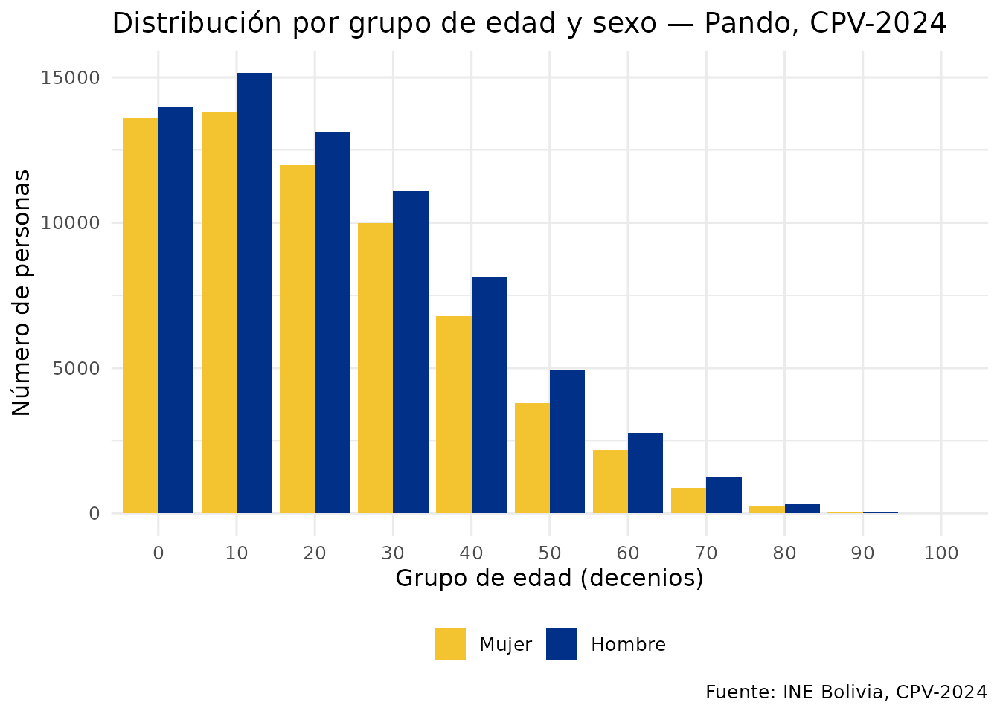
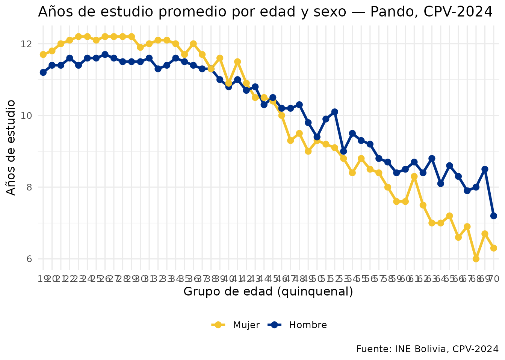

# Análisis avanzado con DuckDB y Arrow

## ¿Por qué usar Arrow o DuckDB?

Con 11 millones de personas, los datos del CPV-2024 pueden ser difíciles
de manejar en RAM. `censosbo` resuelve esto con:

- **Arrow**: aplica filtros y agregaciones *antes* de cargar datos en
  RAM. Compatible con `dplyr`.
- **DuckDB**: motor SQL columnar en memoria, muy rápido para queries
  analíticas y JOINs entre tablas.

## Arrow: análisis lazy con dplyr

El dataset Arrow no carga los datos en RAM. `dplyr` traduce los verbos a
operaciones sobre el Parquet, y solo
[`collect()`](https://dplyr.tidyverse.org/reference/compute.html)
materializa el resultado.

``` r

# Dataset Arrow de Pando (el departamento más pequeño, ~7 MB)
ds <- get_personas_2024(
  departamento = "Pando",
  as = "arrow"
)
#> ℹ Descargando persona_dep09.parquet (~4 MB)...
#> ✔ Descargado persona_dep09.parquet [530ms]
#> 
class(ds)
#> [1] "FileSystemDataset" "Dataset"           "ArrowObject"      
#> [4] "R6"
```

``` r

# Pipeline lazy: todo ocurre en Arrow, solo el resumen llega a RAM
resumen <- ds |>
  filter(p26_edad >= 15) |>
  group_by(p25_sexo) |>
  summarise(
    personas   = n(),
    edad_prom  = mean(p26_edad, na.rm = TRUE),
    .groups    = "drop"
  ) |>
  collect() |>
  etiquetar_valores()

resumen
#> # A tibble: 2 × 3
#>   p25_sexo personas edad_prom
#>   <fct>       <int>     <dbl>
#> 1 Hombre      48918      35.8
#> 2 Mujer       42152      35.0
```

``` r

# Distribución de edad en Pando
ds |>
  filter(!is.na(p26_edad)) |>
  mutate(grupo = (p26_edad %/% 10L) * 10L) |>
  count(grupo, p25_sexo) |>
  collect() |>
  etiquetar_valores() |>
  ggplot(aes(x = factor(grupo), y = n, fill = p25_sexo)) +
  geom_col(position = "dodge") +
  scale_fill_manual(values = c("Mujer" = "#F4C430", "Hombre" = "#003087")) +
  labs(
    title   = "Distribución por grupo de edad y sexo — Pando, CPV-2024",
    x       = "Grupo de edad (decenios)",
    y       = "Número de personas",
    fill    = NULL,
    caption = "Fuente: INE Bolivia, CPV-2024"
  ) +
  theme_minimal(base_size = 12) +
  theme(legend.position = "bottom")
```



## DuckDB: SQL sobre los datos del censo

``` r

library(DBI)

con <- get_personas_2024(departamento = "Pando", as = "duckdb")
#> ✔ Usando caché: persona_dep09.parquet
#> duckdb keeps downloaded extensions and secrets in a temporary directory:
#> ℹ /tmp/Rtmp2qtnRd/duckdb
#> This is removed when the R session ends.
#> • Extensions are re-downloaded each session.
#> • Secrets are lost.
#> ℹ Run duckdb(shared_home = TRUE) (or create ~/.duckdb) to keep them (suitable for most users).
#> ℹ Run duckdb(shared_home = FALSE) to accept the temporary directory (and silence this message).
#> ℹ See ?duckdb_storage for details and alternatives.

# SQL estándar con agregaciones
DBI::dbGetQuery(con, "
  SELECT
    p25_sexo,
    COUNT(*)            AS total,
    ROUND(AVG(p26_edad), 1)  AS edad_prom,
    ROUND(AVG(aestudio), 1)  AS anios_estudio_prom
  FROM personas
  WHERE p26_edad >= 15
  GROUP BY p25_sexo
  ORDER BY p25_sexo
") |> etiquetar_valores()
#>   p25_sexo total edad_prom anios_estudio_prom
#> 1    Mujer 42152      35.0               10.9
#> 2   Hombre 48918      35.8               10.6
```

``` r

# Window functions: municipios con mayor población
DBI::dbGetQuery(con, "
  SELECT
    imun,
    COUNT(*) AS poblacion,
    RANK() OVER (ORDER BY COUNT(*) DESC) AS ranking
  FROM personas
  GROUP BY imun
  ORDER BY ranking
  LIMIT 10
")
#>   imun poblacion ranking
#> 1   01     79399       1
#> 2   02     27814       2
#> 3   03     23351       3
#> 4   04      3630       4
```

``` r

# Años de estudio por grupo quinquenal de edad
anos_edad <- DBI::dbGetQuery(con, "
  SELECT
    FLOOR(p26_edad / 5) * 5 AS grupo_edad,
    p25_sexo,
    ROUND(AVG(aestudio), 1) AS anios_edu
  FROM personas
  WHERE p26_edad BETWEEN 15 AND 70
    AND aestudio IS NOT NULL
  GROUP BY grupo_edad, p25_sexo
  ORDER BY grupo_edad
") |> etiquetar_valores()

DBI::dbDisconnect(con)

ggplot(anos_edad, aes(x = factor(grupo_edad), y = anios_edu,
                      color = p25_sexo, group = p25_sexo)) +
  geom_line(linewidth = 1.2) +
  geom_point(size = 2.5) +
  scale_color_manual(values = c("Mujer" = "#F4C430", "Hombre" = "#003087")) +
  labs(
    title   = "Años de estudio promedio por edad y sexo — Pando, CPV-2024",
    x       = "Grupo de edad (quinquenal)",
    y       = "Años de estudio",
    color   = NULL,
    caption = "Fuente: INE Bolivia, CPV-2024"
  ) +
  theme_minimal(base_size = 12) +
  theme(legend.position = "bottom",
        axis.text.x = element_text(angle = 45, hjust = 1))
```



## Join entre tablas con DuckDB

``` r

con <- DBI::dbConnect(duckdb::duckdb(), dbdir = ":memory:")
#> duckdb keeps downloaded extensions and secrets in a temporary directory:
#> ℹ /tmp/Rtmp2qtnRd/duckdb
#> This is removed when the R session ends.
#> • Extensions are re-downloaded each session.
#> • Secrets are lost.
#> ℹ Run duckdb(shared_home = TRUE) (or create ~/.duckdb) to keep them (suitable for most users).
#> ℹ Run duckdb(shared_home = FALSE) to accept the temporary directory (and silence this message).
#> ℹ See ?duckdb_storage for details and alternatives.

duckdb::duckdb_register_arrow(
  con, "personas",
  get_personas_2024(departamento = "Pando",
               variables = c("idep","iprov","imun","i00","p25_sexo","p26_edad","nivel_edu"))
)
#> ✔ Usando caché: persona_dep09.parquet
duckdb::duckdb_register_arrow(
  con, "viviendas",
  get_viviendas_2024(departamento = "Pando",
                variables = c("idep","iprov","imun","i00","urbrur","v07_aguapro","v09_energia"))
)
#> ℹ Descargando vivienda.parquet (~55 MB)...
#> ✔ Descargado vivienda.parquet [511ms]

# Indicador: personas con educación superior en viviendas con servicios básicos
DBI::dbGetQuery(con, "
  SELECT
    v.urbrur,
    COUNT(*)                    AS personas_edu_sup,
    ROUND(AVG(p.p26_edad), 1)   AS edad_prom
  FROM personas p
  JOIN viviendas v
    ON p.idep = v.idep AND p.iprov = v.iprov
   AND p.imun = v.imun AND p.i00  = v.i00
  WHERE p.nivel_edu >= 4        -- educación superior
    AND v.v07_aguapro = 1       -- red de agua pública
    AND v.v09_energia = 1       -- red eléctrica
    AND p.p26_edad >= 25
  GROUP BY v.urbrur
  ORDER BY v.urbrur
") |> etiquetar_valores()
#>   urbrur personas_edu_sup edad_prom
#> 1 Urbana            10095      39.8
#> 2  Rural              368      37.6

DBI::dbDisconnect(con)
```

## Análisis nacional sin cargar todo en RAM

Cuando necesitas estadísticas del país entero, Arrow agrega en el
Parquet y solo trae el resumen a memoria.

``` r

# Descargar todos los departamentos (~560 MB) y agregar sin cargar todo en RAM
personas_full <- get_personas_2024(as = "arrow")

resumen_nacional <- personas_full |>
  filter(!is.na(p26_edad)) |>
  group_by(idep) |>
  summarise(
    poblacion    = n(),
    edad_mediana = median(p26_edad),
    .groups      = "drop"
  ) |>
  collect() |>
  left_join(departamentos(), by = "idep") |>
  arrange(desc(poblacion))

resumen_nacional
```

## Rendimiento comparado

| Operación            | Arrow + dplyr |        DuckDB        | tibble en RAM  |
|----------------------|:-------------:|:--------------------:|:--------------:|
| Filtro simple        |  Muy rápido   |      Muy rápido      |     Lento      |
| Agregación           |    Rápido     |      Muy rápido      |     Medio      |
| JOIN entre tablas    |  No directo   |      Muy rápido      | Requiere merge |
| Uso de RAM           |    Mínimo     |        Mínimo        |      Alto      |
| Compatibilidad dplyr |     Total     | Parcial (vía dbplyr) |     Total      |

**Recomendación:** usa Arrow + dplyr para exploración y filtros; usa
DuckDB cuando necesites JOINs o window functions.
