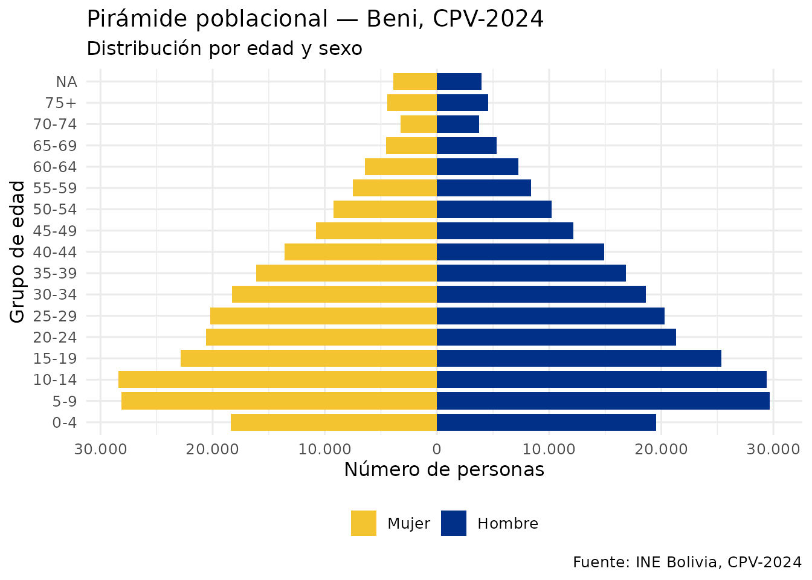
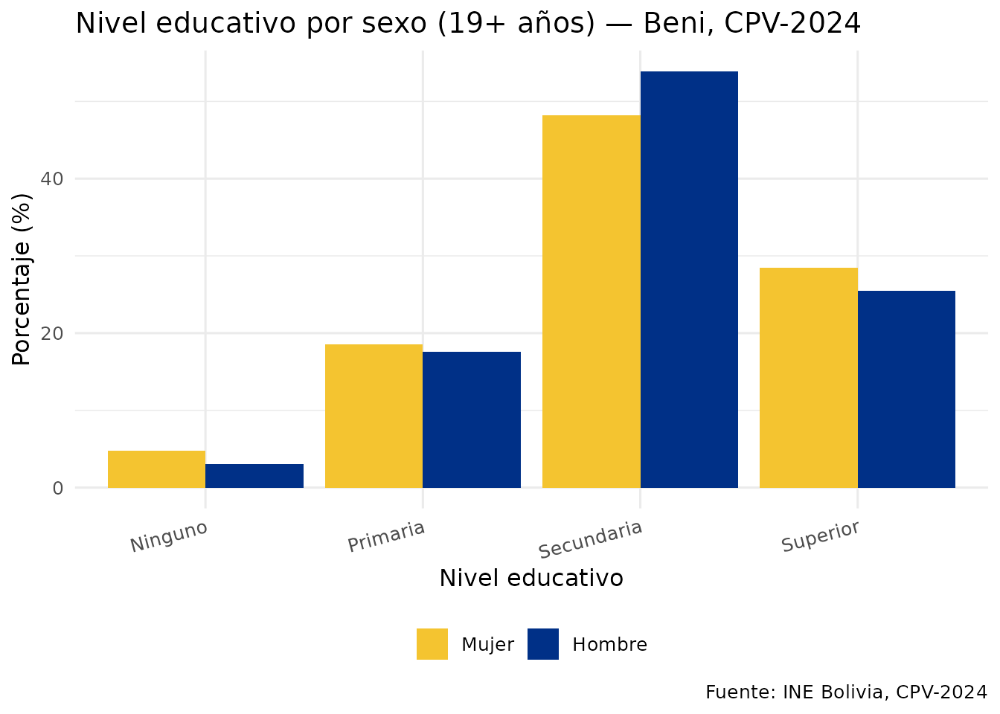
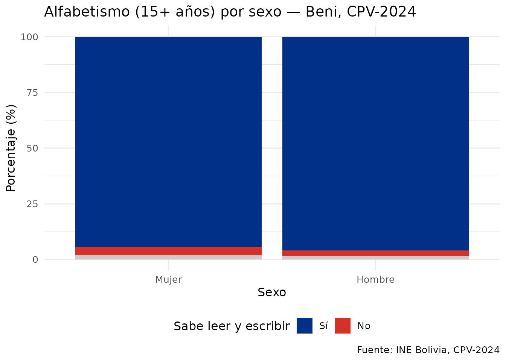
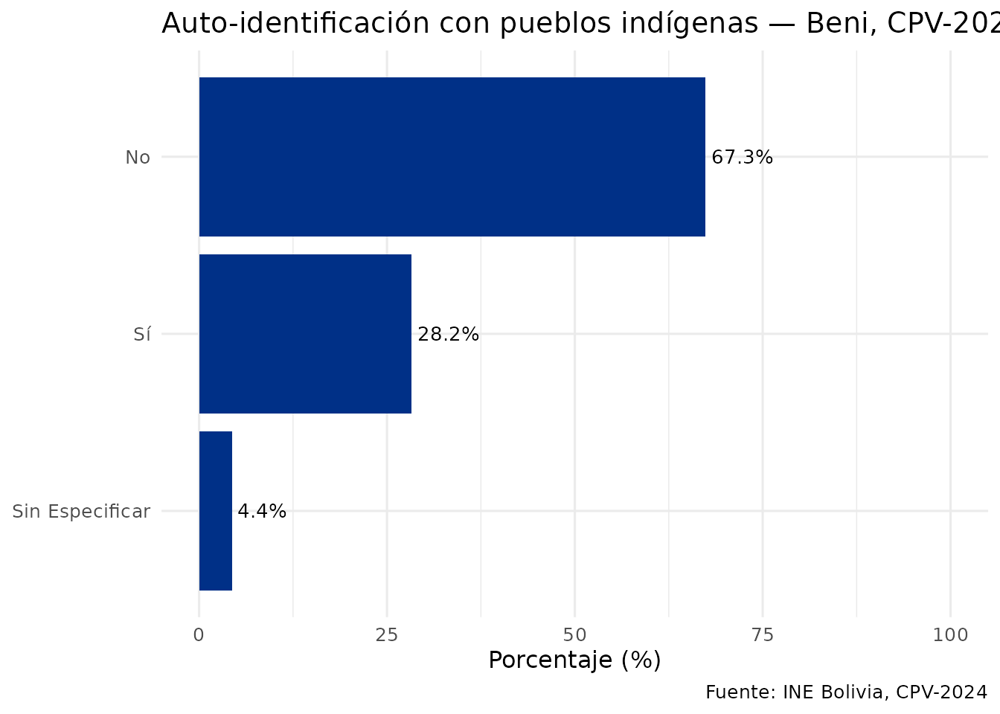

# Análisis demográfico con censosbo

## Introducción

Esta vignette muestra cómo usar `censosbo` para análisis demográficos
con los datos reales del CPV-2024. Los ejemplos descargan datos del
departamento de **Beni** (~24 MB), que se guarda en caché local tras la
primera descarga.

``` r

# Descargar datos de Beni con las variables de interés
personas <- get_personas_2024(
  departamento = "Beni",
  variables    = c("p25_sexo", "p26_edad", "nivel_edu",
                   "p40_lee", "p32_pueblo_per")
) |>
  collect() |>
  etiquetar_valores()
#> ℹ Descargando persona_dep08.parquet (~12 MB)...
#> ✔ Descargado persona_dep08.parquet [355ms]
#> 

nrow(personas)
#> [1] 488260
```

## Pirámide de edades

``` r

piramide <- personas |>
  filter(!is.na(p26_edad), !is.na(p25_sexo)) |>
  mutate(
    grupo_edad = cut(
      p26_edad,
      breaks = c(0, 4, 9, 14, 19, 24, 29, 34, 39, 44, 49,
                 54, 59, 64, 69, 74, 200),
      labels = c("0-4","5-9","10-14","15-19","20-24","25-29",
                 "30-34","35-39","40-44","45-49","50-54",
                 "55-59","60-64","65-69","70-74","75+"),
      right = TRUE
    ),
    n_pir = ifelse(p25_sexo == "Mujer", -1L, 1L)
  ) |>
  count(grupo_edad, p25_sexo, wt = n_pir)

ggplot(piramide, aes(x = grupo_edad, y = n, fill = p25_sexo)) +
  geom_col(width = 0.8) +
  coord_flip() +
  scale_fill_manual(values = c("Mujer" = "#F4C430", "Hombre" = "#003087")) +
  scale_y_continuous(labels = function(x) formatC(abs(x), format = "d", big.mark = ".")) +
  labs(
    title    = "Pirámide poblacional — Beni, CPV-2024",
    subtitle = "Distribución por edad y sexo",
    x = "Grupo de edad", y = "Número de personas", fill = NULL,
    caption  = "Fuente: INE Bolivia, CPV-2024"
  ) +
  theme_minimal(base_size = 12) +
  theme(legend.position = "bottom")
#> Warning in prettyNum(r, big.mark = big.mark, big.interval = big.interval, :
#> 'big.mark' and 'decimal.mark' are both '.', which could be confusing
```



## Nivel educativo por sexo

``` r

edu_sexo <- personas |>
  filter(!is.na(nivel_edu), !is.na(p25_sexo), p26_edad >= 15) |>
  count(nivel_edu, p25_sexo) |>
  group_by(p25_sexo) |>
  mutate(pct = n / sum(n) * 100)

ggplot(edu_sexo, aes(x = nivel_edu, y = pct, fill = p25_sexo)) +
  geom_col(position = "dodge") +
  scale_fill_manual(values = c("Mujer" = "#F4C430", "Hombre" = "#003087")) +
  labs(
    title   = "Nivel educativo por sexo (15+ años) — Beni, CPV-2024",
    x       = "Nivel educativo",
    y       = "Porcentaje (%)",
    fill    = NULL,
    caption = "Fuente: INE Bolivia, CPV-2024"
  ) +
  theme_minimal(base_size = 12) +
  theme(legend.position = "bottom", axis.text.x = element_text(angle = 15, hjust = 1))
```



## Alfabetismo por sexo

``` r

alfa <- personas |>
  filter(!is.na(p40_lee), !is.na(p25_sexo), p26_edad >= 15) |>
  count(p25_sexo, p40_lee) |>
  group_by(p25_sexo) |>
  mutate(pct = n / sum(n) * 100)

ggplot(alfa, aes(x = p25_sexo, y = pct, fill = p40_lee)) +
  geom_col() +
  scale_fill_manual(
    values   = c("Sí" = "#003087", "No" = "#d73027", "Sin especificar" = "grey80")
  ) +
  labs(
    title   = "Alfabetismo (15+ años) por sexo — Beni, CPV-2024",
    x       = "Sexo",
    y       = "Porcentaje (%)",
    fill    = "Sabe leer y escribir",
    caption = "Fuente: INE Bolivia, CPV-2024"
  ) +
  theme_minimal(base_size = 12) +
  theme(legend.position = "bottom")
```



## Auto-identificación con pueblos indígenas

``` r

ind <- personas |>
  filter(!is.na(p32_pueblo_per)) |>
  count(p32_pueblo_per) |>
  mutate(pct = n / sum(n) * 100)

ggplot(ind, aes(x = reorder(p32_pueblo_per, pct), y = pct)) +
  geom_col(fill = "#003087") +
  geom_text(aes(label = paste0(round(pct, 1), "%")), hjust = -0.1, size = 3.5) +
  coord_flip() +
  ylim(0, 100) +
  labs(
    title   = "Auto-identificación con pueblos indígenas — Beni, CPV-2024",
    x       = NULL,
    y       = "Porcentaje (%)",
    caption = "Fuente: INE Bolivia, CPV-2024"
  ) +
  theme_minimal(base_size = 12)
```



## Comparación nacional por departamento

El siguiente ejemplo descarga todos los departamentos (~560 MB en
total). Ejecuta en tu sesión de R cuando necesites datos nacionales.

``` r

# Edad promedio por departamento (todos los datos del país)
edad_dep <- get_personas_2024(variables = c("idep", "p26_edad")) |>
  filter(!is.na(p26_edad)) |>
  group_by(idep) |>
  summarise(edad_promedio = mean(p26_edad, na.rm = TRUE), .groups = "drop") |>
  collect() |>
  left_join(departamentos(), by = "idep") |>
  arrange(edad_promedio)

ggplot(edad_dep, aes(x = reorder(nombre_dep, edad_promedio), y = edad_promedio)) +
  geom_col(fill = "#003087") +
  geom_text(aes(label = round(edad_promedio, 1)), hjust = -0.1, size = 3.5) +
  coord_flip() +
  ylim(0, 35) +
  labs(
    title   = "Edad promedio por departamento — Bolivia, CPV-2024",
    x       = NULL,
    y       = "Edad promedio (años)",
    caption = "Fuente: INE Bolivia, CPV-2024"
  ) +
  theme_minimal()
```
