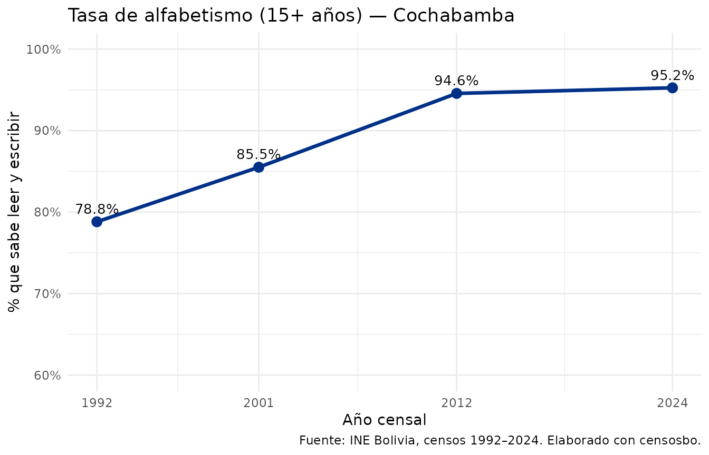
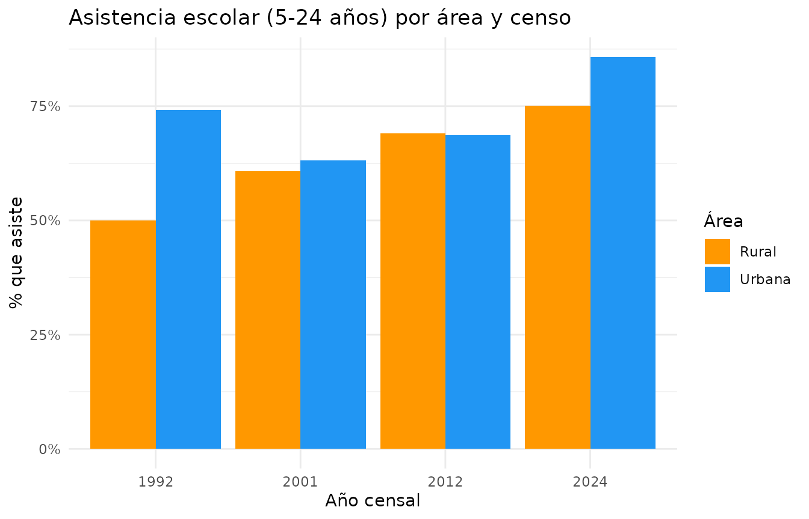
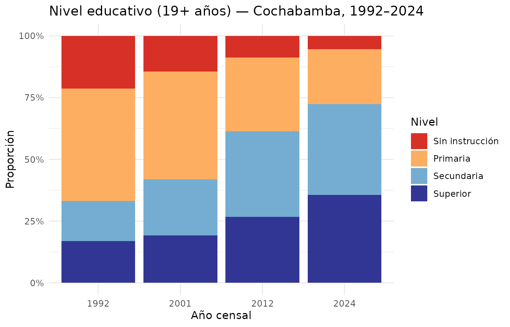
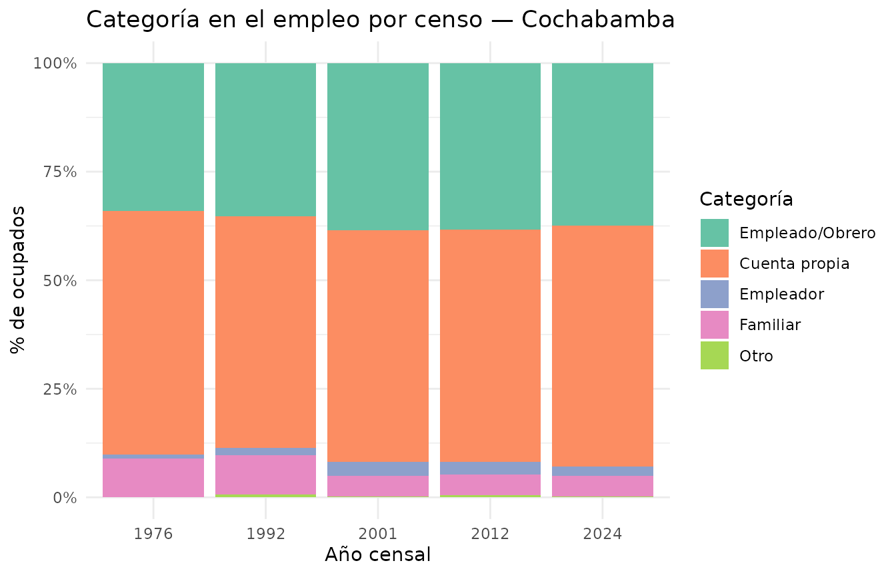
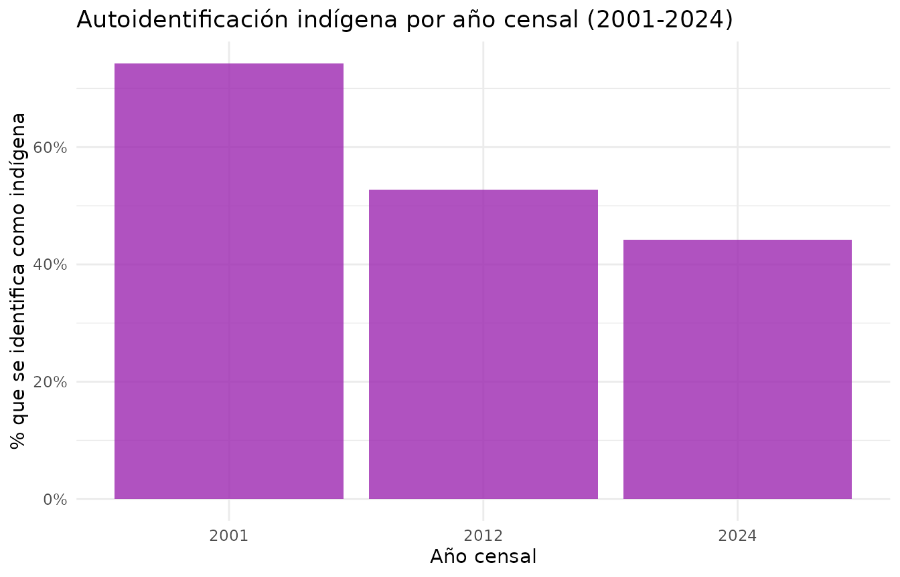
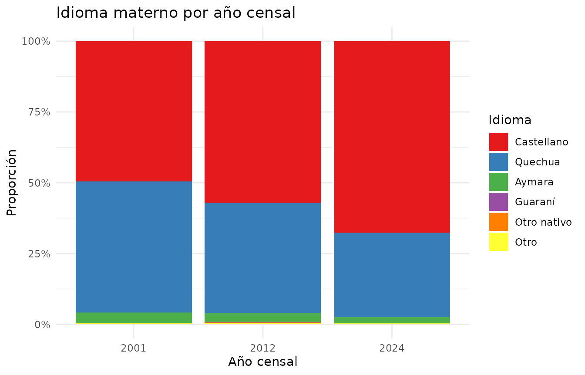
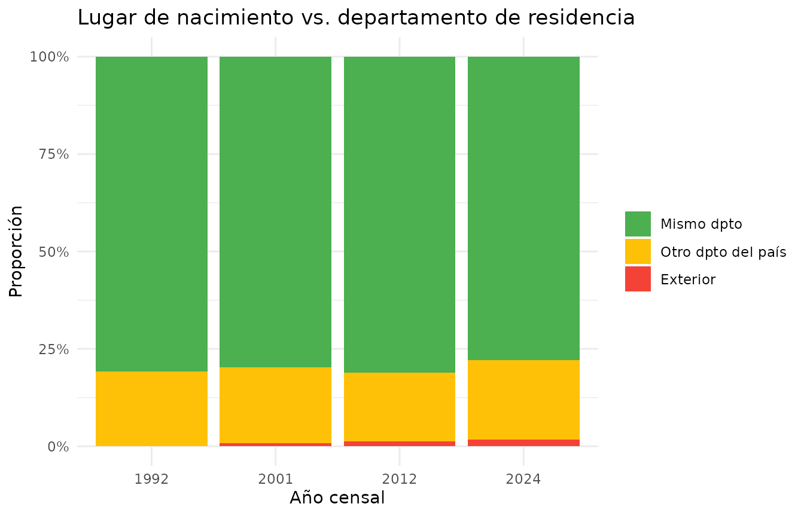
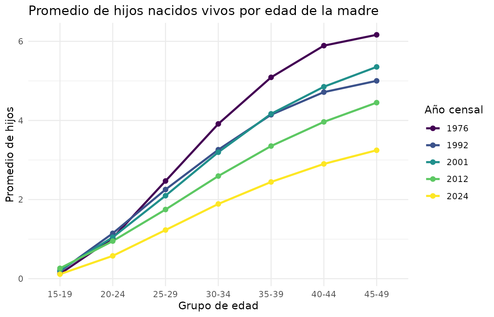
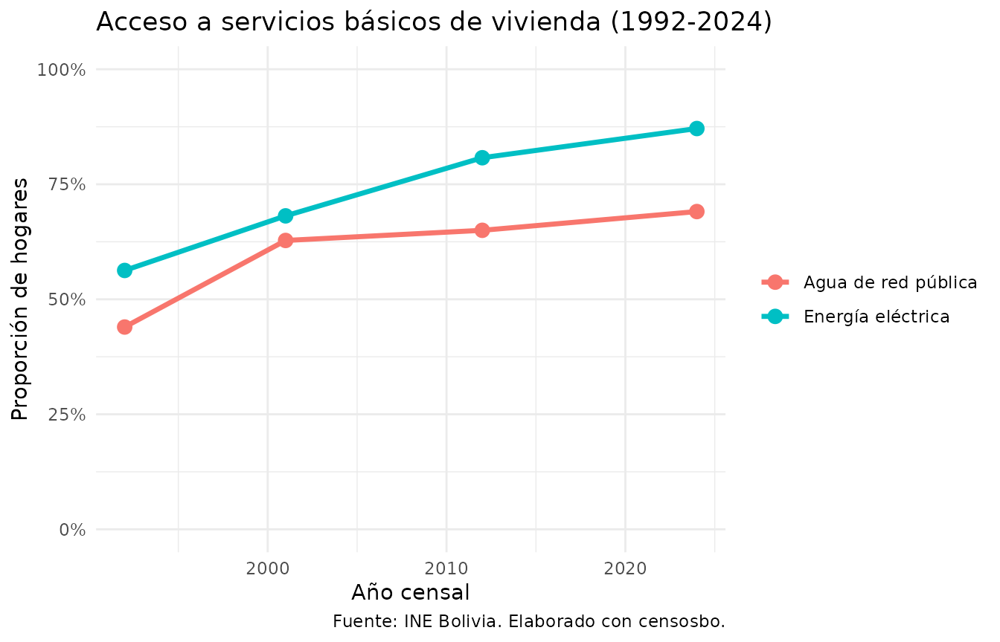
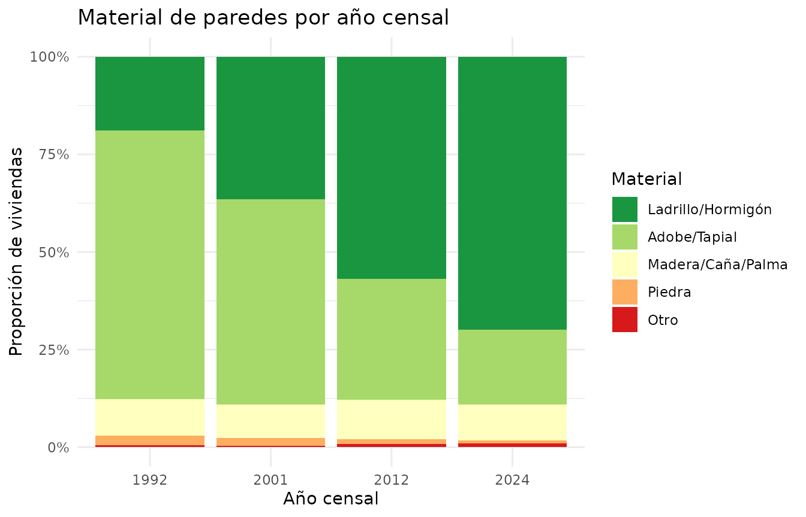

# Análisis temporal entre censos (1976–2024)

`censosbo` incluye funciones para comparar variables clave entre todos
los censos bolivianos (1976, 1992, 2001, 2012 y 2024). Las variables
originales son diferentes en cada censo; la librería aplica una
armonización y devuelve un data.frame en formato largo (“tidy”) con una
columna `anio` que identifica el censo.

> **Sobre los ejemplos de esta viñeta.** Las cifras que se muestran son
> reales, pero están acotadas a **Cochabamba** (`departamento = DEP`,
> con `DEP <- "Cochabamba"`): cargar los cinco censos completos del país
> en RAM requiere varios GB. El mismo código sin el argumento
> `departamento` devuelve las cifras nacionales. Nótese que la descarga
> es igual en ambos casos: los censos históricos se publican en un único
> archivo por tabla.

## Variables y grupos disponibles

``` r

# Lista completa de variables armonizadas y su nombre en cada censo
variables_armonizadas() |>
  select(variable, tabla, armonizada, v1976, v1992, v2001, v2012, v2024)
#>                variable    tabla armonizada  v1976 v1992  v2001         v2012
#> 1                  sexo  persona       TRUE    p03   P03    P28           P24
#> 2                  edad  persona       TRUE    p04   P04    P29           P25
#> 3            grupo_edad  persona       TRUE    p04   P04    P29           P25
#> 4            parentesco  persona      FALSE    p02   P02    P31           P23
#> 5          estado_civil  persona       TRUE    p05   P05    P48           P45
#> 6             sabe_leer  persona       TRUE    p10   P10    P36           P35
#> 7             nivel_edu  persona       TRUE nivela   P12 P39NIV P37A_NIVELNUE
#> 8    asistencia_escolar  persona       TRUE    p11   P11    P37           P36
#> 9                   pea  persona       TRUE    pea  NPEA   <NA>           PEA
#> 10                  pet  persona       TRUE    pet  NPET   <NA>           PET
#> 11  categoria_ocupacion  persona       TRUE    p18   P18    P46           P43
#> 12   identidad_indigena  persona       TRUE   <NA>  <NA>   P491          P29C
#> 13       idioma_materno  persona       TRUE    p09  <NA>    P35          P30B
#> 14   migracion_nac_dpto  persona       TRUE lugnac  P07A  DEP34          P32J
#> 15   migracion_rec_dpto  persona       TRUE  resh5  P08A  DEP41          P34H
#> 16  hijos_nacidos_vivos  persona       TRUE    p20   P20    P50           P46
#> 17 hijos_sobrevivientes  persona       TRUE    p21   P21    P51           P47
#> 18                 area  persona       TRUE   area  area   area          area
#> 19         departamento  persona       TRUE    dep  idep   idep          idep
#> 20     material_paredes vivienda       TRUE    v03   V03    V06           P03
#> 21       material_techo vivienda       TRUE    v04   V04    V08           P05
#> 22        material_piso vivienda       TRUE    v05   V05    V09           P06
#> 23          fuente_agua vivienda       TRUE    v07   V07    V10           P07
#> 24    energia_electrica vivienda       TRUE    v09   V09    V15           P11
#> 25   servicio_sanitario vivienda       TRUE   v081   V08    V12           P09
#> 26    tenencia_vivienda vivienda       TRUE    v14   V14    V21           P19
#> 27   habitaciones_total vivienda       TRUE    v10   V10    V18           P14
#>               v2024
#> 1          p25_sexo
#> 2          p26_edad
#> 3          p26_edad
#> 4      p24_parentes
#> 5        p53_ecivil
#> 6           p40_lee
#> 7         nivel_edu
#> 8        p38_asiste
#> 9            pea_13
#> 10           pet_13
#> 11         p50_semp
#> 12   p32_pueblo_per
#> 13 p341_idiomat_cod
#> 14    p35j_deptocod
#> 15    p37j_deptocod
#> 16        p54_hvtot
#> 17        p55_hstot
#> 18             area
#> 19             idep
#> 20        v03_pared
#> 21        v05_techo
#> 22         v06_piso
#> 23      v07_aguapro
#> 24      v09_energia
#> 25      v15_servsan
#> 26     v17_tenencia
#> 27      v13_habitac
```

``` r

# Grupos temáticos predefinidos
grupos_variables()
#> $demografico
#> [1] "sexo"         "edad"         "grupo_edad"   "parentesco"   "estado_civil"
#> 
#> $educacion
#> [1] "sexo"               "edad"               "sabe_leer"         
#> [4] "nivel_edu"          "asistencia_escolar"
#> 
#> $economia
#> [1] "sexo"                "edad"                "pea"                
#> [4] "pet"                 "categoria_ocupacion"
#> 
#> $cultural
#> [1] "sexo"               "edad"               "identidad_indigena"
#> [4] "idioma_materno"    
#> 
#> $migracion
#> [1] "sexo"               "edad"               "migracion_nac_dpto"
#> [4] "migracion_rec_dpto"
#> 
#> $fertilidad
#> [1] "sexo"                 "edad"                 "hijos_nacidos_vivos" 
#> [4] "hijos_sobrevivientes"
```

Cada grupo combina variables complementarias para un análisis temático
coherente. Los grupos disponibles son: `demografico`, `educacion`,
`economia`, `cultural`, `migracion` y `fertilidad`.

## Función `get_temporal()`

La función acepta variables individuales o un grupo predefinido:

``` r

# Por grupo temático
datos <- get_temporal(
  grupo = "educacion",
  anios = c(1992, 2001, 2012, 2024)
)

# Por variables individuales
datos <- get_temporal(
  variables    = c("sexo", "nivel_edu", "sabe_leer"),
  anios        = c(1976, 1992, 2001, 2012, 2024),
  departamento = NULL   # todo el país
)
```

El resultado siempre incluye las columnas `anio`, las variables
solicitadas, más `area` (1=Urbana, 2=Rural) y `departamento` (código
01–09) como auxiliares de estratificación.

| Parámetro | Descripción |
|----|----|
| `variables` | Vector con nombres armonizados (de [`variables_armonizadas()`](https://lab-tecnosocial.github.io/censosbo/reference/variables_armonizadas.md)) |
| `grupo` | Nombre de un grupo predefinido (alternativa a `variables`) |
| `anios` | Años a incluir: subconjunto de `c(1976, 1992, 2001, 2012, 2024)` |
| `departamento` | Código `"01"`–`"09"` o nombre del departamento. `NULL` = todo el país |
| `verbose` | Mostrar mensajes de progreso (por defecto `TRUE`) |

------------------------------------------------------------------------

## Grupo: Educación

Incluye `sexo`, `edad`, `sabe_leer`, `nivel_edu`, `asistencia_escolar`.

``` r

edu <- get_temporal(grupo = "educacion", anios = c(1992, 2001, 2012, 2024),
                    departamento = DEP, verbose = FALSE)
#> Warning: ! `sabe_leer` no se preguntó a la misma población en todos los censos:
#>   1992: personas de 6 años o más
#>   2001: personas de 4 años o más
#>   2024: personas de 5 años o más
#> ℹ Compararla sin igualar el universo mide poblaciones distintas en cada año.
#> ℹ Filtra `edad >= 6` en todos los años antes de comparar.
#> Warning: ! `nivel_edu` no se preguntó a la misma población en todos los censos:
#>   1992: personas de 6 años o más
#>   2001: personas de 4 años o más
#>   2024: personas de 19 años o más
#> ℹ Compararla sin igualar el universo mide poblaciones distintas en cada año.
#> ℹ Filtra `edad >= 19` en todos los años antes de comparar.
#> Warning: ! `asistencia_escolar` no se preguntó a la misma población en todos los censos:
#>   1992: personas de 6 años o más
#>   2001: personas de 4 años o más
#> ℹ Compararla sin igualar el universo mide poblaciones distintas en cada año.
#> ℹ Filtra `edad >= 6` en todos los años antes de comparar.

# Tasa de alfabetismo por año
edu |>
  filter(!is.na(sabe_leer), edad >= 15) |>
  count(anio, sabe_leer) |>
  group_by(anio) |>
  mutate(pct = n / sum(n)) |>
  filter(sabe_leer == 1) |>
  ggplot(aes(anio, pct)) +
  geom_line(linewidth = 1.2, color = "#003087") +
  geom_point(size = 3, color = "#003087") +
  geom_text(aes(label = scales::percent(pct, 0.1)), vjust = -0.8, size = 3.5) +
  scale_y_continuous(labels = scales::percent_format(), limits = c(0.6, 1)) +
  scale_x_continuous(breaks = c(1992, 2001, 2012, 2024)) +
  labs(title = "Tasa de alfabetismo (15+ años) — Cochabamba",
       x = "Año censal", y = "% que sabe leer y escribir",
       caption = "Fuente: INE Bolivia, censos 1992–2024. Elaborado con censosbo.") +
  theme_minimal()
```



``` r

# Asistencia escolar (5-24 años) por área urbana/rural
edu |>
  filter(!is.na(asistencia_escolar), edad >= 5, edad <= 24) |>
  count(anio, area, asistencia_escolar) |>
  group_by(anio, area) |>
  mutate(pct = n / sum(n)) |>
  filter(asistencia_escolar == 1) |>
  mutate(area_label = ifelse(area == 1, "Urbana", "Rural")) |>
  ggplot(aes(factor(anio), pct, fill = area_label)) +
  geom_col(position = "dodge") +
  scale_y_continuous(labels = scales::percent_format()) +
  scale_fill_manual(values = c("Urbana" = "#2196F3", "Rural" = "#FF9800")) +
  labs(title = "Asistencia escolar (5-24 años) por área y censo",
       x = "Año censal", y = "% que asiste", fill = "Área") +
  theme_minimal()
```



### El universo importa: `nivel_edu` y el filtro de edad

`nivel_edu` es la variable donde más se nota que armonizar los
**códigos** no basta: hay que igualar también la **población a la que se
preguntó**. En el CPV-2024 la variable derivada del INE solo cubre a los
mayores de 18 años, mientras que en 1992–2012 cubre desde los 6. Sin
filtrar por edad, 2024 sale comparativamente “más educado” solo porque
los niños no están en la tabla:

``` r

edu |>
  group_by(anio) |>
  summarise(
    n              = n(),
    pct_na         = round(100 * mean(is.na(nivel_edu)), 1),
    pct_na_menor19 = round(100 * mean(is.na(nivel_edu[edad < 19])), 1),
    .groups        = "drop"
  )
#> # A tibble: 4 × 4
#>    anio       n pct_na pct_na_menor19
#>   <int>   <int>  <dbl>          <dbl>
#> 1  1992 1110205   22.9           37.9
#> 2  2001 1455711   11.9           23.6
#> 3  2012 1762761    9.7           22.6
#> 4  2024 2016357   34.6          100
```

Con `edad >= 19` en todos los años la serie sí es comparable:

``` r

# Distribución del nivel educativo, población de 19 años o más
edu |>
  filter(!is.na(nivel_edu), edad >= 19) |>
  count(anio, nivel_edu) |>
  group_by(anio) |>
  mutate(pct = n / sum(n)) |>
  ggplot(aes(factor(anio), pct, fill = factor(nivel_edu))) +
  geom_col() +
  scale_fill_manual(
    values = c("0" = "#d73027", "1" = "#fdae61", "2" = "#74add1", "3" = "#313695"),
    labels = c("0" = "Sin instrucción", "1" = "Primaria",
               "2" = "Secundaria", "3" = "Superior"),
    name = "Nivel"
  ) +
  scale_y_continuous(labels = scales::percent_format()) +
  labs(title = "Nivel educativo (19+ años) — Cochabamba, 1992–2024",
       x = "Año censal", y = "Proporción") +
  theme_minimal()
```



> **Nota sobre asistencia escolar:** En 2001 los códigos originales
> estaban invertidos (1=No asiste, 2/3=Sí asiste). `censosbo` aplica la
> corrección automáticamente.
>
> **Nota sobre `estado_civil`:** el universo también cambia. En 1992 la
> pregunta se registró para toda la población y los menores quedan como
> “Soltero/a”; en 2001 y 2012 se aplica desde los 15 años, y en 1976 y
> 2024 desde los 12. Filtra `edad >= 15` antes de comparar.

------------------------------------------------------------------------

## Grupo: Economía

Incluye `sexo`, `edad`, `pea`, `pet`, `categoria_ocupacion`.

``` r

eco <- get_temporal(grupo = "economia", anios = c(1976, 1992, 2001, 2012, 2024),
                    departamento = DEP, verbose = FALSE)
#> Warning: ! Variables no disponibles en el censo 2001: "pea" and "pet"
#> ℹ Se incluirán como `NA`.

# Categoría de ocupación entre la PEA
eco |>
  filter(!is.na(categoria_ocupacion)) |>
  count(anio, categoria_ocupacion) |>
  group_by(anio) |>
  mutate(pct = n / sum(n)) |>
  mutate(cat_label = factor(categoria_ocupacion,
    levels = 1:5,
    labels = c("Empleado/Obrero", "Cuenta propia", "Empleador", "Familiar", "Otro")
  )) |>
  ggplot(aes(factor(anio), pct, fill = cat_label)) +
  geom_col() +
  scale_y_continuous(labels = scales::percent_format()) +
  scale_fill_brewer(palette = "Set2") +
  labs(title = "Categoría en el empleo por censo — Cochabamba",
       x = "Año censal", y = "% de ocupados", fill = "Categoría") +
  theme_minimal()
```



> **Nota:** `pea` y `pet` no están disponibles directamente en el censo
> 2001. Se incluirán como `NA` con un aviso. Para 2001 usa directamente
> las variables de actividad económica del censo.

------------------------------------------------------------------------

## Grupo: Cultura

Incluye `sexo`, `edad`, `identidad_indigena`, `idioma_materno`. Solo
disponible desde 2001.

``` r

cult <- get_temporal(grupo = "cultural", anios = c(2001, 2012, 2024),
                     departamento = DEP, verbose = FALSE)

# Autoidentificación indígena
cult |>
  filter(!is.na(identidad_indigena)) |>
  count(anio, identidad_indigena) |>
  group_by(anio) |>
  mutate(pct = n / sum(n)) |>
  filter(identidad_indigena == 1) |>
  ggplot(aes(factor(anio), pct)) +
  geom_col(fill = "#9C27B0", alpha = 0.8) +
  scale_y_continuous(labels = scales::percent_format()) +
  labs(title = "Autoidentificación indígena por año censal (2001-2024)",
       x = "Año censal", y = "% que se identifica como indígena") +
  theme_minimal()
```



``` r

# Distribución de idioma materno
cult |>
  filter(!is.na(idioma_materno)) |>
  count(anio, idioma_materno) |>
  group_by(anio) |>
  mutate(pct = n / sum(n)) |>
  mutate(idioma = factor(idioma_materno, 1:6,
    c("Castellano", "Quechua", "Aymara", "Guaraní", "Otro nativo", "Otro"))) |>
  ggplot(aes(factor(anio), pct, fill = idioma)) +
  geom_col() +
  scale_y_continuous(labels = scales::percent_format()) +
  scale_fill_brewer(palette = "Set1") +
  labs(title = "Idioma materno por año censal",
       x = "Año censal", y = "Proporción", fill = "Idioma") +
  theme_minimal()
```



> **Limitaciones metodológicas:** - `identidad_indigena` no disponible
> en 1976 ni 1992. - `idioma_materno` en 1992: solo existían flags
> binarios de idiomas *hablados* (no materno); se devuelve `NA`. -
> `idioma_materno` en 1976: la variable capturaba el idioma *hablado*,
> no el materno; se incluye con advertencia.

------------------------------------------------------------------------

## Grupo: Migración

Incluye `sexo`, `edad`, `migracion_nac_dpto`, `migracion_rec_dpto`.

Las variables de migración son **derivadas**: comparan el departamento
de nacimiento (o de residencia hace 5 años) con el departamento de
residencia actual.

``` r

mig <- get_temporal(grupo = "migracion", anios = c(1992, 2001, 2012, 2024),
                    departamento = DEP, verbose = FALSE)

# Migración de nacimiento
mig |>
  filter(!is.na(migracion_nac_dpto)) |>
  count(anio, migracion_nac_dpto) |>
  group_by(anio) |>
  mutate(pct = n / sum(n)) |>
  mutate(cat = factor(migracion_nac_dpto, 1:3,
    c("Mismo dpto", "Otro dpto del país", "Exterior"))) |>
  ggplot(aes(factor(anio), pct, fill = cat)) +
  geom_col() +
  scale_y_continuous(labels = scales::percent_format()) +
  scale_fill_manual(values = c("Mismo dpto" = "#4CAF50",
                               "Otro dpto del país" = "#FFC107",
                               "Exterior" = "#F44336")) +
  labs(title = "Lugar de nacimiento vs. departamento de residencia",
       x = "Año censal", y = "Proporción", fill = NULL) +
  theme_minimal()
```



| Código | Significado                                 |
|--------|---------------------------------------------|
| 1      | Nació en el mismo departamento donde reside |
| 2      | Nació en otro departamento del país         |
| 3      | Nació en el exterior                        |

Para `migracion_rec_dpto` (residencia hace 5 años), el código 4 = “no
había nacido hace 5 años”.

------------------------------------------------------------------------

## Grupo: Fertilidad

Incluye `sexo`, `edad`, `hijos_nacidos_vivos`, `hijos_sobrevivientes`.
Solo significativo para mujeres 12+.

``` r

fert <- get_temporal(grupo = "fertilidad", anios = c(1976, 1992, 2001, 2012, 2024),
                     departamento = DEP, verbose = FALSE)
#> Warning: ! `hijos_nacidos_vivos` no se preguntó a la misma población en todos los
#>   censos:
#>   1976: mujeres de 12 años o más
#>   1992: mujeres de 12 años o más
#>   2001: personas de 15 años o más
#>   2024: mujeres de 12 años o más
#> ℹ Compararla sin igualar el universo mide poblaciones distintas en cada año.
#> ℹ Filtra `edad >= 15` en todos los años antes de comparar.
#> Warning: ! `hijos_sobrevivientes` no se preguntó a la misma población en todos los
#>   censos:
#>   1976: mujeres de 12 años o más
#>   1992: mujeres de 12 años o más
#>   2001: personas de 15 años o más
#>   2024: mujeres de 12 años o más
#> ℹ Compararla sin igualar el universo mide poblaciones distintas en cada año.
#> ℹ Filtra `edad >= 15` en todos los años antes de comparar.

# Promedio de hijos nacidos vivos por grupo de edad
fert |>
  filter(sexo == 1, edad >= 15, edad <= 49, !is.na(hijos_nacidos_vivos)) |>
  mutate(grupo = cut(edad, breaks = c(14, 19, 24, 29, 34, 39, 44, 49),
                     labels = c("15-19", "20-24", "25-29", "30-34",
                                "35-39", "40-44", "45-49"))) |>
  group_by(anio, grupo) |>
  summarise(media = mean(hijos_nacidos_vivos), .groups = "drop") |>
  ggplot(aes(grupo, media, color = factor(anio), group = anio)) +
  geom_line(linewidth = 1) + geom_point(size = 2) +
  scale_color_viridis_d(name = "Año censal") +
  labs(title = "Promedio de hijos nacidos vivos por edad de la madre",
       x = "Grupo de edad", y = "Promedio de hijos") +
  theme_minimal()
```



------------------------------------------------------------------------

## Vivienda: `get_temporal_vivienda()`

Para variables de la **tabla vivienda** existe una función equivalente:

``` r

viv <- get_temporal_vivienda(
  variables = c("material_paredes", "fuente_agua", "energia_electrica",
                "tenencia_vivienda", "habitaciones_total"),
  anios     = c(1992, 2001, 2012, 2024),
  departamento = DEP, verbose = FALSE
)

count(viv, anio)
#> # A tibble: 4 × 2
#>    anio      n
#>   <int>  <int>
#> 1  1992 300666
#> 2  2001 417240
#> 3  2012 594301
#> 4  2024 841516
```

### Variables de vivienda disponibles

``` r

variables_armonizadas(tabla = "vivienda") |>
  select(variable, etiqueta, v1976, v1992, v2001, v2012, v2024)
#>              variable                                etiqueta v1976 v1992 v2001
#> 20   material_paredes Material de construcción de las paredes   v03   V03   V06
#> 21     material_techo      Material de construcción del techo   v04   V04   V08
#> 22      material_piso                       Material del piso   v05   V05   V09
#> 23        fuente_agua     Fuente de agua para beber y cocinar   v07   V07   V10
#> 24  energia_electrica     Disponibilidad de energía eléctrica   v09   V09   V15
#> 25 servicio_sanitario    Disponibilidad de servicio sanitario  v081   V08   V12
#> 26  tenencia_vivienda                 Tenencia de la vivienda   v14   V14   V21
#> 27 habitaciones_total         Total de habitaciones del hogar   v10   V10   V18
#>    v2012        v2024
#> 20   P03    v03_pared
#> 21   P05    v05_techo
#> 22   P06     v06_piso
#> 23   P07  v07_aguapro
#> 24   P11  v09_energia
#> 25   P09  v15_servsan
#> 26   P19 v17_tenencia
#> 27   P14  v13_habitac
```

### Ejemplo: evolución del acceso a servicios básicos

``` r

viv_basicos <- get_temporal_vivienda(
  variables = c("fuente_agua", "energia_electrica"),
  anios     = c(1992, 2001, 2012, 2024),
  departamento = DEP, verbose = FALSE
)

bind_rows(
  viv_basicos |> filter(!is.na(energia_electrica)) |>
    count(anio, energia_electrica) |> group_by(anio) |>
    mutate(pct = n / sum(n)) |> filter(energia_electrica == 1) |>
    mutate(indicador = "Energía eléctrica"),
  viv_basicos |> filter(!is.na(fuente_agua)) |>
    count(anio, fuente_agua) |> group_by(anio) |>
    mutate(pct = n / sum(n)) |> filter(fuente_agua == 1) |>
    mutate(indicador = "Agua de red pública")
) |>
  ggplot(aes(anio, pct, color = indicador, group = indicador)) +
  geom_line(linewidth = 1.2) + geom_point(size = 3) +
  scale_y_continuous(labels = scales::percent_format(), limits = c(0, 1)) +
  labs(title = "Acceso a servicios básicos de vivienda (1992-2024)",
       x = "Año censal", y = "Proporción de hogares", color = NULL,
       caption = "Fuente: INE Bolivia. Elaborado con censosbo.") +
  theme_minimal()
```



### Ejemplo: material de paredes por censo

``` r

viv_mat <- get_temporal_vivienda(
  variables = c("material_paredes"),
  anios     = c(1992, 2001, 2012, 2024),
  departamento = DEP, verbose = FALSE
)

viv_mat |>
  filter(!is.na(material_paredes)) |>
  count(anio, material_paredes) |>
  group_by(anio) |>
  mutate(pct = n / sum(n)) |>
  mutate(mat = factor(material_paredes, 1:5,
    c("Ladrillo/Hormigón", "Adobe/Tapial", "Madera/Caña/Palma", "Piedra", "Otro"))) |>
  ggplot(aes(factor(anio), pct, fill = mat)) +
  geom_col() +
  scale_y_continuous(labels = scales::percent_format()) +
  scale_fill_brewer(palette = "RdYlGn", direction = -1) +
  labs(title = "Material de paredes por año censal",
       x = "Año censal", y = "Proporción de viviendas", fill = "Material") +
  theme_minimal()
```



------------------------------------------------------------------------

## Filtrar por departamento

Tanto
[`get_temporal()`](https://lab-tecnosocial.github.io/censosbo/reference/get_temporal.md)
como
[`get_temporal_vivienda()`](https://lab-tecnosocial.github.io/censosbo/reference/get_temporal_vivienda.md)
aceptan un filtro por departamento:

``` r

# Por nombre
edu_lp <- get_temporal(grupo = "educacion",
                            anios = c(2001, 2012, 2024),
                            departamento = "La Paz")

# Por código
viv_sc <- get_temporal_vivienda(
  variables    = c("fuente_agua", "energia_electrica"),
  anios        = c(2012, 2024),
  departamento = "07"   # Santa Cruz
)
```

------------------------------------------------------------------------

## Variables con limitaciones conocidas

``` r

variables_armonizadas() |>
  select(variable, tabla, notas) |>
  filter(!is.na(notas)) |>
  knitr::kable()
```

| variable | tabla | notas |
|:---|:---|:---|
| sexo | persona | 1976/1992/2001: codificación original 1=Hombre, 2=Mujer (invertida). 2012/2024: 1=Mujer, 2=Hombre. get_temporal() harmoniza todo a 1=Mujer, 2=Hombre. |
| edad | persona | 2001: P29 re-exportado con .dicx corregido (bug fieldsize exportaba 3 bits en vez de 7). 2012: P25 re-exportado desde .dicx (el .dic binario no la exportaba). |
| grupo_edad | persona | Se calcula en todos los censos desde la edad individual en años con (edad %/% 5) \* 5, por lo que los intervalos son idénticos y comparables entre años. (Antes 1976/1992 usaban las variables ya agrupadas edad5/GEDAD, cuyos códigos NO eran quinquenios y rompían la comparación.) |
| parentesco | persona | NO ARMONIZADA: get_temporal() devuelve los códigos crudos de cada censo, que no son comparables. Consulta codebook_ANIO() por año para interpretarlos. |
| estado_civil | persona | Harmonizado al máximo nivel comparable (limitado por 1992, que agrupa casado/conviviente y separado/divorciado). 1976: 1=Soltero→1, 2=Casado→2, 3=Viudo→4, 4=Divorciado→3 (sin categoría conviviente ni separado). 1992: 1=Casado/conviviente→2, 2=Viudo→4, 3=Separado/divorciado→3, 4=Soltero→1. 2001/2012: 1=Soltero→1, 2=Casado→2, 3=Conviviente→2, 4=Separado→3, 5=Divorciado→3, 6=Viudo→4. 2024: 1=Casado→2, 2=Conviviente→2, 3=Separado→3, 4=Divorciado→3, 5=Viudo→4, 6=Soltero→1, 9=Sin especificar→NA. ATENCIÓN — EL UNIVERSO CAMBIA ENTRE CENSOS: en 1992 la pregunta se registró para toda la población, incluidos los menores, que quedan como ‘Soltero’; en 2001 y 2012 se aplica desde los 15 años y en 1976 y 2024 desde los 12. Comparar la distribución entre censos exige filtrar por edad (p.ej. edad \>= 15). |
| sabe_leer | persona | 1992 (P10): códigos 7=Sí, 8=No (distinto al resto). get_temporal() harmoniza a 1=Sí, 2=No. |
| nivel_edu | persona | 1976: ‘nivela’ es var. derivada (1=Ninguno..5=Técnico). 1992: P12 solo cubre quienes asistieron; Ninguno se obtiene combinando con P11 en get_temporal(). 2001: P39NIV con códigos reales 11=Ninguno,12=Preescolar,13=Básico,14=Intermedio,15=Medio,16=Primaria,17=Secundaria,18=Licenciatura,19=Técnico,20=Normal,21-23=Otros. 2012: P37A_NIVELNUE usa códigos no secuenciales (1,2,3,9,10,11-18,99). La Ley Avelino Siñani (2010) cambió la nomenclatura en 2012. ATENCIÓN — EL UNIVERSO CAMBIA ENTRE CENSOS: la variable derivada ‘nivel_edu’ del CPV-2024 solo cubre a la población de 19 años o más residente en el país, mientras que en 1992, 2001 y 2012 cubre desde los 6 años. Por eso 2024 tiene muchos más NA. Para comparar la distribución entre censos hay que filtrar edad \>= 19 en todos los años. |
| asistencia_escolar | persona | 1992: 1=Asiste, 2=No asiste pero asistió, 3=Nunca asistió → harmonizado a 1=Asiste, 2=No. 2001: CÓDIGOS INVERTIDOS — 1=NO asiste, 2=SÍ (pública), 3=SÍ (privada). 2012: 1/2/3=SÍ (pública/privada/convenio), 4=No asiste. |
| pea | persona | Codificación idéntica en todos los años: 1=Ocupado, 2=Cesante, 3=Aspirante. NO disponible en 2001 (retorna NA). 2024: se usa pea_13 (Población Económicamente Activa, 13° CIET); NO confundir con fft_19 (fuera de la fuerza de trabajo) ni ft_19 (condición de actividad de la fuerza de trabajo). |
| pet | persona | Harmonizado a 1=Sí, 2=No. 1976: 1=PET→1, 2=PENT→2. 1992 NPET: 1=PET→1, 0=PENT→2. 2012 PET: 1=trabajar→1, 0=no trabajar→2. 2024 pet_13: 1=PET→1, 2=PENT→2, 9=no especificó→NA. NO disponible en 2001 (retorna NA). La edad mínima de referencia puede variar entre censos (7+ en 2024). |
| categoria_ocupacion | persona | Solo aplica a personas ocupadas (PEA). 1976 p18: 1/2=Obrero/Empleado→1, 4=Cta propia→2, 5=Patrón→3, 3=Familiar→4. 1992 P18: 1/2=Obrero/Empleado→1, 3=Cta propia→2, 4=Patrón→3, 7=Familiar→4, 5/6=Otro→5. 2012 P43: 1/5=Obrero/TrabHogar→1, 2=Cta propia→2, 3=Empleador→3, 4=Familiar→4, 6=Coop→5. 2024 p50_semp: 2/5=Obrero/TrabHogar→1, 1=Cta propia→2, 3=Empleador→3, 4=Familiar→4, 6/7=Otro→5. |
| identidad_indigena | persona | NO disponible en 1976 ni 1992 (retorna NA). 2001 P491: 1-6=pueblo indígena→1, 7=NINGUNO→2. 2012 P29C: código de pueblo (1-123)→1, 0=NOTAPPLICABLE (no se identifica)→2, otros→NA. 2024 p32_pueblo_per: 1=Sí→1, 2=No→2. |
| idioma_materno | persona | LIMITACIÓN METODOLÓGICA: 1976 p09 captura ‘idioma que habla’ (no materno), con combinaciones bilingüísticas (ej. código 5=Castellano/Aymara → se clasifica como Aymara). 1992 NO disponible (solo flags binarios de idiomas hablados, no maternal). 2001-2024: primer idioma aprendido en la niñez. 2012/2024: códigos 1-37 para lenguas nativas (6=Castellano, 2=Aymara, 27=Quechua, 12=Guaraní); códigos \>=38 son idiomas extranjeros. |
| migracion_nac_dpto | persona | Variable DERIVADA: compara columna de dpto de nacimiento con dpto de residencia (idep o dep). 1976: lugnac=1-9 (dpto nac), 10=exterior. 1992: P07A=dpto nac (1-9). 2001: DEP34=dpto nac (1-9). 2012: P32J=dpto nac (1-9), 99=ignorado. 2024: p35j_deptocod=dpto nac (1-9). La comparación con idep actual se hace en get_temporal(). |
| migracion_rec_dpto | persona | Variable DERIVADA: compara dpto hace 5 años con dpto actual (idep o dep). 1976: resh5=10→exterior, 11→NA. 2024: p37_lugres5=4 (no había nacido) → se usa como indicador alternativo; p37j_deptocod para comparar dpto. |
| hijos_nacidos_vivos | persona | Solo aplica a mujeres de 12 o más años. Hombres y mujeres menores de edad retornan 0 o NA. 1992: P20 (el diccionario del parquet confirma P20=nacidos vivos, P21=vivos actualmente). 2024: p54_hvtot es el total (existe también p54a/p54b por sexo del hijo). |
| hijos_sobrevivientes | persona | Subconjunto de hijos_nacidos_vivos. Solo aplica a mujeres 12+. 1992: P21 (el diccionario del parquet confirma P21=vivos actualmente). |
| area | persona | Columna ‘area’ presente en todos los parquets de persona. 1976: fuente SPSS directa. 1992/2012: derivada de URBRUR de vivienda (pre-unida). 2001: derivada de TURUR de vivienda (pre-unida). 2024: derivada de urbrur de vivienda (pre-unida). Siempre 1=Urbana, 2=Rural, sin NAs. |
| departamento | persona | En 1976: columna ‘dep’ (numérica 1-9). En censos REDATAM: ‘idep’ se calcula desde REDCODEN via join con munic.parquet; get_temporal() lo fuerza automáticamente. |
| material_paredes | vivienda | 1976/1992: 1=Adobe revocado→2, 2=Adobe/tapial→2, 3=Ladrillo/bloque/cemento→1, 4=Piedra→4, 5=Madera→3, 6=Caña/palma→3, 7=Otros→5. 2001/2012/2024: 1=Ladrillo→1, 2=Adobe/tapial→2, 3=Tabique/quinche→3, 4=Piedra→4, 5=Madera→3, 6=Caña/palma→3, 7=Otro→5. |
| material_techo | vivienda | Códigos muy consistentes entre censos: 1=Calamina→1, 2=Tejas→1, 3=Losa hormigón→2, 4=Paja/caña/palma→3, 5=Otro→4. Idéntico en los 5 censos. |
| material_piso | vivienda | 1976/1992: 1=Madera→3, 2=Mosaico→3, 3=Ladrillo→2, 4=Cemento→2, 5=Tierra→1, 6=Otros→4. 2001/2012/2024: 1=Tierra→1, y demás materiales mapeados a 2-4. |
| fuente_agua | vivienda | 1976 usa v07 (procedencia), no v06 (distribución). 1976: 1/2=Red→1, 3/4=Pozo/aljibe→2, 5=Río/lago→3, 6=Carro→2, 7=Otra→2. 1992: 1=Red→1, 2=Pozo→2, 3=Río→3, 4=Carro→2, 5=Otra→2. 2001: 1=Cañería→1, 2=Pileta→1, 3=Carro→2, 4=Pozo bomba→2, 5=Pozo sin bomba→3, 6/7=Río/lago→3. 2024: 3=Cosecha lluvia→3, 6=Vertiente protegida→2. |
| energia_electrica | vivienda | 1976/1992: 1=Sí, 2=No. 2001 V15: 5=Sí→1, 6=No→2 (codificación distinta). 2012 P11: 1-4=cualquier fuente (red/motor/solar/otra)→1, 5=No tiene→2. 2024: 1-4=cualquier fuente→1, 5=No tiene→2. |
| servicio_sanitario | vivienda | 1976: 1/2=Tiene→1, 3=No→2. 1992: 1/2=Tiene (con/sin descarga)→1, 3=No→2. 2001: 1=Tiene→1, 2=No→2. 2012 P09: 1/2=Tiene (privado/compartido)→1, 3=No→2. 2024: 1/2=Tiene (solo/compartido)→1, 3=No→2. |
| tenencia_vivienda | vivienda | Categorías muy consistentes entre censos. 1→1 (Propia), 2→2 (Alquiler), anticrético/cedida/servicios→3, otro→4. 2024: código 1/2=Propia pagada/pagando→1, código 4=Alquilada→2, códigos 3/5/6/7=Cedida/anticr/servicios→3, 8=Otra→4. |
| habitaciones_total | vivienda | Variable numérica en 1976/1992/2001. 2012 P14: valores 1-7 directos, 8=‘8 y más’, 98/99=NA. 2024 v13_habitac codificada como categorías ordinales (1=Una, …, 8=Ocho o más). Se recomienda tratar como ordinal. |

Resumen de limitaciones principales:

| Variable | Limitación |
|----|----|
| `pea`, `pet` | No disponibles en 2001 |
| `identidad_indigena` | Solo 2001–2024 |
| `idioma_materno` | 1992: solo flags de idioma hablado; 1976: idioma hablado, no materno |
| `nivel_edu` | **El universo cambia**: 2024 solo cubre 19+ años; 1992–2012 desde los 6. Filtrar `edad >= 19` |
| `estado_civil` | **El universo cambia**: 1992 incluye menores como “Soltero/a”. Filtrar `edad >= 15` |
| `habitaciones_total` | 2024: variable categórica (1=Una, 2=Dos, … 8=Ocho o más) |
| `migracion_nac_dpto` | Variable derivada; 1992 no tiene flag para exterior |

Las variables no disponibles en un año determinado se incluyen como `NA`
con un aviso de `cli_warn()`.

------------------------------------------------------------------------

## Acceso directo a los censos

Si necesitas variables no armonizadas o mayor control, accede
directamente a cada censo:

``` r

# Nivel educativo 2012 con códigos originales
get_personas_2012(departamento = DEP, verbose = FALSE) |>
  count(nivel = P37A_NIVELNUE) |>
  collect() |>
  arrange(desc(n)) |>
  head(5)
#> # A tibble: 5 × 2
#>   nivel      n
#>   <int>  <int>
#> 1    10 604760
#> 2     9 535567
#> 3     0 149714
#> 4    12 127724
#> 5     1  93231

# Ver qué variables existen en cada censo
codebook_2012(buscar = "nivel") |> select(variable, etiqueta)
#>        variable                                 etiqueta
#> 1 P37A_NIVELNUE Nivel más alto de instrucción que aprobó
```
