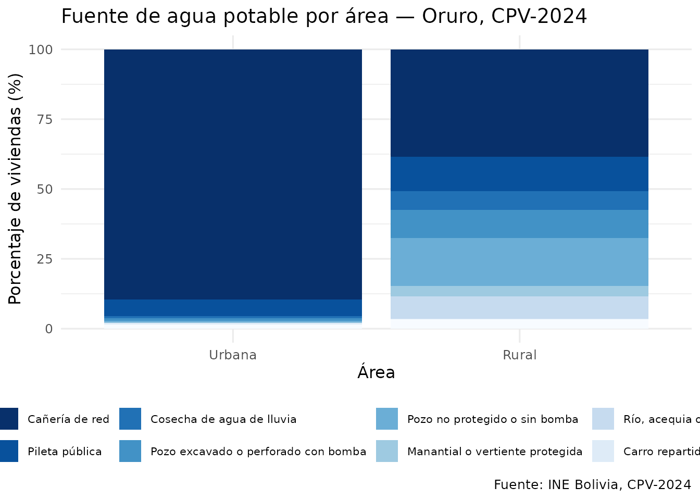
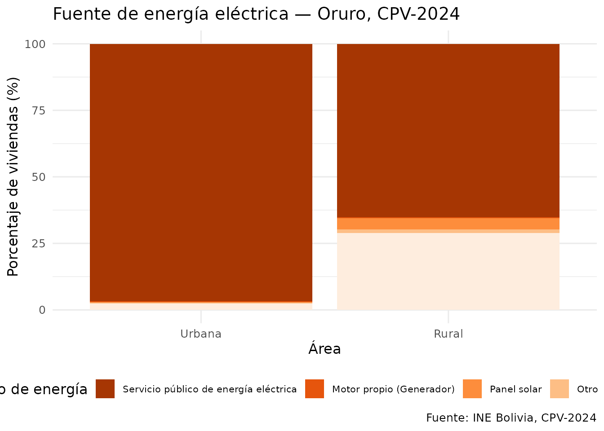
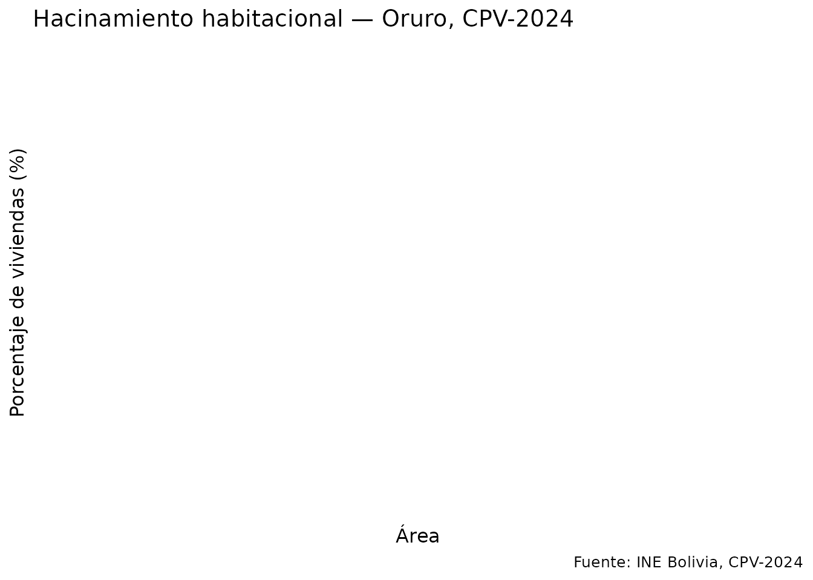
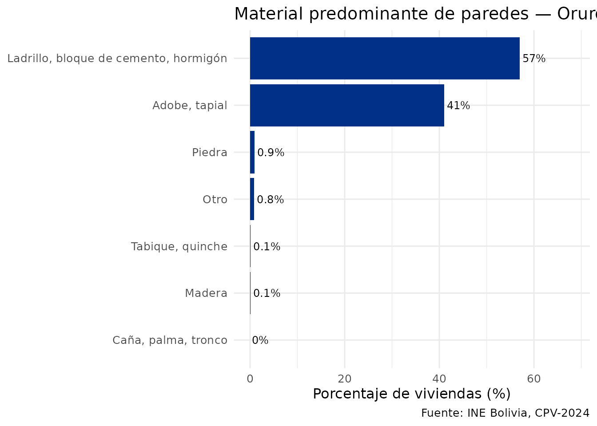

# Análisis de condiciones de vivienda

## Introducción

Esta vignette analiza las condiciones habitacionales usando los datos de
viviendas del CPV-2024. La tabla de viviendas se descarga como un único
archivo (~55 MB) que incluye todos los departamentos.

## Qué cuenta como vivienda

La entidad `vivienda` de REDATAM tiene 4.490.488 registros, pero
**10.287 de ellos no son viviendas**: son personas censadas fuera de una
vivienda, en la calle o en tránsito. El INE no las cuenta como viviendas
en ningún tabulado, y descontarlas da exactamente su total oficial de
**4.480.201 viviendas**.

Por eso
[`get_viviendas_2024()`](https://lab-tecnosocial.github.io/censosbo/reference/get_viviendas_2024.md)
devuelve por defecto el universo oficial. El argumento `universo` da
acceso a los demás:

``` r

tipos_vivienda(2024)
#>    codigo                                         etiqueta       grupo
#> 1       1                                             Casa  particular
#> 2       2                                  Choza, pahuichi  particular
#> 3       3                                     Departamento  particular
#> 4       4             Cuarto(s) o habitación(es) suelta(s)  particular
#> 5       5            Vivienda improvisada o vivienda móvil  particular
#> 6       6       Establecimiento no destinado para vivienda  particular
#> 7       7         Hotel, hostal, residencial o alojamiento   colectiva
#> 8       8               Hospital o clínica con internación   colectiva
#> 9       9     Cuartel o establecimiento militar o policial   colectiva
#> 10     10             Residencia u otro de adultos mayores   colectiva
#> 11     11             Albergue de niñas(os) y adolescentes   colectiva
#> 12     12         Recinto penitenciario o de reintegración   colectiva
#> 13     13                            Campamento de trabajo   colectiva
#> 14     14     Otra (Instituto de rehabilitación, convento)   colectiva
#> 15     15                     Persona que vive en la calle no_vivienda
#> 16     16 En tránsito: terminal, aeropuerto, puerto u otro no_vivienda
#>    en_universo_viviendas
#> 1                   TRUE
#> 2                   TRUE
#> 3                   TRUE
#> 4                   TRUE
#> 5                   TRUE
#> 6                   TRUE
#> 7                   TRUE
#> 8                   TRUE
#> 9                   TRUE
#> 10                  TRUE
#> 11                  TRUE
#> 12                  TRUE
#> 13                  TRUE
#> 14                  TRUE
#> 15                 FALSE
#> 16                 FALSE
```

| `universo` | Registros | Qué es |
|----|---:|----|
| `"viviendas"` | 4.480.201 | El universo oficial del INE (defecto) |
| `"particulares"` | 4.463.773 | Casas, departamentos, chozas, cuartos sueltos… |
| `"colectivas"` | 16.428 | Hoteles, hospitales, cuarteles, recintos penitenciarios… |
| `"todos"` | 4.490.488 | La entidad cruda, con calle y tránsito |

``` r

# El total oficial
nrow(get_viviendas_2024())

# La entidad completa, como la devuelve REDATAM
nrow(get_viviendas_2024(universo = "todos"))

# Solo viviendas colectivas
get_viviendas_2024(universo = "colectivas", variables = "v01_tipoviv") |>
  collect() |>
  count(v01_tipoviv) |>
  etiquetar_valores()
```

Este es también el motivo de una diferencia que aparecía al comparar con
el geoportal
([`get_unidades_2024()`](https://lab-tecnosocial.github.io/censosbo/reference/get_unidades_2024.md)):
agregando por municipio, sus viviendas cuadran con el universo oficial
en los 343 municipios, no con la entidad cruda.

``` r

# Descargar viviendas con variables de habitabilidad
# (se filtra por Oruro después de descargar el archivo completo)
viviendas <- get_viviendas_2024(
  departamento = "Oruro",
  variables    = c("urbrur", "v03_pared", "v05_techo", "v06_piso",
                   "v07_aguapro", "v09_energia", "v11_basura",
                   "v14_dormit", "tot_pers")
) |>
  collect() |>
  etiquetar_valores(columnas = c("urbrur", "v03_pared", "v05_techo", "v06_piso",
                                  "v07_aguapro", "v09_energia", "v11_basura"))
#> ✔ Usando caché: vivienda.parquet
#> ℹ Universo "viviendas": se excluyen los registros de personas en la calle o en
#>   tránsito, que el INE no cuenta como viviendas.
#> ℹ Con `universo = "todos"` obtienes la entidad completa de REDATAM.

nrow(viviendas)
#> [1] 270705
```

## Fuente de agua potable

``` r

agua <- viviendas |>
  filter(!is.na(v07_aguapro), !is.na(urbrur)) |>
  count(urbrur, v07_aguapro) |>
  group_by(urbrur) |>
  mutate(pct = n / sum(n) * 100)

ggplot(agua, aes(x = urbrur, y = pct, fill = v07_aguapro)) +
  geom_col() +
  scale_fill_brewer(palette = "Blues", direction = -1) +
  labs(
    title   = "Fuente de agua potable por área — Oruro, CPV-2024",
    x       = "Área",
    y       = "Porcentaje de viviendas (%)",
    fill    = "Fuente de agua",
    caption = "Fuente: INE Bolivia, CPV-2024"
  ) +
  theme_minimal(base_size = 12) +
  theme(legend.position = "bottom",
        legend.text = element_text(size = 8))
```



## Energía eléctrica

``` r

energia <- viviendas |>
  filter(!is.na(v09_energia), !is.na(urbrur)) |>
  count(urbrur, v09_energia) |>
  group_by(urbrur) |>
  mutate(pct = n / sum(n) * 100)

ggplot(energia, aes(x = urbrur, y = pct, fill = v09_energia)) +
  geom_col() +
  scale_fill_brewer(palette = "Oranges", direction = -1) +
  labs(
    title   = "Fuente de energía eléctrica — Oruro, CPV-2024",
    x       = "Área",
    y       = "Porcentaje de viviendas (%)",
    fill    = "Tipo de energía",
    caption = "Fuente: INE Bolivia, CPV-2024"
  ) +
  theme_minimal(base_size = 12) +
  theme(legend.position = "bottom",
        legend.text = element_text(size = 8))
```



## Índice de hacinamiento

``` r

hacinamiento <- viviendas |>
  filter(!is.na(tot_pers), !is.na(v14_dormit), v14_dormit > 0, tot_pers > 0,
         !is.na(urbrur)) |>
  mutate(
    ppp = tot_pers / v14_dormit,
    nivel = case_when(
      ppp <= 2 ~ "Sin hacinamiento (≤2 p/dormitorio)",
      ppp <= 3 ~ "Hacinamiento medio (2–3)",
      TRUE     ~ "Hacinamiento severo (>3)"
    )
  ) |>
  count(urbrur, nivel) |>
  group_by(urbrur) |>
  mutate(pct = n / sum(n) * 100)

ggplot(hacinamiento, aes(x = urbrur, y = pct, fill = nivel)) +
  geom_col() +
  scale_fill_manual(values = c(
    "Sin hacinamiento (≤2 p/dormitorio)" = "#003087",
    "Hacinamiento medio (2–3)"           = "#F4C430",
    "Hacinamiento severo (>3)"           = "#d7191c"
  )) +
  labs(
    title   = "Hacinamiento habitacional — Oruro, CPV-2024",
    x       = "Área",
    y       = "Porcentaje de viviendas (%)",
    fill    = NULL,
    caption = "Fuente: INE Bolivia, CPV-2024"
  ) +
  theme_minimal(base_size = 12) +
  theme(legend.position = "bottom")
```



## Material de paredes

``` r

paredes <- viviendas |>
  filter(!is.na(v03_pared)) |>
  count(v03_pared, sort = TRUE) |>
  mutate(pct = n / sum(n) * 100)

ggplot(paredes, aes(x = reorder(v03_pared, pct), y = pct)) +
  geom_col(fill = "#003087") +
  geom_text(aes(label = paste0(round(pct, 1), "%")), hjust = -0.1, size = 3.2) +
  coord_flip() +
  ylim(0, max(paredes$pct) * 1.2) +
  labs(
    title   = "Material predominante de paredes — Oruro, CPV-2024",
    x       = NULL,
    y       = "Porcentaje de viviendas (%)",
    caption = "Fuente: INE Bolivia, CPV-2024"
  ) +
  theme_minimal(base_size = 12)
```



## Join personas–viviendas con DuckDB

``` r

library(DBI)

con <- DBI::dbConnect(duckdb::duckdb(), dbdir = ":memory:")
#> duckdb keeps downloaded extensions and secrets in a temporary directory:
#> ℹ /tmp/Rtmps5XzKb/duckdb
#> This is removed when the R session ends.
#> • Extensions are re-downloaded each session.
#> • Secrets are lost.
#> ℹ Run duckdb(shared_home = TRUE) (or create ~/.duckdb) to keep them (suitable for most users).
#> ℹ Run duckdb(shared_home = FALSE) to accept the temporary directory (and silence this message).
#> ℹ See ?duckdb_storage for details and alternatives.

duckdb::duckdb_register_arrow(
  con, "personas",
  get_personas_2024(departamento = "Oruro",
               variables = c("idep","iprov","imun","i00","p25_sexo","p26_edad","nivel_edu"))
)
#> ℹ Descargando persona_dep04.parquet (~14 MB)...
#> ✔ Descargado persona_dep04.parquet [313ms]
duckdb::duckdb_register_arrow(
  con, "viviendas",
  get_viviendas_2024(departamento = "Oruro",
                variables = c("idep","iprov","imun","i00","v07_aguapro","urbrur","tot_pers"))
)
#> ✔ Usando caché: vivienda.parquet

# Personas en viviendas sin acceso a red pública de agua, por área
resultado <- DBI::dbGetQuery(con, "
  SELECT
    v.urbrur,
    COUNT(*)            AS personas,
    ROUND(AVG(p.p26_edad), 1) AS edad_promedio
  FROM personas p
  JOIN viviendas v
    ON p.idep = v.idep AND p.iprov = v.iprov
   AND p.imun = v.imun AND p.i00  = v.i00
  WHERE v.v07_aguapro != 1
  GROUP BY v.urbrur
  ORDER BY personas DESC
")

DBI::dbDisconnect(con, shutdown = TRUE)

resultado |> etiquetar_valores()
#>   urbrur personas edad_promedio
#> 1  Rural   129099          33.6
#> 2 Urbana    30466          26.8
```
