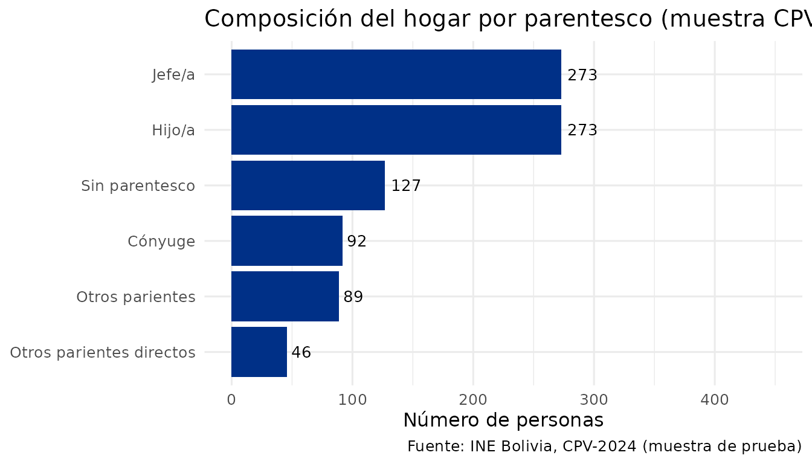
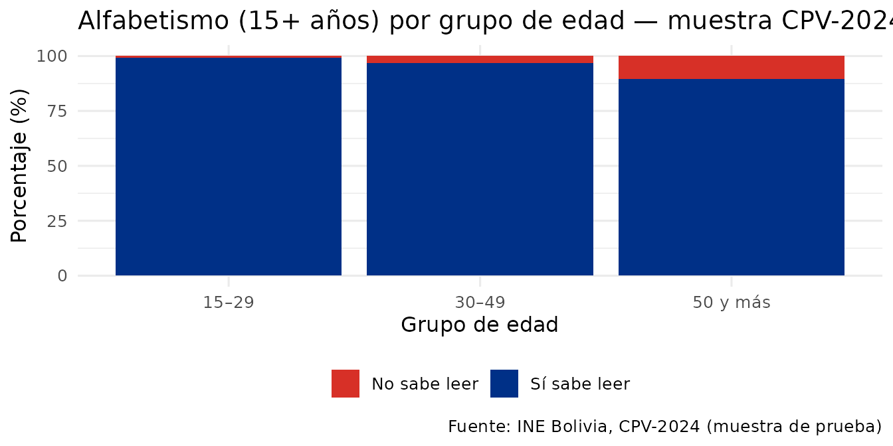

# Análisis de condiciones de vivienda

## Exploración rápida con datos de muestra

Antes de descargar los datos completos, puedes explorar el perfil
demográfico de los hogares con `sample_personas`:

``` r

library(censosbo)
library(dplyr)
#> 
#> Attaching package: 'dplyr'
#> The following objects are masked from 'package:stats':
#> 
#>     filter, lag
#> The following objects are masked from 'package:base':
#> 
#>     intersect, setdiff, setequal, union
library(ggplot2)

# Composición del hogar por relación de parentesco (datos de muestra)
sample_personas |>
  mutate(
    parentes = case_when(
      p24_parentes == 1 ~ "Jefe/a",
      p24_parentes == 2 ~ "Cónyuge",
      p24_parentes == 3 ~ "Hijo/a",
      p24_parentes %in% c(4,5,6) ~ "Otros parientes directos",
      p24_parentes %in% c(7:12) ~ "Otros parientes",
      TRUE ~ "Sin parentesco"
    )
  ) |>
  count(parentes, sort = TRUE) |>
  ggplot(aes(x = reorder(parentes, n), y = n)) +
  geom_col(fill = "#003087") +
  geom_text(aes(label = n), hjust = -0.2, size = 3.5) +
  coord_flip() +
  ylim(0, 450) +
  labs(
    title   = "Composición del hogar por parentesco (muestra CPV-2024)",
    x = NULL, y = "Número de personas",
    caption = "Fuente: INE Bolivia, CPV-2024 (muestra de prueba)"
  ) +
  theme_minimal(base_size = 12)
```



``` r

# Tasa de alfabetismo por grupo de edad (datos de muestra)
sample_personas |>
  filter(p26_edad >= 15) |>
  mutate(
    lee    = ifelse(p40_lee == 1, "Sí sabe leer", "No sabe leer"),
    g_edad = case_when(
      p26_edad < 30 ~ "15–29",
      p26_edad < 50 ~ "30–49",
      TRUE          ~ "50 y más"
    )
  ) |>
  filter(!is.na(lee)) |>
  count(g_edad, lee) |>
  group_by(g_edad) |>
  mutate(pct = n / sum(n) * 100) |>
  ggplot(aes(x = g_edad, y = pct, fill = lee)) +
  geom_col() +
  scale_fill_manual(values = c("Sí sabe leer" = "#003087", "No sabe leer" = "#d73027")) +
  labs(
    title   = "Alfabetismo (15+ años) por grupo de edad — muestra CPV-2024",
    x = "Grupo de edad", y = "Porcentaje (%)", fill = NULL,
    caption = "Fuente: INE Bolivia, CPV-2024 (muestra de prueba)"
  ) +
  theme_minimal(base_size = 12) +
  theme(legend.position = "bottom")
```



------------------------------------------------------------------------

> Los siguientes ejemplos requieren **descargar datos de vivienda**
> (~100 MB). Ejecuta el código en tu sesión de R después de instalar el
> paquete.

## Condiciones habitacionales

``` r

library(dplyr)
library(ggplot2)

# Descargar datos de vivienda de Cochabamba
viviendas_cbba <- get_viviendas(
  departamento = "03",
  variables    = c("urbrur", "v03_pared", "v05_techo", "v06_piso",
                   "v07_aguapro", "v08_aguadist", "v09_energia",
                   "v10_combus", "v11_basura", "v15_servsan")
) |>
  collect()
```

``` r

# Acceso al agua potable por área urbano/rural
agua <- viviendas_cbba |>
  filter(!is.na(v07_aguapro), !is.na(urbrur)) |>
  mutate(
    area  = ifelse(urbrur == 1, "Urbano", "Rural"),
    agua  = case_when(
      v07_aguapro == 1 ~ "Red pública",
      v07_aguapro == 2 ~ "Pozo",
      v07_aguapro == 3 ~ "Río/vertiente",
      v07_aguapro == 4 ~ "Lluvia/otro",
      TRUE             ~ "Otro"
    )
  ) |>
  count(area, agua) |>
  group_by(area) |>
  mutate(pct = n / sum(n) * 100)

ggplot(agua, aes(x = area, y = pct, fill = agua)) +
  geom_col() +
  scale_fill_brewer(palette = "Blues", direction = -1) +
  labs(
    title   = "Fuente de agua potable por área - Cochabamba, CPV-2024",
    x       = "Área",
    y       = "Porcentaje de viviendas (%)",
    fill    = "Fuente de agua",
    caption = "Fuente: INE Bolivia, CPV-2024"
  ) +
  theme_minimal()
```

``` r

# Tipo de energía por área
energia <- viviendas_cbba |>
  filter(!is.na(v09_energia)) |>
  mutate(
    area    = ifelse(urbrur == 1, "Urbano", "Rural"),
    energia = case_when(
      v09_energia == 1 ~ "Red eléctrica",
      v09_energia == 2 ~ "Panel solar",
      v09_energia == 3 ~ "Generador",
      v09_energia == 4 ~ "Gas/leña/vela",
      TRUE             ~ "Sin energía/otro"
    )
  ) |>
  count(area, energia) |>
  group_by(area) |>
  mutate(pct = n / sum(n) * 100)

ggplot(energia, aes(x = area, y = pct, fill = energia)) +
  geom_col() +
  scale_fill_manual(values = c(
    "Red eléctrica"   = "#003087",
    "Panel solar"     = "#F4C430",
    "Generador"       = "#6baed6",
    "Gas/leña/vela"   = "#fd8d3c",
    "Sin energía/otro"= "#d9d9d9"
  )) +
  labs(
    title   = "Fuente de energía eléctrica - Cochabamba, CPV-2024",
    x       = "Área",
    y       = "Porcentaje de viviendas (%)",
    fill    = "Tipo de energía",
    caption = "Fuente: INE Bolivia, CPV-2024"
  ) +
  theme_minimal()
```

## Join personas-viviendas con DuckDB

``` r

library(DBI)

# Conectar ambas tablas en DuckDB para análisis conjunto
con <- DBI::dbConnect(duckdb::duckdb(), dbdir = ":memory:")

duckdb::duckdb_register_arrow(
  con, "personas",
  get_personas(departamento = "03", variables = c("idep","iprov","imun","i00","p25_sexo","p26_edad"))
)
duckdb::duckdb_register_arrow(
  con, "viviendas",
  get_viviendas(departamento = "03", variables = c("idep","iprov","imun","i00","v07_aguapro","urbrur"))
)

# Personas en viviendas sin acceso a red de agua pública
sin_agua <- DBI::dbGetQuery(con, "
  SELECT
    p.idep,
    v.urbrur,
    COUNT(*) AS personas,
    AVG(p.p26_edad) AS edad_promedio
  FROM personas p
  JOIN viviendas v
    ON p.idep = v.idep AND p.iprov = v.iprov
   AND p.imun = v.imun AND p.i00  = v.i00
  WHERE v.v07_aguapro != 1  -- sin red pública
  GROUP BY p.idep, v.urbrur
  ORDER BY personas DESC
")

DBI::dbDisconnect(con)
print(sin_agua)
```

## Índice de hacinamiento

``` r

viviendas_hab <- get_viviendas(
  departamento = "03",
  variables    = c("urbrur", "v13_habitac", "v14_dormit", "tot_pers")
) |>
  collect()

hacinamiento <- viviendas_hab |>
  filter(!is.na(tot_pers), !is.na(v14_dormit), v14_dormit > 0, tot_pers > 0) |>
  mutate(
    personas_por_dormitorio = tot_pers / v14_dormit,
    hacinamiento = case_when(
      personas_por_dormitorio <= 2 ~ "Sin hacinamiento (<=2)",
      personas_por_dormitorio <= 3 ~ "Hacinamiento medio (2-3)",
      TRUE                         ~ "Hacinamiento severo (>3)"
    ),
    area = ifelse(urbrur == 1, "Urbano", "Rural")
  ) |>
  count(area, hacinamiento) |>
  group_by(area) |>
  mutate(pct = n / sum(n) * 100)

ggplot(hacinamiento, aes(x = area, y = pct, fill = hacinamiento)) +
  geom_col() +
  scale_fill_manual(values = c(
    "Sin hacinamiento (<=2)"    = "#003087",
    "Hacinamiento medio (2-3)"  = "#F4C430",
    "Hacinamiento severo (>3)"  = "#d7191c"
  )) +
  labs(
    title   = "Hacinamiento habitacional - Cochabamba, CPV-2024",
    x       = "Área",
    y       = "Porcentaje de viviendas (%)",
    fill    = "Categoría",
    caption = "Fuente: INE Bolivia, CPV-2024"
  ) +
  theme_minimal()
```
