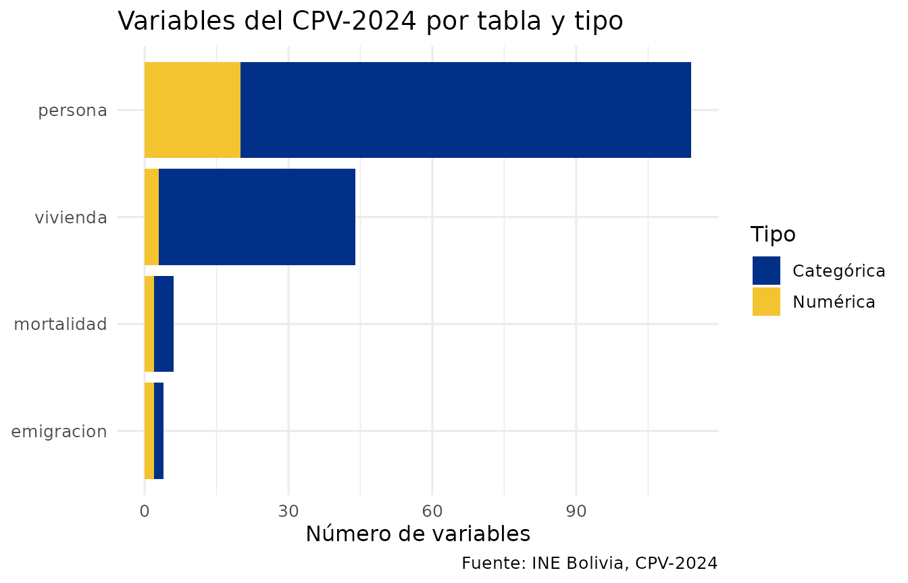
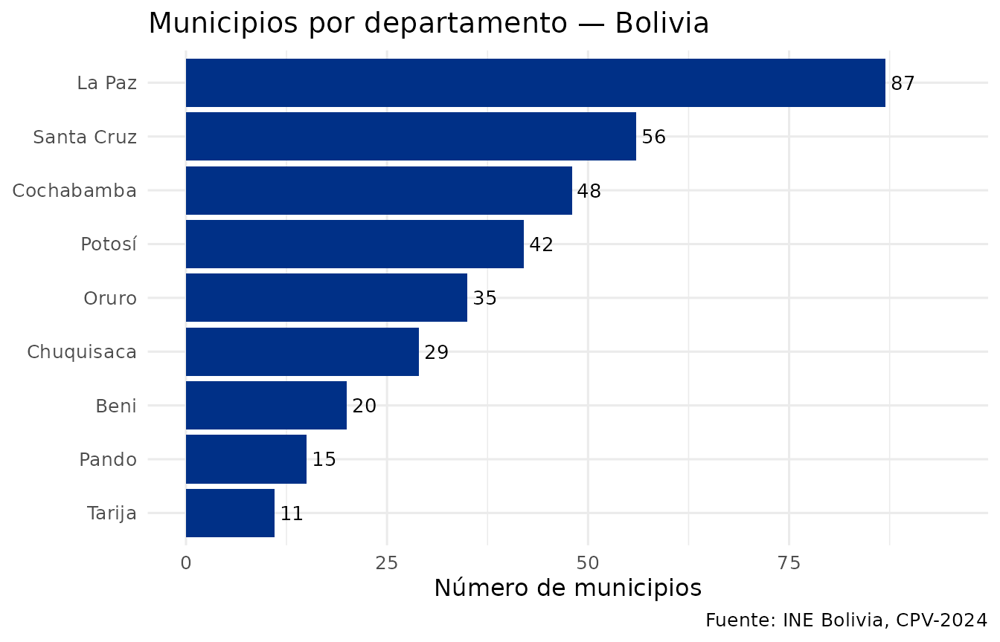
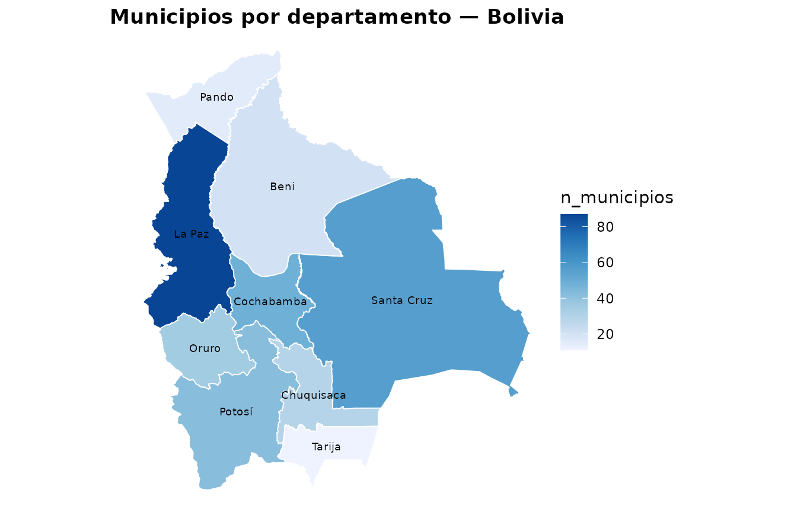

# Introducción a censosbo

## ¿Qué es censosbo?

`censosbo` es un paquete de R que facilita el acceso a los microdatos de
los **censos de Bolivia** (1976, 1992, 2001, 2012 y CPV-2024),
publicados por el Instituto Nacional de Estadística (INE).

Los datos se distribuyen como archivos **Parquet** comprimidos, que se
descargan **bajo demanda** y se guardan en un caché local. No es
necesario descargar todo: se puede pedir solo el departamento de
interés.

## Instalación

``` r

remotes::install_github("lab-tecnosocial/censosbo")
```

## Censos disponibles

| Año | Función | Registros | Variables | Disco (Parquet) | RAM (aprox.)¹ |
|:--:|----|---:|---:|---:|---:|
| **1976** | [`get_poblacion_1976()`](https://lab-tecnosocial.github.io/censosbo/reference/get_censo.md) | 4,613,419 | 46 | 63 MB | 83 MB |
| **1976** | [`get_viviendas_1976()`](https://lab-tecnosocial.github.io/censosbo/reference/get_censo.md) | 1,158,482 | 28 | 7 MB | 9 MB |
| **1992** | [`get_personas_1992()`](https://lab-tecnosocial.github.io/censosbo/reference/get_censo.md) | 6,420,792 | 54 | 135 MB | 238 MB |
| **1992** | [`get_viviendas_1992()`](https://lab-tecnosocial.github.io/censosbo/reference/get_censo.md) | 1,706,107 | 44 | 29 MB | 43 MB |
| **1992** | [`get_mortalidad_1992()`](https://lab-tecnosocial.github.io/censosbo/reference/get_censo.md) | 1,706,107 | 14 | 17 MB | 36 MB |
| **2001** | [`get_personas_2001()`](https://lab-tecnosocial.github.io/censosbo/reference/get_censo.md) | 8,274,325 | 66 | 136 MB | 316 MB |
| **2001** | [`get_viviendas_2001()`](https://lab-tecnosocial.github.io/censosbo/reference/get_censo.md) | 2,290,414 | 39 | 20 MB | 37 MB |
| **2001** | `get_censo(2001, "comunidades_poblacion")` | 14,620 | 103 | 1 MB | 2 MB |
| **2001** | `get_censo(2001, "comunidades_vivienda")` | 14,611 | 94 | \<1 MB | 1 MB |
| **2012** | [`get_personas_2012()`](https://lab-tecnosocial.github.io/censosbo/reference/get_censo.md) | 10,059,856 | 33 | 146 MB | 279 MB |
| **2012** | [`get_viviendas_2012()`](https://lab-tecnosocial.github.io/censosbo/reference/get_censo.md) | 3,172,321 | 32 | 38 MB | 58 MB |
| **2012** | [`get_emigracion_2012()`](https://lab-tecnosocial.github.io/censosbo/reference/get_censo.md) | 489,559 | 6 | 5 MB | 11 MB |
| **2012** | [`get_discapacidad_2012()`](https://lab-tecnosocial.github.io/censosbo/reference/get_censo.md) | 342,929 | 8 | 4 MB | 8 MB |
| **2024**² | [`get_personas_2024()`](https://lab-tecnosocial.github.io/censosbo/reference/get_personas_2024.md) | 11,365,333 | 118 | 283 MB | ~490 MB |
| **2024**² | [`get_viviendas_2024()`](https://lab-tecnosocial.github.io/censosbo/reference/get_viviendas_2024.md) | 4,490,488 | 48 | 55 MB | ~111 MB |
| **2024**² | [`get_emigracion_2024()`](https://lab-tecnosocial.github.io/censosbo/reference/get_emigracion_2024.md) | 500,914 | 8 | 2 MB | ~7 MB |
| **2024**² | [`get_mortalidad_2024()`](https://lab-tecnosocial.github.io/censosbo/reference/get_mortalidad_2024.md) | 382,731 | 10 | 2 MB | ~5 MB |

¹ Tamaño al cargar la tabla completa con
[`collect()`](https://dplyr.tidyverse.org/reference/compute.html) sin
filtros, medido desde metadatos Parquet. ² Persona 2024 está
particionada en 9 archivos por departamento (4–77 MB cada uno). Disco y
RAM muestran el total; en la práctica se descarga solo el/los
departamentos necesarios.

El formato **Arrow** (defecto) mantiene los datos en disco hasta que se
llama [`collect()`](https://dplyr.tidyverse.org/reference/compute.html).
Las tablas del CPV-2024 se unen con la clave compuesta
`idep + iprov + imun + i00` (identificador de hogar).

## Diccionario de variables

El paquete incluye un diccionario completo de las 168 variables del
CPV-2024 con etiquetas en español, disponible sin necesidad de descargar
nada:

``` r

# Distribución de variables por tabla y tipo
codebook_meta |>
  count(tabla, tipo) |>
  ggplot(aes(x = reorder(tabla, n), y = n, fill = tipo)) +
  geom_col() +
  coord_flip() +
  scale_fill_manual(
    values = c(categorica = "#003087", numerica = "#F4C430"),
    labels = c(categorica = "Categórica", numerica = "Numérica")
  ) +
  labs(
    title   = "Variables del CPV-2024 por tabla y tipo",
    x       = NULL, y = "Número de variables", fill = "Tipo",
    caption = "Fuente: INE Bolivia, CPV-2024"
  ) +
  theme_minimal(base_size = 12)
```



``` r

# Buscar variables relacionadas con educación
codebook(buscar = "educa")
#>          variable
#> 40    p39_tipoest
#> 42     p41a_nivel
#> 43     p41b_curso
#> 79 p41a_nivel_act
#> 81      nivel_edu
#> 83         asiste
#> 84       gedadedu
#>                                                                                                              etiqueta
#> 40                                                        39. El centro o establecimiento educativo al que asiste es:
#> 42                                    41.A. Cuál es el último curso o año que aprobó y en que nivel educativo (Nivel)
#> 43                              41.B. Cuál es el último curso o año que aprobó y en que nivel educativo (Curso o Año)
#> 79                                                   Nivel educativo alcanzado: sistema actual (5 o más años de edad)
#> 81 Nivel educativo alcanzado agrupado (19 o más años de edad, residentes en el país y que respondieron a la pregunta)
#> 83                                      Asistencia educativa (residentes en el país y que respondieron a la pregunta)
#> 84                  Grupo de edad según asistencia educativa (residentes en el país y que respondieron a la pregunta)
#>      tabla       tipo
#> 40 persona categorica
#> 42 persona categorica
#> 43 persona   numerica
#> 79 persona categorica
#> 81 persona categorica
#> 83 persona categorica
#> 84 persona categorica
#>                                                                                                                                                                                                                                        valores_codigos
#> 40                                                                                                                                                                                            1, 2, 9, Público o de convenio, Privado, Sin especificar
#> 42 1, 2, 3, 4, 5, 6, 7, 8, 9, 10, 11, 12, 13, 99, Ninguno, Curso de alfabetización, Inicial (Pre kínder, kínder), Básico, Intermedio, Medio, Primaria, Secundaria, Técnico Medio, Técnico Superior, Licenciatura, Maestría, Doctorado, Sin especificar
#> 43                                                                                                                                                                                                                                                NULL
#> 79                                     1, 2, 3, 7, 8, 9, 10, 11, 12, 13, 99, Ninguno, Curso de Alfabetización, Inicial (Pre kínder, kínder), Primaria, Secundaria, Técnico Medio, Técnico Superior, Licenciatura, Maestría, Doctorado, Sin especificar
#> 81                                                                                                                                                                                                 1, 2, 3, 4, Ninguno, Primaria, Secundaria, Superior
#> 83                                                                                                                                                                                                                                        1, 2, Sí, No
#> 84                                                                                                                                                                      1, 2, 3, 4, 5, 6, 7, 0 - 3, 4 - 5, 6 - 11, 12 - 17, 18 - 24, 25 - 59, 60 o más
```

``` r

# Ver los códigos de una variable categórica
codebook_valores("p25_sexo")
#>   codigo etiqueta
#> 1      1    Mujer
#> 2      2   Hombre
```

## Etiquetas en los resultados

Los datos del censo usan códigos numéricos. El paquete ofrece dos
funciones para hacerlos legibles:

- [`etiquetar_valores()`](https://lab-tecnosocial.github.io/censosbo/reference/etiquetar_valores.md)
  — convierte los **códigos** a etiquetas en español (1 → “Mujer”)
- [`etiquetar_variables()`](https://lab-tecnosocial.github.io/censosbo/reference/etiquetar_variables.md)
  — renombra las **columnas** con sus descripciones del INE

``` r

# Ejemplo con los datos de geografía incluidos en el paquete
codebook_meta |>
  filter(tabla == "persona", tipo == "categorica") |>
  head(5) |>
  select(variable, etiqueta, tipo)
#>       variable
#> 1 p24_parentes
#> 2     p25_sexo
#> 3       p28_cn
#> 4       p29_ci
#> 5  p30a_public
#>                                                                                etiqueta
#> 1                                 24. Que parentesco tiene con la jefa o jefe del hogar
#> 2                                                                 25. Es mujer u hombre
#> 3                        28. Su nacimiento está inscrito en el registro civil boliviano
#> 4                                        29. Tiene o tuvo cédula de identidad boliviana
#> 5 30.A. Cuando tiene problemas de salud acude a Puesto/centro/hospital de salud público
#>         tipo
#> 1 categorica
#> 2 categorica
#> 3 categorica
#> 4 categorica
#> 5 categorica
```

En los siguientes ejemplos se aplican después de
[`collect()`](https://dplyr.tidyverse.org/reference/compute.html):

``` r

get_personas_2024(departamento = "La Paz") |>
  count(p25_sexo, nivel_edu) |>
  collect() |>
  etiquetar_valores()    # 1 → "Mujer", 2 → "Hombre"; 1 → "Ninguno", etc.

# Para reportes: también renombrar columnas
get_personas_2024(departamento = "La Paz") |>
  count(p25_sexo) |>
  collect() |>
  etiquetar_valores() |>
  etiquetar_variables()  # "p25_sexo" → "25. Es mujer u hombre"
```

## Geografía: departamentos, provincias y municipios

El paquete incluye la división político-administrativa completa de
Bolivia sin necesidad de descargar nada:

``` r

departamentos()
#>     idep nombre_dep
#> 1     01 Chuquisaca
#> 30    02     La Paz
#> 117   03 Cochabamba
#> 165   04      Oruro
#> 200   05     Potosí
#> 242   06     Tarija
#> 253   07 Santa Cruz
#> 309   08       Beni
#> 329   09      Pando
```

``` r

geo_bolivia |>
  count(idep, nombre_dep, name = "municipios") |>
  ggplot(aes(x = reorder(nombre_dep, municipios), y = municipios)) +
  geom_col(fill = "#003087") +
  geom_text(aes(label = municipios), hjust = -0.2, size = 3.5) +
  coord_flip() +
  ylim(0, 95) +
  labs(
    title   = "Municipios por departamento — Bolivia",
    x       = NULL, y = "Número de municipios",
    caption = "Fuente: INE Bolivia, CPV-2024"
  ) +
  theme_minimal(base_size = 12)
```



``` r

# Variables de la tabla de emigración
codebook(tabla = "emigracion")
#>             variable                           etiqueta      tabla       tipo
#> 159        e203_sexo               20.3. La persona es: emigracion categorica
#> 160       e204_ansal    20.4. En qué año salió del país emigracion   numerica
#> 161        e205_edad            20.5. A qué edad se fue emigracion   numerica
#> 162 pais_destino_cod 20.2. En que país vive actualmente emigracion categorica
#>                                                                                                                                                                                                                                                                                                                                                                                                                                                                                                                                                                                                                                                                                                                                                                                                                                                                                                                                                                                                                                                                                                                                                                                                                                                                                                                                                                                                                                                                                                                                                                                                                                                                                                                                                                                                                                                                                                                                                                                                                                                                                                                                                                                                                                                                                                                                                                                                                                                                                                                                                                                                                                                                                                                                                                                                                                                                                                                                                                                                                                                                                                                                                                                                                                                                                                                                                                                                                                                                                                                                                                                                                                                                                                                                                                                                                                                                                                                                                                                                                                                                                                                                                                                                                                                                                                                                                                                                                                                                                                                                                                                                                                                                                                                                                                                                                                                                                                   valores_codigos
#> 159                                                                                                                                                                                                                                                                                                                                                                                                                                                                                                                                                                                                                                                                                                                                                                                                                                                                                                                                                                                                                                                                                                                                                                                                                                                                                                                                                                                                                                                                                                                                                                                                                                                                                                                                                                                                                                                                                                                                                                                                                                                                                                                                                                                                                                                                                                                                                                                                                                                                                                                                                                                                                                                                                                                                                                                                                                                                                                                                                                                                                                                                                                                                                                                                                                                                                                                                                                                                                                                                                                                                                                                                                                                                                                                                                                                                                                                                                                                                                                                                                                                                                                                                                                                                                                                                                                                                                                                                                                                                                                                                                                                                                                                                                                                                                                                                                                                                       1, 2, 9, Mujer, Hombre, Sin Especificar
#> 160                                                                                                                                                                                                                                                                                                                                                                                                                                                                                                                                                                                                                                                                                                                                                                                                                                                                                                                                                                                                                                                                                                                                                                                                                                                                                                                                                                                                                                                                                                                                                                                                                                                                                                                                                                                                                                                                                                                                                                                                                                                                                                                                                                                                                                                                                                                                                                                                                                                                                                                                                                                                                                                                                                                                                                                                                                                                                                                                                                                                                                                                                                                                                                                                                                                                                                                                                                                                                                                                                                                                                                                                                                                                                                                                                                                                                                                                                                                                                                                                                                                                                                                                                                                                                                                                                                                                                                                                                                                                                                                                                                                                                                                                                                                                                                                                                                                                                                          NULL
#> 161                                                                                                                                                                                                                                                                                                                                                                                                                                                                                                                                                                                                                                                                                                                                                                                                                                                                                                                                                                                                                                                                                                                                                                                                                                                                                                                                                                                                                                                                                                                                                                                                                                                                                                                                                                                                                                                                                                                                                                                                                                                                                                                                                                                                                                                                                                                                                                                                                                                                                                                                                                                                                                                                                                                                                                                                                                                                                                                                                                                                                                                                                                                                                                                                                                                                                                                                                                                                                                                                                                                                                                                                                                                                                                                                                                                                                                                                                                                                                                                                                                                                                                                                                                                                                                                                                                                                                                                                                                                                                                                                                                                                                                                                                                                                                                                                                                                                                                          NULL
#> 162 4, 8, 12, 16, 20, 24, 28, 31, 32, 36, 40, 44, 48, 50, 51, 52, 56, 60, 64, 68, 70, 72, 76, 84, 90, 92, 96, 100, 104, 108, 112, 116, 120, 124, 132, 136, 140, 144, 148, 152, 156, 158, 162, 166, 170, 174, 175, 178, 180, 184, 188, 191, 192, 196, 203, 204, 208, 212, 214, 218, 222, 226, 231, 232, 233, 234, 238, 239, 242, 246, 248, 250, 254, 258, 260, 262, 266, 268, 270, 275, 276, 288, 292, 296, 300, 304, 308, 312, 316, 320, 324, 328, 332, 336, 340, 344, 348, 352, 356, 360, 364, 368, 372, 376, 380, 384, 388, 392, 398, 400, 404, 408, 410, 414, 417, 418, 422, 426, 428, 430, 434, 438, 440, 442, 446, 450, 454, 458, 462, 466, 470, 474, 478, 480, 484, 492, 496, 498, 499, 500, 504, 508, 512, 516, 520, 524, 528, 531, 533, 534, 535, 540, 548, 554, 558, 562, 566, 570, 574, 578, 580, 583, 584, 585, 586, 591, 598, 600, 604, 608, 612, 616, 620, 624, 626, 630, 634, 638, 642, 643, 646, 652, 654, 659, 660, 662, 663, 666, 670, 674, 678, 682, 686, 688, 689, 690, 694, 702, 703, 704, 705, 706, 710, 716, 724, 728, 729, 732, 740, 744, 748, 752, 756, 760, 762, 764, 768, 772, 776, 780, 784, 788, 792, 795, 796, 798, 800, 804, 807, 818, 826, 831, 832, 833, 834, 840, 850, 854, 858, 860, 862, 876, 882, 887, 894, 987, 988, 991, 992, 993, 994, 995, 996, 997, 998, 999, Afganistán, Albania, Argelia, Samoa Americana, Andorra, Angola, Antigua y Barbuda, Azerbaiyán, Argentina, Australia, Austria, Bahamas, Bahrein, Bangladesh, Armenia, Barbados, Bélgica, Bermuda, Bhután, Bolivia (Estado Plurinacional de, Bosnia y Herzegovina, Botswana, Brasil, Belice, Islas Salomón, Islas Vírgenes Británicas, Brunei Darussalam, Bulgaria, Myanmar, Burundi, Belarús, Camboya, Camerún, Canadá, Cabo Verde, Islas Caimán, República Centroafricana, Sri Lanka, Chad, Chile, China, Taiwán (Provincia de China), Isla Christmas, Islas Cocos (Keeling), Colombia, Comoras, Mayotte, Congo, República Democrática del Congo, Islas Cook, Costa Rica, Croacia, Cuba, Chipre, República Checa, Benin, Dinamarca, Dominica, República Dominicana, Ecuador, El Salvador, Guinea Ecuatorial, Etiopía, Eritrea, Estonia, Islas Feroe, Islas Malvinas (Falkland), Georgia del Sur y las Islas Sandwich del Sur, Fiji, Finlandia, Islas Åland, Francia, Guayana Francesa, Polinesia Francesa, Territorio de las Tierras Australes Francesas, Djibouti, Gabón, Georgia, Gambia, Estado de Palestina, Alemania, Ghana, Gibraltar, Kiribati, Grecia, Groenlandia, Granada, Guadalupe, Guam, Guatemala, Guinea, Guyana, Haití, Santa Sede, Honduras, China, región administrativa especial de Hong Kong, Hungría, Islandia, India, Indonesia, Irán (República Islámica del), Iraq, Irlanda, Israel, Italia, Costa de Marfil, Jamaica, Japón, Kazajstán, Jordania, Kenya, República Popular Democrática de Corea, República de Corea, Kuwait, Kirguistán, República Democrática Popular Lao, Líbano, Lesotho, Letonia, Liberia, Libia, Liechtenstein, Lituania, Luxemburgo, China, región administrativa especial de Macao, Madagascar, Malawi, Malasia, Maldivas, Malí, Malta, Martinica, Mauritania, Mauricio, México, Mónaco, Mongolia, República de Moldova, Montenegro, Montserrat, Marruecos, Mozambique, Omán, Namibia, Nauru, Nepal, Países Bajos, Curazao, Aruba, San Martín (parte Holandesa), Bonaire, San Eustaquio y Saba, Nueva Caledonia, Vanuatu, Nueva Zelandia, Nicaragua, Níger, Nigeria, Niue, Isla Norfolk, Noruega, Islas Marianas Septentrionales, Micronesia (Estados Federados de), Islas Marshall, Palau, Pakistán, Panamá, Papua Nueva Guinea, Paraguay, Perú, Filipinas, Pitcairn, Polonia, Portugal, Guinea-Bissau, Timor-Leste, Puerto Rico, Qatar, Reunión, Rumania, Federación de Rusia, Rwanda, San Barthélemy, Santa Elena, Saint Kitts y Nevis, Anguila, Santa Lucía, San Martín (parte francesa), San Pedro y Miquelón, San Vicente y las Granadinas, San Marino, Santo Tomé y Príncipe, Arabia Saudita, Senegal, Serbia, Kosovo, Seychelles, Sierra Leona, Singapur, Eslovaquia, Viet Nam, Eslovenia, Somalia, Sudáfrica, Zimbabwe, España, Sudán del Sur, Sudán, Sáhara Occidental, Suriname, Islas Svalbard y Jan Mayen, Eswatini, Suecia, Suiza, República Árabe Siria, Tayikistán, Tailandia, Togo, Tokelau, Tonga, Trinidad y Tobago, Emiratos Árabes Unidos, Túnez, Turquía, Turkmenistán, Islas Turcas y Caicos, Tuvalu, Uganda, Ucrania, Macedonia del Norte, Egipto, Reino Unido de Gran Bretaña e Irlanda del Norte, Guernsey, Jersey, Isla de Man, República Unida de Tanzanía, Estados Unidos de América, Islas Vírgenes de los Estados Unidos, Burkina Faso, Uruguay, Uzbekistán, Venezuela (República Bolivariana de), Islas Wallis y Futuna, Samoa, Yemen, Zambia, Caracteres aleatorios o descripción ilegible, Otro municipio, África, América, Asia, Europa, Oceanía, Otro país extranjero, No corresponde a país, No sabe, Sin Especificar
```

## Mapas coropléticos

El paquete incluye geometrías sf para los 9 departamentos
(`geo_departamentos`) y 336 municipios (`geo_municipios`) de Bolivia,
disponibles sin descarga. La función
[`mapa_dep()`](https://lab-tecnosocial.github.io/censosbo/reference/mapa_dep.md)
genera mapas coropléticos a nivel departamental:

``` r

# Número de municipios por departamento (solo usa datos incluidos en el paquete)
mun_x_dep <- geo_bolivia |>
  count(idep, name = "n_municipios")

mapa_dep(mun_x_dep, "n_municipios",
         titulo          = "Municipios por departamento — Bolivia",
         mostrar_nombres = TRUE)
#> Warning: st_centroid assumes attributes are constant over geometries
#> Warning in st_point_on_surface.sfc(sf::st_zm(x)): st_point_on_surface may not
#> give correct results for longitude/latitude data
```



Para mapas a nivel municipal con ejemplos usando datos reales del
CPV-2024, ver la viñeta **[Visualización en
mapas](https://lab-tecnosocial.github.io/censosbo/articles/visualizacion-mapas.md)**.

## Primera descarga de microdatos (CPV-2024)

``` r

# Descargar datos de Santa Cruz (~155 MB, se guarda en caché)
personas_sc <- get_personas_2024(departamento = "Santa Cruz")
personas_sc
#> FileSystemDataset with 1 Parquet file
#> 118 columns
```

El resultado por defecto es un **Arrow Dataset** — los datos quedan en
disco, no en RAM.

## Filtros geográficos

``` r

# CPV-2024
get_personas_2024(departamento = "La Paz")
get_personas_2024(departamento = c("La Paz", "Cochabamba", "Santa Cruz"))
get_personas_2024(departamento = "Santa Cruz", provincia = "01")
get_personas_2024(departamento = "Santa Cruz", municipio = "01")

# Censos históricos — mismos argumentos
get_personas_2012(departamento = "La Paz")
get_censo(2001, "persona", departamento = "Santa Cruz", municipio = "01")
```

## Selección de variables

``` r

get_personas_2024(
  departamento = "Santa Cruz",
  variables    = c("p25_sexo", "p26_edad", "nivel_edu")
)
# Las columnas idep, iprov, imun, i00 siempre se incluyen
```

## Formatos de retorno

``` r

# Arrow (defecto): lazy, no carga en RAM
ds <- get_personas_2024(departamento = "Santa Cruz", as = "arrow")

# tibble: trae a RAM (cuidado con departamentos grandes)
df <- get_personas_2024(departamento = "Pando", as = "tibble")

# DuckDB: conexión SQL
con <- get_personas_2024(departamento = "Santa Cruz", as = "duckdb")
DBI::dbGetQuery(con, "SELECT COUNT(*) FROM personas")
DBI::dbDisconnect(con)
```

## Uso con dplyr

Arrow es compatible con `dplyr`. Usa
[`etiquetar_valores()`](https://lab-tecnosocial.github.io/censosbo/reference/etiquetar_valores.md)
después de
[`collect()`](https://dplyr.tidyverse.org/reference/compute.html):

``` r

# Distribución por sexo con etiquetas
get_personas_2024(departamento = "Cochabamba") |>
  count(p25_sexo) |>
  collect() |>
  etiquetar_valores()
#>   p25_sexo       n
#>   <fct>      <int>
#> 1 Mujer    831062
#> 2 Hombre   855433

# Grupos quinquenales de edad (usar %/% — cut() no es compatible con Arrow)
get_personas_2024(departamento = "Santa Cruz") |>
  filter(!is.na(p26_edad), !is.na(p25_sexo)) |>
  mutate(grupo_edad = (p26_edad %/% 5L) * 5L) |>
  count(grupo_edad, p25_sexo) |>
  collect() |>
  etiquetar_valores()
```

## Consultas SQL con DuckDB

``` r

library(DBI)

con <- get_personas_2024(departamento = "Santa Cruz", as = "duckdb")

DBI::dbGetQuery(con, "
  SELECT p25_sexo, COUNT(*) AS total, ROUND(AVG(p26_edad), 1) AS edad_prom
  FROM personas
  GROUP BY p25_sexo
  ORDER BY p25_sexo
") |> etiquetar_valores()
#> p25_sexo   total edad_prom
#>    Mujer 1234567      29.1
#>   Hombre 1212345      28.8

DBI::dbDisconnect(con)
```

## Censos históricos

Para acceder a censos anteriores al 2024, usa
[`get_censo()`](https://lab-tecnosocial.github.io/censosbo/reference/get_censo.md)
o las funciones cortas por año:

``` r

# API genérica
get_censo(2012, "persona", departamento = "07")
get_censo(1992, "vivienda", departamento = "La Paz")

# Funciones cortas equivalentes
get_personas_2012(departamento = "07")
get_viviendas_1992(departamento = "La Paz")

# Codebook para censos históricos
codebook_2012(buscar = "educacion")
codebook_1976()  # ver todas las variables del censo 1976
```

Ver la viñeta **[Censos
históricos](https://lab-tecnosocial.github.io/censosbo/articles/censos-historicos.md)**
para ejemplos completos.

## Gestión del caché

``` r

# Guardar caché dentro del proyecto (recomendado)
options(censosbo.cache_dir = "data/censosbo")
```

``` r

censosbo_cache_dir()
#> [1] "/home/runner/.cache/R/censosbo"
```

``` r

censosbo_cache_info()
censosbo_cache_clear()
```

## Siguientes pasos

- **[Visualización en
  mapas](https://lab-tecnosocial.github.io/censosbo/articles/visualizacion-mapas.md)**:
  mapas coropléticos por departamento y municipio.
- **[Análisis
  demográfico](https://lab-tecnosocial.github.io/censosbo/articles/analisis-demografico.md)**:
  pirámide de edades, nivel educativo, alfabetismo.
- **[Análisis de
  vivienda](https://lab-tecnosocial.github.io/censosbo/articles/analisis-vivienda.md)**:
  agua, energía, hacinamiento, joins personas-viviendas.
- **[Análisis
  avanzado](https://lab-tecnosocial.github.io/censosbo/articles/analisis-avanzado.md)**:
  DuckDB, Arrow, datos más grandes que la RAM.
- **[Censos
  históricos](https://lab-tecnosocial.github.io/censosbo/articles/censos-historicos.md)**:
  acceso a datos de 1976, 1992, 2001 y 2012.
- **[Análisis
  longitudinal](https://lab-tecnosocial.github.io/censosbo/articles/analisis-longitudinal.md)**:
  comparar variables entre censos históricos.

## Fuente de datos y nota metodológica

Los microdatos originales son publicados por el **Instituto Nacional de
Estadística (INE) de Bolivia**:

- **CPV-2024**:
  <https://cpv2024.ine.gob.bo/index.php/principal/descargas/>
- **Censos históricos 1976–2012**:
  <https://www.ine.gob.bo/index.php/censos-y-banco-de-datos/censos/>

Los archivos originales se distribuyeron en formatos heterogéneos y
fueron transformados a **Parquet** (compresión zstd nivel 6) para su
distribución en este paquete:

| Censo | Formato original | Conversión |
|----|----|----|
| 1976 | SPSS (`.sav`) | `pyreadstat` + `pyarrow` |
| 1992 | REDATAM (`.dic` binario + `.rbf`) | `open-redatam` CLI → CSV → Parquet |
| 2001 | REDATAM (`.wxp` → `.dicX`) | script `.wxp`→`.dicX` + `open-redatam` → CSV → Parquet |
| 2012 | REDATAM (`.dic` binario + `.ptr`) | `open-redatam` CLI → CSV → Parquet |
| 2024 | CSV delimitado por `;` (~3.6 GB total) | `pandas` + `pyarrow`; persona particionada por departamento |

El formato Parquet conserva todos los registros y variables originales
sin modificación de valores. Los scripts de conversión están en
`data-raw/` del
[repositorio](https://github.com/lab-tecnosocial/censosbo).

## Cómo citar

``` r

citation("censosbo")
```

> Ojeda Copa, A. (2026). *censosbo: Acceso y análisis de los censos de
> Bolivia (1976–2024)*. R package version 1.0.0.
> <https://github.com/lab-tecnosocial/censosbo>
