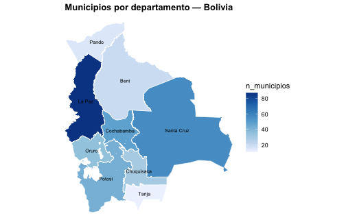

# Introducción a censosbo

## ¿Qué es censosbo?

`censosbo` es un paquete de R que facilita el acceso a los microdatos de
los **censos de Bolivia** (1976, 1992, 2001, 2012 y CPV-2024),
publicados por el Instituto Nacional de Estadística (INE).

Los datos se distribuyen como archivos **Parquet** comprimidos, que se
descargan **bajo demanda** y se guardan en un caché local. No es
necesario descargar todo: se puede pedir solo el departamento de
interés.

## Instalación

``` r

install.packages("censosbo")
```

## Censos disponibles

| Año | Función | Registros | Columnas | Disco (Parquet) | RAM (aprox.)¹ |
|:--:|----|---:|---:|---:|---:|
| **1976** | [`get_poblacion_1976()`](https://lab-tecnosocial.github.io/censosbo/reference/get_censo.md) | 4,613,419 | 48 | 46 MB | ~890 MB |
| **1976** | [`get_viviendas_1976()`](https://lab-tecnosocial.github.io/censosbo/reference/get_censo.md) | 1,158,482⁴ | 29 | 5 MB | ~135 MB |
| **1992** | [`get_personas_1992()`](https://lab-tecnosocial.github.io/censosbo/reference/get_censo.md) | 6,420,792 | 58 | 99 MB | ~1,5 GB |
| **1992** | [`get_viviendas_1992()`](https://lab-tecnosocial.github.io/censosbo/reference/get_censo.md) | 1,701,168⁴ | 47 | 20 MB | ~330 MB |
| **1992** | [`get_mortalidad_1992()`](https://lab-tecnosocial.github.io/censosbo/reference/get_censo.md) | 1,706,107 | 17 | 11 MB | ~125 MB |
| **2001** | [`get_personas_2001()`](https://lab-tecnosocial.github.io/censosbo/reference/get_censo.md) | 8,274,325 | 70 | 135 MB | ~2,5 GB |
| **2001** | [`get_viviendas_2001()`](https://lab-tecnosocial.github.io/censosbo/reference/get_censo.md) | 2,281,022⁴ | 42 | 21 MB | ~390 MB |
| **2012** | [`get_personas_2012()`](https://lab-tecnosocial.github.io/censosbo/reference/get_censo.md) | 10,059,856 | 41 | 120 MB | ~1,7 GB |
| **2012** | [`get_viviendas_2012()`](https://lab-tecnosocial.github.io/censosbo/reference/get_censo.md) | 3,159,350⁴ | 35 | 26 MB | ~455 MB |
| **2012** | [`get_emigracion_2012()`](https://lab-tecnosocial.github.io/censosbo/reference/get_censo.md) | 489,559 | 9 | 4 MB | ~20 MB |
| **2012** | [`get_discapacidad_2012()`](https://lab-tecnosocial.github.io/censosbo/reference/get_censo.md) | 342,929 | 11 | 3 MB | ~17 MB |
| **2024**² | [`get_personas_2024()`](https://lab-tecnosocial.github.io/censosbo/reference/get_personas_2024.md) | 11,365,333 | 119 | 282 MB | ~5,6 GB |
| **2024**² | [`get_viviendas_2024()`](https://lab-tecnosocial.github.io/censosbo/reference/get_viviendas_2024.md) | 4,480,201⁴ | 48 | 55 MB | ~1,0 GB |
| **2024**² | [`get_emigracion_2024()`](https://lab-tecnosocial.github.io/censosbo/reference/get_emigracion_2024.md) | 500,914 | 8 | 2 MB | ~39 MB |
| **2024**² | [`get_mortalidad_2024()`](https://lab-tecnosocial.github.io/censosbo/reference/get_mortalidad_2024.md) | 382,731 | 10 | 2 MB | ~33 MB |
| **2024**³ | [`get_unidades_2024()`](https://lab-tecnosocial.github.io/censosbo/reference/get_unidades_2024.md) | 268,604 | 9 | 2 MB | ~16 MB |
| **2024**³ | [`get_fichas_2024()`](https://lab-tecnosocial.github.io/censosbo/reference/get_fichas_2024.md) | 150,744 | 199 | 15 MB | ~230 MB |

¹ Tamaño al cargar la tabla **completa** con
[`collect()`](https://dplyr.tidyverse.org/reference/compute.html) sin
filtros. Por eso Arrow es el formato por defecto:
[`get_personas_2024()`](https://lab-tecnosocial.github.io/censosbo/reference/get_personas_2024.md)
para todo el país no cabe cómodamente en RAM, pero sí se puede filtrar y
agregar sobre el Parquet. ² Persona 2024 está particionada en 9 archivos
por departamento (4–77 MB cada uno). Disco y RAM muestran el total; en
la práctica se descarga solo el/los departamentos necesarios. ³ Datos
**agregados** por manzano urbano y comunidad rural (no microdatos), del
geoportal del INE. Ver el artículo [Manzanos y
comunidades](https://lab-tecnosocial.github.io/censosbo/articles/manzanos-comunidades.html).
⁴ Viviendas en el universo oficial del INE, que es lo que devuelven por
defecto. La entidad cruda de REDATAM trae además registros de personas
censadas en la calle o en tránsito, que no son viviendas:
`universo = "todos"` los incluye (10.287 más en 2024). Ver
[`tipos_vivienda()`](https://lab-tecnosocial.github.io/censosbo/reference/tipos_vivienda.md)
y el artículo [Análisis de
vivienda](https://lab-tecnosocial.github.io/censosbo/articles/analisis-vivienda.html).

El formato **Arrow** (defecto) mantiene los datos en disco hasta que se
llama [`collect()`](https://dplyr.tidyverse.org/reference/compute.html).
Las tablas del CPV-2024 se unen con la clave compuesta
`idep + iprov + imun + i00` (identificador de hogar).

## Diccionario de variables

El paquete incluye diccionarios completos de los cinco censos (1976,
1992, 2001, 2012 y CPV-2024) con etiquetas en español, disponibles sin
necesidad de descargar nada:

``` r

# Distribución de variables por tabla y tipo
codebook_meta |>
  count(tabla, tipo) |>
  ggplot(aes(x = reorder(tabla, n), y = n, fill = tipo)) +
  geom_col() +
  coord_flip() +
  scale_fill_manual(
    values = c(categorica = "#003087", numerica = "#F4C430", texto = "#9AA5B1"),
    labels = c(categorica = "Categórica", numerica = "Numérica", texto = "Texto")
  ) +
  labs(
    title   = "Variables del CPV-2024 por tabla y tipo",
    x       = NULL, y = "Número de variables", fill = "Tipo",
    caption = "Fuente: INE Bolivia, CPV-2024"
  ) +
  theme_minimal(base_size = 12)
```


plot of chunk codebook-grafico

``` r

# Buscar variables relacionadas con educación
codebook(buscar = "educa")
#>            variable
#> 1        p38_asiste
#> 2       p39_tipoest
#> 3           p40_lee
#> 4        p41a_nivel
#> 5        p41b_curso
#> 6    p41a_nivel_act
#> 7    p41b_curso_act
#> 8         nivel_edu
#> 9          aestudio
#> 10           asiste
#> 11         gedadedu
#> 12      edu_total_h
#> 13      edu_total_m
#> 14    edu_ninguno_h
#> 15    edu_ninguno_m
#> 16   edu_primaria_h
#> 17   edu_primaria_m
#> 18 edu_secundaria_h
#> 19 edu_secundaria_m
#> 20   edu_superior_h
#> 21   edu_superior_m
#> 22         edu_ns_h
#> 23         edu_ns_m
#>                                                                                                              etiqueta
#> 1                                                                          38. Actualmente, asiste como estudiante a:
#> 2                                                         39. El centro o establecimiento educativo al que asiste es:
#> 3                                                                                            40. Sabe leer y escribir
#> 4                                     41.A. Cuál es el último curso o año que aprobó y en que nivel educativo (Nivel)
#> 5                               41.B. Cuál es el último curso o año que aprobó y en que nivel educativo (Curso o Año)
#> 6                                                    Nivel educativo alcanzado: sistema actual (5 o más años de edad)
#> 7                                                         Curso o año aprobado: sistema actual (5 o más años de edad)
#> 8  Nivel educativo alcanzado agrupado (19 o más años de edad, residentes en el país y que respondieron a la pregunta)
#> 9                     Años de estudio (19 o más años de edad, residentes en el país y que respondieron a la pregunta)
#> 10                                      Asistencia educativa (residentes en el país y que respondieron a la pregunta)
#> 11                  Grupo de edad según asistencia educativa (residentes en el país y que respondieron a la pregunta)
#> 12                                                                                Población de 19 o más años, hombres
#> 13                                                                                Población de 19 o más años, mujeres
#> 14                                                                              Nivel de instrucción ninguno, hombres
#> 15                                                                              Nivel de instrucción ninguno, mujeres
#> 16                                                                             Nivel de instrucción primaria, hombres
#> 17                                                                             Nivel de instrucción primaria, mujeres
#> 18                                                                           Nivel de instrucción secundaria, hombres
#> 19                                                                           Nivel de instrucción secundaria, mujeres
#> 20                                                                             Nivel de instrucción superior, hombres
#> 21                                                                             Nivel de instrucción superior, mujeres
#> 22                                                                      Nivel de instrucción sin especificar, hombres
#> 23                                                                      Nivel de instrucción sin especificar, mujeres
#>      tabla    categorias       tipo      tema capitulo pregunta pregunta_num
#> 1  persona  9 categorías categorica educacion        G       38           38
#> 2  persona  3 categorías categorica educacion        G       39           39
#> 3  persona  3 categorías categorica educacion        G       40           40
#> 4  persona 14 categorías categorica educacion        G     41.A           41
#> 5  persona                 numerica educacion        G     41.B           41
#> 6  persona 11 categorías categorica educacion        G     41.A           41
#> 7  persona                 numerica educacion        G     41.B           41
#> 8  persona  4 categorías categorica educacion        G     <NA>           NA
#> 9  persona                 numerica educacion        G     <NA>           NA
#> 10 persona  2 categorías categorica educacion        G     <NA>           NA
#> 11 persona  7 categorías categorica educacion        G     <NA>           NA
#> 12   ficha                 numerica educacion        G     <NA>           NA
#> 13   ficha                 numerica educacion        G     <NA>           NA
#> 14   ficha                 numerica educacion        G     <NA>           NA
#> 15   ficha                 numerica educacion        G     <NA>           NA
#> 16   ficha                 numerica educacion        G     <NA>           NA
#> 17   ficha                 numerica educacion        G     <NA>           NA
#> 18   ficha                 numerica educacion        G     <NA>           NA
#> 19   ficha                 numerica educacion        G     <NA>           NA
#> 20   ficha                 numerica educacion        G     <NA>           NA
#> 21   ficha                 numerica educacion        G     <NA>           NA
#> 22   ficha                 numerica educacion        G     <NA>           NA
#> 23   ficha                 numerica educacion        G     <NA>           NA
#>          origen        universo    bloque denominador
#> 1  cuestionario  todas_personas      <NA>        <NA>
#> 2  cuestionario  todas_personas      <NA>        <NA>
#> 3  cuestionario  personas_5_mas      <NA>        <NA>
#> 4  cuestionario  personas_5_mas      <NA>        <NA>
#> 5  cuestionario  personas_5_mas      <NA>        <NA>
#> 6      derivada  personas_5_mas      <NA>        <NA>
#> 7      derivada  personas_5_mas      <NA>        <NA>
#> 8      derivada personas_19_mas      <NA>        <NA>
#> 9      derivada personas_19_mas      <NA>        <NA>
#> 10     derivada  todas_personas      <NA>        <NA>
#> 11     derivada  todas_personas      <NA>        <NA>
#> 12    indicador  todas_personas educacion        <NA>
#> 13    indicador  todas_personas educacion        <NA>
#> 14    indicador  todas_personas educacion edu_total_h
#> 15    indicador  todas_personas educacion edu_total_m
#> 16    indicador  todas_personas educacion edu_total_h
#> 17    indicador  todas_personas educacion edu_total_m
#> 18    indicador  todas_personas educacion edu_total_h
#> 19    indicador  todas_personas educacion edu_total_m
#> 20    indicador  todas_personas educacion edu_total_h
#> 21    indicador  todas_personas educacion edu_total_m
#> 22    indicador  todas_personas educacion edu_total_h
#> 23    indicador  todas_personas educacion edu_total_m
#> 
#> 2 columnas sin datos aquí: grupo_ine, valores_fuente
```

``` r

# Ver los códigos de una variable categórica
codebook_valores("p25_sexo")
#>   codigo etiqueta
#> 1      1    Mujer
#> 2      2   Hombre
```

## Etiquetas en los resultados

Los datos del censo usan códigos numéricos. El paquete ofrece dos
funciones para hacerlos legibles:

- [`etiquetar_valores()`](https://lab-tecnosocial.github.io/censosbo/reference/etiquetar_valores.md)
  — convierte los **códigos** a etiquetas en español (1 → “Mujer”)
- [`etiquetar_variables()`](https://lab-tecnosocial.github.io/censosbo/reference/etiquetar_variables.md)
  — renombra las **columnas** con sus descripciones del INE

Ambas funciones **detectan automáticamente el censo** a partir de los
nombres de columna del data frame, por lo que funcionan igual para el
CPV-2024 y para los censos históricos (1976, 1992, 2001, 2012) sin
necesidad de especificar el año.

``` r

# Ejemplo con los datos de geografía incluidos en el paquete
codebook_meta |>
  filter(tabla == "persona", tipo == "categorica") |>
  head(5) |>
  select(variable, etiqueta, tipo)
#>       variable
#> 1 p24_parentes
#> 2     p25_sexo
#> 3       p28_cn
#> 4       p29_ci
#> 5  p30a_public
#>                                                                                etiqueta
#> 1                                 24. Que parentesco tiene con la jefa o jefe del hogar
#> 2                                                                 25. Es mujer u hombre
#> 3                        28. Su nacimiento está inscrito en el registro civil boliviano
#> 4                                        29. Tiene o tuvo cédula de identidad boliviana
#> 5 30.A. Cuando tiene problemas de salud acude a Puesto/centro/hospital de salud público
#>         tipo
#> 1 categorica
#> 2 categorica
#> 3 categorica
#> 4 categorica
#> 5 categorica
```

En los siguientes ejemplos se aplican después de
[`collect()`](https://dplyr.tidyverse.org/reference/compute.html):

``` r

# CPV-2024: detección automática
get_personas_2024(departamento = "Pando", verbose = FALSE) |>
  count(p25_sexo, nivel_edu) |>
  collect() |>
  etiquetar_valores() |>    # 1 → "Mujer", 2 → "Hombre"; 1 → "Ninguno", etc.
  head(4)
#> # A tibble: 4 × 3
#>   p25_sexo nivel_edu      n
#>   <fct>    <fct>      <int>
#> 1 Hombre   Secundaria 22987
#> 2 Mujer    Secundaria 17563
#> 3 Mujer    <NA>       27417
#> 4 Hombre   <NA>       29000

# Para reportes: también renombrar columnas
get_personas_2024(departamento = "Pando", verbose = FALSE) |>
  count(p25_sexo) |>
  collect() |>
  etiquetar_valores() |>
  etiquetar_variables()  # "p25_sexo" → "25. Es mujer u hombre"
#> # A tibble: 2 × 2
#>   `25. Es mujer u hombre`     n
#>   <fct>                   <int>
#> 1 Hombre                  70839
#> 2 Mujer                   63355
```

``` r

# Censos históricos: mismo flujo, sin especificar año
get_personas_1992(departamento = "07") |>
  count(P03) |>
  collect() |>
  etiquetar_valores() |>
  etiquetar_variables()  # "P03" → "Es hombre o mujer"
```

## Geografía: departamentos, provincias y municipios

El paquete incluye la división político-administrativa completa de
Bolivia sin necesidad de descargar nada:

``` r

departamentos()
#> # A tibble: 9 × 2
#>   idep  nombre_dep
#>   <chr> <chr>     
#> 1 01    Chuquisaca
#> 2 02    La Paz    
#> 3 03    Cochabamba
#> 4 04    Oruro     
#> 5 05    Potosí    
#> 6 06    Tarija    
#> 7 07    Santa Cruz
#> 8 08    Beni      
#> 9 09    Pando
```

``` r

geo_bolivia |>
  count(idep, nombre_dep, name = "municipios") |>
  ggplot(aes(x = reorder(nombre_dep, municipios), y = municipios)) +
  geom_col(fill = "#003087") +
  geom_text(aes(label = municipios), hjust = -0.2, size = 3.5) +
  coord_flip() +
  ylim(0, 95) +
  labs(
    title   = "Municipios por departamento — Bolivia",
    x       = NULL, y = "Número de municipios",
    caption = "Fuente: INE Bolivia, CPV-2024"
  ) +
  theme_minimal(base_size = 12)
```


plot of chunk municipios-por-dep

``` r

# Variables de la tabla de emigración
codebook(tabla = "emigracion")
#>           variable                             etiqueta      tabla
#> 1        e203_sexo                 20.3. La persona es: emigracion
#> 2       e204_ansal      20.4. En qué año salió del país emigracion
#> 3        e205_edad              20.5. A qué edad se fue emigracion
#> 4 pais_destino_cod   20.2. En que país vive actualmente emigracion
#> 5             idep       Código de departamento (01-09) emigracion
#> 6            iprov                  Código de provincia emigracion
#> 7             imun                  Código de municipio emigracion
#> 8              i00 Número de vivienda dentro del predio emigracion
#>       categorias       tipo                     tema capitulo pregunta
#> 1   3 categorías categorica emigracion_internacional        D     20.3
#> 2                  numerica emigracion_internacional        D     20.4
#> 3                  numerica emigracion_internacional        D     20.5
#> 4 256 categorías categorica emigracion_internacional        D     20.2
#> 5                categorica     ubicacion_geografica        A     <NA>
#> 6                categorica     ubicacion_geografica        A     <NA>
#> 7                categorica     ubicacion_geografica        A     <NA>
#> 8                categorica           identificacion        A     <NA>
#>   pregunta_num        origen            universo
#> 1           20  cuestionario personas_emigrantes
#> 2           20  cuestionario personas_emigrantes
#> 3           20  cuestionario personas_emigrantes
#> 4           20  cuestionario personas_emigrantes
#> 5           NA     geografia                <NA>
#> 6           NA     geografia                <NA>
#> 7           NA     geografia                <NA>
#> 8           NA identificador                <NA>
#> 
#> 4 columnas sin datos aquí: grupo_ine, bloque, denominador, valores_fuente
```

## Mapas coropléticos

El paquete incluye geometrías sf para los 9 departamentos
(`geo_departamentos`) y los 343 municipios (`geo_municipios`) de
Bolivia, disponibles sin descarga. La función
[`mapa_dep()`](https://lab-tecnosocial.github.io/censosbo/reference/mapa_dep.md)
genera mapas coropléticos a nivel departamental:

``` r

# Número de municipios por departamento (solo usa datos incluidos en el paquete)
mun_x_dep <- geo_bolivia |>
  count(idep, name = "n_municipios")

mapa_dep(mun_x_dep, "n_municipios",
         titulo          = "Municipios por departamento — Bolivia",
         mostrar_nombres = TRUE)
```



plot of chunk mapa-intro

Para mapas a nivel municipal con ejemplos usando datos reales del
CPV-2024, ver el artículo **[Visualización en
mapas](https://lab-tecnosocial.github.io/censosbo/articles/visualizacion-mapas.html)**.

## Primera descarga de microdatos (CPV-2024)

``` r

# Descargar datos de Pando, el departamento más pequeño (~4 MB, queda en caché)
personas_pando <- get_personas_2024(departamento = "Pando")
#> ✔ Usando caché: 'persona_dep09.parquet'
personas_pando
#> FileSystemDataset with 1 Parquet file
#> 119 columns
#> idep: string
#> iprov: string
#> imun: string
#> i00: string
#> p24_parentes: int32
#> p25_sexo: int32
#> p26_edad: int32
#> p28_cn: int32
#> p29_ci: int32
#> p30a_public: int32
#> p30b_caja: int32
#> p30c_privad: int32
#> p30d_atedom: int32
#> p30e_tradic: int32
#> p30f_autome: int32
#> p30g_casera: int32
#> p31_afiliado: int32
#> p32_pueblo_per: int32
#> p32_pueblo_cod: string
#> p331_idiohab1_cod: string
#> ...
#> 99 more columns
#> Use `schema()` to see entire schema
```

El resultado por defecto es un **Arrow Dataset** — los datos quedan en
disco, no en RAM.

## Filtros geográficos

`departamento`, `provincia` y `municipio` aceptan **códigos o nombres**
(mezclables). Los nombres son únicos dentro de su departamento, así que
basta con dar el departamento para desambiguar.

``` r

# CPV-2024 — por código o por nombre
get_personas_2024(departamento = "La Paz")
get_personas_2024(departamento = c("La Paz", "Cochabamba", "Santa Cruz"))
get_personas_2024(departamento = "Santa Cruz", provincia = "Andrés Ibáñez")
get_personas_2024(departamento = "Cochabamba", municipio = "Cochabamba")

# Si das municipio/provincia sin departamento, se infiere (no descarga todo el país)
get_personas_2024(municipio = "Cochabamba")

# Censos históricos — mismos argumentos (1992/2001/2012 también por nombre)
get_personas_2012(departamento = "La Paz")
get_censo(2001, "persona", departamento = "Santa Cruz", municipio = "Andrés Ibáñez")
```

Un valor inexistente produce un **error claro** (no un resultado vacío
en silencio). Un nombre repetido entre departamentos (p. ej.
`"Cercado"`, `"Totora"`) pide indicar `departamento`.

### Nombres geográficos legibles en los microdatos

Los microdatos traen solo códigos (`idep`, `iprov`, `imun`).
[`etiquetar_geografia()`](https://lab-tecnosocial.github.io/censosbo/reference/etiquetar_geografia.md)
agrega los nombres (`nombre_dep`, `nombre_prov`, `nombre_mun`) sin
necesidad de un `left_join` manual con
[`municipios()`](https://lab-tecnosocial.github.io/censosbo/reference/municipios.md):

``` r

get_personas_2024(departamento = "Pando", verbose = FALSE) |>
  count(idep, iprov, imun) |>
  collect() |>
  etiquetar_geografia() |>
  head(5)
#> # A tibble: 5 × 7
#>   idep  iprov imun      n nombre_dep nombre_prov    nombre_mun 
#>   <chr> <chr> <chr> <int> <chr>      <chr>          <chr>      
#> 1 09    01    01    55114 Pando      Nicolás Suárez Cobija     
#> 2 09    05    02     2511 Pando      Federico Román Villa Nueva
#> 3 09    04    02     2600 Pando      Abuná          Ingavi     
#> 4 09    01    04     3630 Pando      Nicolás Suárez Bella Flor 
#> 5 09    02    01     7367 Pando      Manuripi       Puerto Rico
```

## Selección de variables

``` r

get_personas_2024(
  departamento = "Santa Cruz",
  variables    = c("p25_sexo", "p26_edad", "nivel_edu")
)
# Las columnas idep, iprov, imun, i00 siempre se incluyen
```

## Formatos de retorno

``` r

# Arrow (defecto): lazy, no carga en RAM
ds <- get_personas_2024(departamento = "Santa Cruz", as = "arrow")

# tibble: trae a RAM (cuidado con departamentos grandes)
df <- get_personas_2024(departamento = "Pando", as = "tibble")

# DuckDB: conexión SQL. Cerrar siempre con shutdown = TRUE para liberar
# la instancia de DuckDB, no solo la conexión.
con <- get_personas_2024(departamento = "Santa Cruz", as = "duckdb")
DBI::dbGetQuery(con, "SELECT COUNT(*) FROM personas")
DBI::dbDisconnect(con, shutdown = TRUE)
```

## Uso con dplyr

Arrow es compatible con `dplyr`. Usa
[`etiquetar_valores()`](https://lab-tecnosocial.github.io/censosbo/reference/etiquetar_valores.md)
después de
[`collect()`](https://dplyr.tidyverse.org/reference/compute.html):

``` r

# Distribución por sexo con etiquetas
get_personas_2024(departamento = "Pando", verbose = FALSE) |>
  count(p25_sexo) |>
  collect() |>
  etiquetar_valores()
#> # A tibble: 2 × 2
#>   p25_sexo     n
#>   <fct>    <int>
#> 1 Hombre   70839
#> 2 Mujer    63355

# Grupos quinquenales de edad (usar %/% — cut() no es compatible con Arrow)
get_personas_2024(departamento = "Pando", verbose = FALSE) |>
  filter(!is.na(p26_edad), !is.na(p25_sexo)) |>
  mutate(grupo_edad = (p26_edad %/% 5L) * 5L) |>
  count(grupo_edad, p25_sexo) |>
  collect() |>
  etiquetar_valores() |>
  arrange(grupo_edad) |>
  head(6)
#> # A tibble: 6 × 3
#>   grupo_edad p25_sexo     n
#>        <int> <fct>    <int>
#> 1          0 Mujer     6091
#> 2          0 Hombre    6090
#> 3          5 Hombre    7894
#> 4          5 Mujer     7522
#> 5         10 Mujer     7590
#> 6         10 Hombre    7937
```

## Consultas SQL con DuckDB

``` r

library(DBI)

con <- get_personas_2024(departamento = "Pando", as = "duckdb", verbose = FALSE)
#> duckdb is storing downloaded extensions and secrets under ~/.duckdb:
#> ℹ /Users/alexojeda/.duckdb
#> This persists across sessions and is shared with the DuckDB CLI and other clients.
#> ℹ Run duckdb(shared_home = FALSE) to use a temporary directory instead.
#> ℹ See ?duckdb_storage for details and alternatives.

DBI::dbGetQuery(con, "
  SELECT p25_sexo, COUNT(*) AS total, ROUND(AVG(p26_edad), 1) AS edad_prom
  FROM personas
  GROUP BY p25_sexo
  ORDER BY p25_sexo
") |> etiquetar_valores()
#>   p25_sexo total edad_prom
#> 1    Mujer 63355      25.8
#> 2   Hombre 70839      27.1

DBI::dbDisconnect(con, shutdown = TRUE)
```

## Censos históricos

Para acceder a censos anteriores al 2024, usa
[`get_censo()`](https://lab-tecnosocial.github.io/censosbo/reference/get_censo.md)
o las funciones cortas por año:

``` r

# API genérica: el argumento `anio` cubre 1976, 1992, 2001, 2012 y 2024
get_censo(2012, "persona", departamento = "07")
get_censo(1992, "vivienda", departamento = "La Paz")
get_censo(2024, "persona", departamento = "07")  # = get_personas_2024()

# Funciones cortas equivalentes
get_personas_2012(departamento = "07")
get_viviendas_1992(departamento = "La Paz")

# Codebook para censos históricos
codebook_2012(buscar = "educacion")
codebook_1976()  # ver todas las variables del censo 1976
```

Ver el artículo **[Censos
históricos](https://lab-tecnosocial.github.io/censosbo/articles/censos-historicos.html)**
para ejemplos completos.

## Gestión del caché

``` r

# Guardar caché dentro del proyecto (recomendado)
options(censosbo.cache_dir = "data/censosbo")
```

``` r

censosbo_cache_dir()
#> [1] "/Users/alexojeda/Library/Caches/org.R-project.R/R/censosbo"
```

``` r

censosbo_cache_info()
censosbo_cache_clear()
```

## Fuente de datos y nota metodológica

Los microdatos originales son publicados por el **Instituto Nacional de
Estadística (INE) de Bolivia**:

- **CPV-2024**:
  <https://cpv2024.ine.gob.bo/index.php/principal/descargas/>
- **Censos históricos 1976–2012**:
  <https://www.ine.gob.bo/index.php/censos-y-banco-de-datos/censos/>

Los archivos originales se distribuyeron en formatos heterogéneos y
fueron transformados a **Parquet** (compresión zstd nivel 6) para su
distribución en este paquete:

| Censo | Formato original | Conversión |
|----|----|----|
| 1976 | SPSS (`.sav`) | `haven` + `arrow` (R) |
| 1992 | REDATAM (`.dic` binario + `.rbf`) | `open-redatam` CLI → CSV → `arrow` (R) |
| 2001 | REDATAM (`.wxp` → `.dicX`) | conversión `.wxp`→`.dicX` + `open-redatam` CLI → CSV → `arrow` (R) |
| 2012 | REDATAM (`.dic` binario + `.ptr`) | `open-redatam` CLI → CSV → `arrow` (R) |
| 2024 | CSV delimitado por `;` (~3.6 GB total) | `readr` + `arrow` (R); persona particionada por departamento |

El formato Parquet conserva todos los registros y variables originales
sin modificación de valores.

## Siguientes pasos

- **[Censos
  históricos](https://lab-tecnosocial.github.io/censosbo/articles/censos-historicos.html)**:
  acceso a datos de 1976, 1992, 2001 y 2012.
- **[Análisis
  temporal](https://lab-tecnosocial.github.io/censosbo/articles/analisis-temporal.html)**:
  comparar variables entre censos históricos.
- **[Análisis
  demográfico](https://lab-tecnosocial.github.io/censosbo/articles/analisis-demografico.html)**:
  pirámide de edades, nivel educativo, alfabetismo.
- **[Análisis de
  vivienda](https://lab-tecnosocial.github.io/censosbo/articles/analisis-vivienda.html)**:
  agua, energía, hacinamiento, joins personas-viviendas.
- **[Manzanos y
  comunidades](https://lab-tecnosocial.github.io/censosbo/articles/manzanos-comunidades.html)**:
  el CPV-2024 por unidad censal, el nivel más fino disponible.
- **[Análisis
  avanzado](https://lab-tecnosocial.github.io/censosbo/articles/analisis-avanzado.html)**:
  DuckDB, Arrow, datos más grandes que la RAM.
- **[Visualización en
  mapas](https://lab-tecnosocial.github.io/censosbo/articles/visualizacion-mapas.html)**:
  mapas coropléticos por departamento y municipio.

## Cómo citar

``` r

citation("censosbo")
#> To cite package 'censosbo' in publications use:
#> 
#>   Ojeda Copa A (2026). _censosbo: Access and Analysis of Bolivian
#>   Census Microdata_. Lab TecnoSocial, Cochabamba, Bolivia. R package
#>   version 2.0.0, <https://lab-tecnosocial.github.io/censosbo/>.
#> 
#> A BibTeX entry for LaTeX users is
#> 
#>   @Manual{,
#>     title = {censosbo: Access and Analysis of Bolivian Census Microdata},
#>     author = {Alex {Ojeda Copa}},
#>     organization = {Lab TecnoSocial},
#>     address = {Cochabamba, Bolivia},
#>     year = {2026},
#>     note = {R package version 2.0.0},
#>     url = {https://lab-tecnosocial.github.io/censosbo/},
#>   }
```
