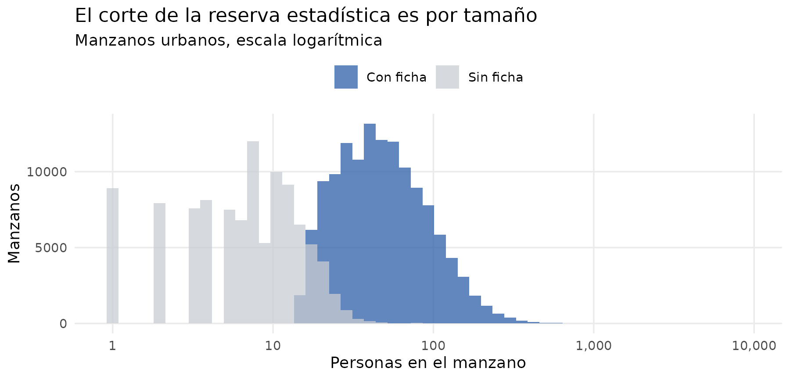
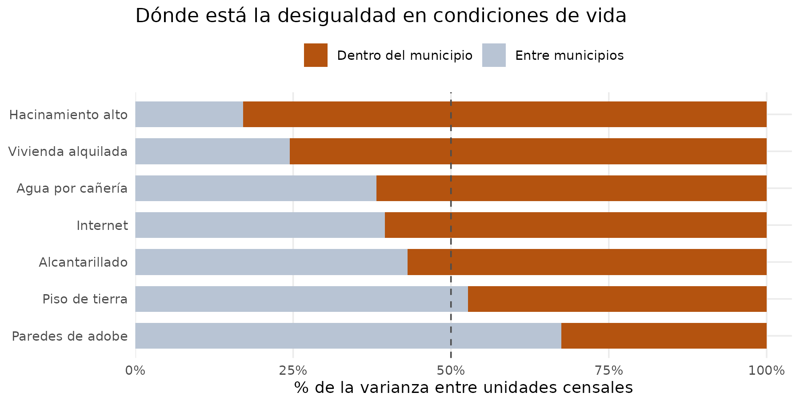
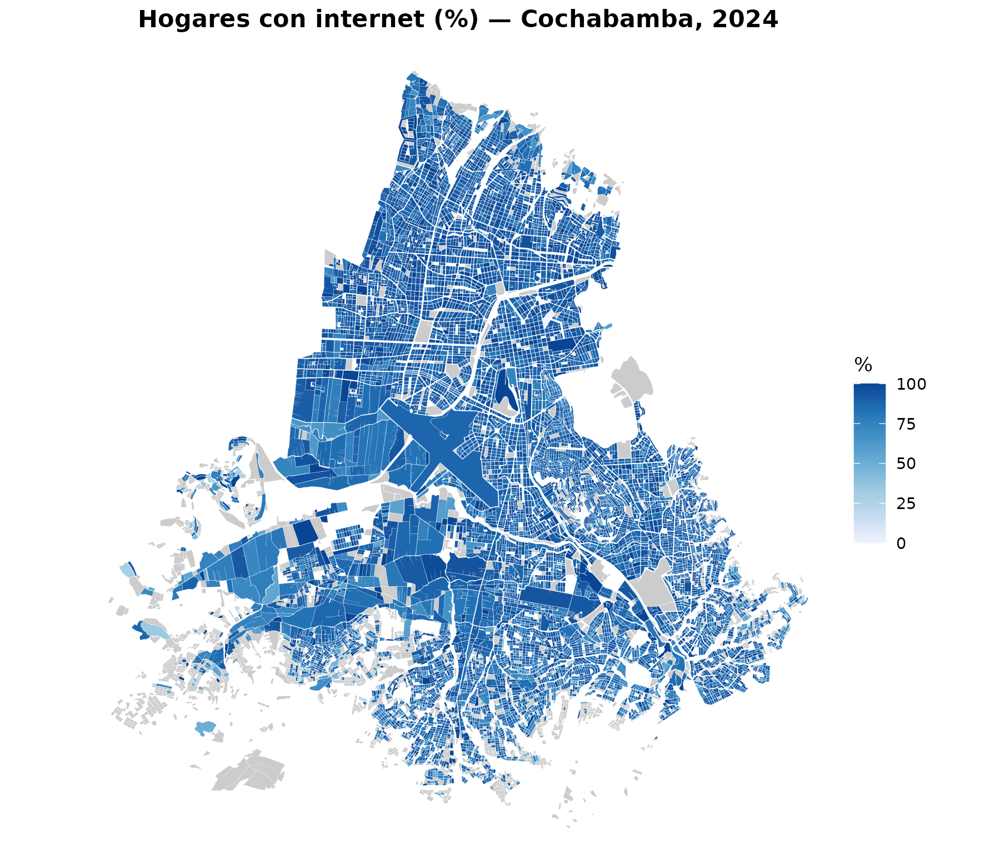
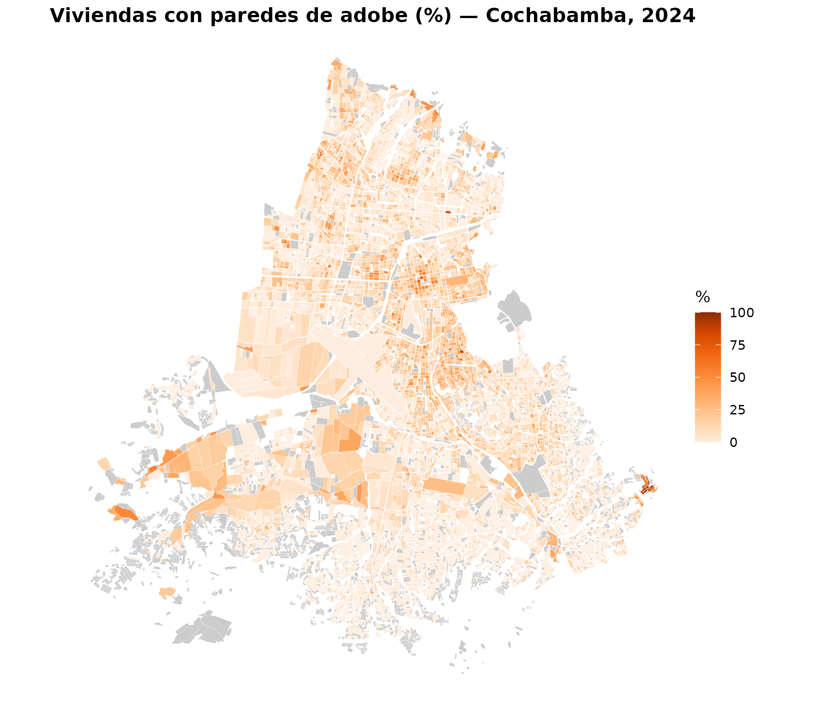
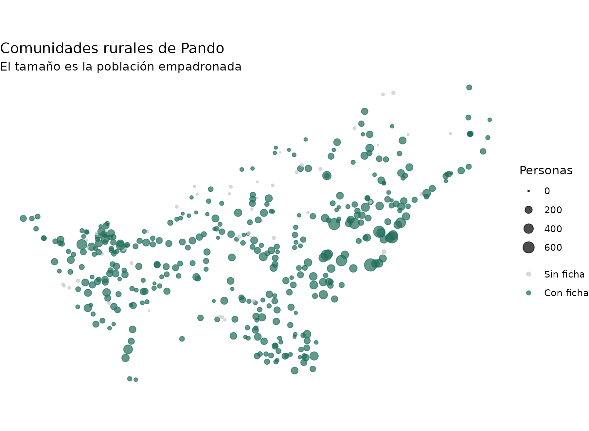
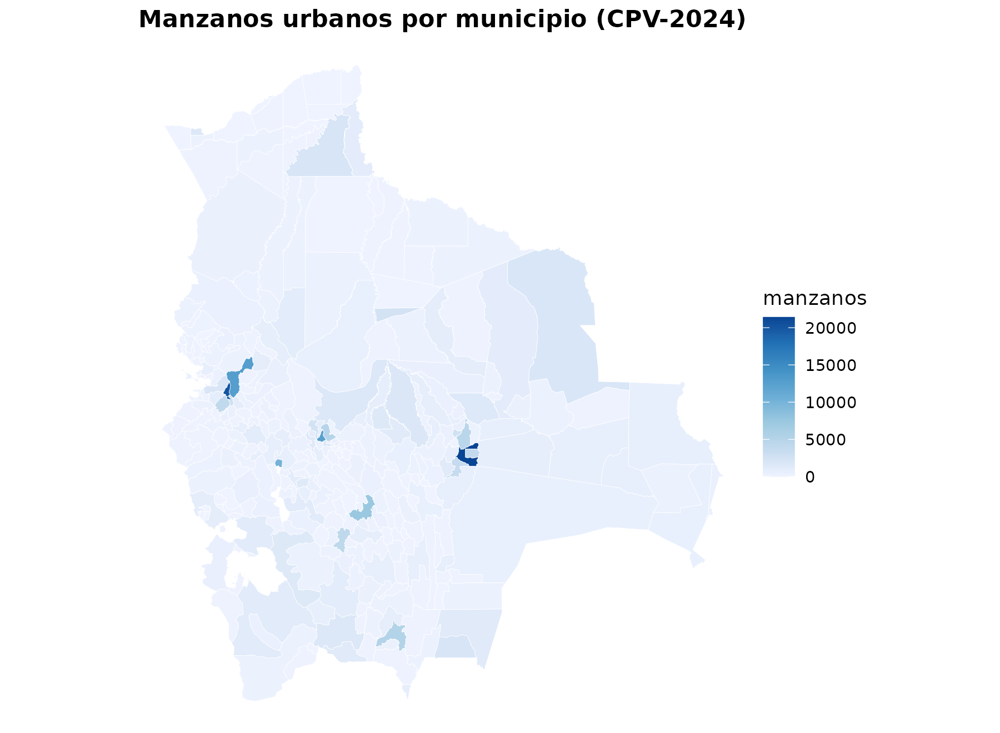

# Manzanos y comunidades: el CPV-2024 al máximo detalle

Los microdatos del CPV-2024 llegan hasta el municipio: 343 unidades para
todo el país. Pero el INE también publica, en su
[geoportal](https://geoportal.ine.gob.bo/), una **ficha resumen** por
cada unidad censal —manzano urbano o comunidad rural—. Son **268.604
unidades**: casi mil veces más resolución espacial.

| Función | Qué devuelve |
|----|----|
| [`get_unidades_2024()`](https://lab-tecnosocial.github.io/censosbo/reference/get_unidades_2024.md) | El universo: 268.604 unidades con población y viviendas |
| [`get_fichas_2024()`](https://lab-tecnosocial.github.io/censosbo/reference/get_fichas_2024.md) | 194 indicadores para las 150.744 unidades con ficha |
| [`get_geo_manzanos()`](https://lab-tecnosocial.github.io/censosbo/reference/get_geo_manzanos.md) / [`get_geo_comunidades()`](https://lab-tecnosocial.github.io/censosbo/reference/get_geo_comunidades.md) | Las geometrías |
| [`mapa_man()`](https://lab-tecnosocial.github.io/censosbo/reference/mapa_man.md) | Mapas de un municipio a nivel de manzano |

## Dos tablas, no una

La distinción entre las dos primeras funciones responde a cómo publica
el INE.

De **todas** las unidades se conoce cuánta gente y cuántas viviendas
hay. Pero el INE **no libera la ficha detallada de las unidades con poca
población**, por reserva estadística: en un manzano de seis viviendas,
publicar la desagregación por edad, sexo y nivel educativo permitiría
identificar personas.

``` r

unidades <- get_unidades_2024(as = "tibble", verbose = FALSE)

unidades |>
  etiquetar_valores() |>
  group_by(area) |>
  summarise(
    unidades      = n(),
    con_ficha     = sum(ficha),
    pct_unidades  = round(100 * mean(ficha), 1),
    pct_poblacion = round(100 * sum(personas[ficha]) / sum(personas), 1)
  )
#> # A tibble: 2 × 5
#>   area   unidades con_ficha pct_unidades pct_poblacion
#>   <fct>     <int>     <int>        <dbl>         <dbl>
#> 1 Urbana   247429    131801         53.3          89.5
#> 2 Rural     21175     18943         89.5          99.2
```

Ese es el punto clave para interpretar todo lo demás: **se pierde casi
la mitad de los manzanos, pero solo el 10% de la población urbana**. Las
unidades sin ficha son las pequeñas.

``` r

unidades |>
  filter(area == 1, personas > 0) |>
  mutate(tiene = ifelse(ficha, "Con ficha", "Sin ficha")) |>
  ggplot(aes(personas, fill = tiene)) +
  geom_histogram(bins = 55, position = "identity", alpha = 0.75) +
  scale_x_log10(labels = scales::comma) +
  scale_fill_manual(values = c("Con ficha" = "#2E5EA8", "Sin ficha" = "#C8CCD1")) +
  labs(title = "El corte de la reserva estadística es por tamaño",
       subtitle = "Manzanos urbanos, escala logarítmica",
       x = "Personas en el manzano", y = "Manzanos", fill = NULL) +
  theme_minimal(base_size = 11) +
  theme(legend.position = "top", panel.grid.minor = element_blank())
```



`area` usa el mismo código que en los microdatos (1 = Urbana, 2 =
Rural), así que
[`etiquetar_valores()`](https://lab-tecnosocial.github.io/censosbo/reference/etiquetar_valores.md)
se comporta igual en ambas fuentes.

## Los 194 indicadores

[`get_fichas_2024()`](https://lab-tecnosocial.github.io/censosbo/reference/get_fichas_2024.md)
devuelve **conteos**, no porcentajes. Cada bloque temático trae su
propio total, que es el denominador correcto:

``` r

codebook(tabla = "ficha") |>
  filter(grepl("^serv_agua", variable)) |>
  select(variable, etiqueta) |>
  head(5)
#>              variable                                    etiqueta
#> 1     serv_agua_total Viviendas ocupadas por procedencia del agua
#> 2   serv_agua_caneria                     Agua por cañería de red
#> 3    serv_agua_pileta                      Agua de pileta pública
#> 4     serv_agua_carro                    Agua de carro repartidor
#> 5 serv_agua_pozobomba                      Agua de pozo con bomba
```

Con eso, calcular un porcentaje es directo:

``` r

sucre <- get_fichas_2024(municipio = "Sucre", as = "tibble", verbose = FALSE)

sucre |>
  mutate(pct_caneria = round(100 * serv_agua_caneria / serv_agua_total, 1)) |>
  select(codigo, serv_agua_total, serv_agua_caneria, pct_caneria) |>
  head(5)
#> # A tibble: 5 × 4
#>   codigo        serv_agua_total serv_agua_caneria pct_caneria
#>   <chr>                   <dbl>             <dbl>       <dbl>
#> 1 00414143787-A               9                 1        11.1
#> 2 00414466062-A               5                 0         0  
#> 3 00414475295-A              10                 1        10  
#> 4 00414483400-A              11                 6        54.5
#> 5 00414514716-A               9                 2        22.2
```

### Cuidado con los bloques de respuesta múltiple

Dos bloques **no** son categorías excluyentes: `salud_lugar_*` (dónde
acude una persona por problemas de salud) y `tic_*` (equipamiento del
hogar). Una misma persona puede acudir a la farmacia y al centro
público; un hogar puede tener radio y televisor.

``` r

fichas <- get_fichas_2024(as = "tibble", verbose = FALSE)

tibble(
  bloque = c("serv_agua_* (excluyente)", "tic_* (múltiple)"),
  total  = c(sum(fichas$serv_agua_total), sum(fichas$tic_total)),
  suma_categorias = c(
    sum(fichas$serv_agua_caneria + fichas$serv_agua_pileta + fichas$serv_agua_carro +
        fichas$serv_agua_pozobomba + fichas$serv_agua_pozosinbomba +
        fichas$serv_agua_vertienteno + fichas$serv_agua_vertientesi +
        fichas$serv_agua_lluvia + fichas$serv_agua_otra),
    sum(fichas$tic_radio + fichas$tic_tv + fichas$tic_celular + fichas$tic_internet)
  )
) |>
  mutate(razon = round(suma_categorias / total, 2))
#> # A tibble: 2 × 4
#>   bloque                     total suma_categorias razon
#>   <chr>                      <dbl>           <dbl> <dbl>
#> 1 serv_agua_* (excluyente) 3322402         3322402  1   
#> 2 tic_* (múltiple)         3322402         9785275  2.95
```

En el primero la razón es exactamente 1; en el segundo es mucho mayor.
Por eso el denominador correcto es siempre el total del bloque, nunca la
suma de categorías.

## Para qué sirve bajar del municipio al manzano

Si la desigualdad en condiciones de vida ocurriera sobre todo *entre*
municipios, el nivel municipal bastaría. Se puede medir: para cada
indicador, qué fracción de la varianza entre unidades explica el
municipio al que pertenecen, y qué fracción queda dentro.

``` r

indicadores <- tribble(
  ~nombre,               ~num,                          ~den,
  "Agua por cañería",    "serv_agua_caneria",           "serv_agua_total",
  "Alcantarillado",      "serv_desague_alcantarillado", "serv_desague_total",
  "Internet",            "tic_internet",                "tic_total",
  "Piso de tierra",      "mat_piso_tierra",             "viv_tipo_presentes",
  "Paredes de adobe",    "mat_pared_adobe",             "viv_tipo_presentes",
  "Hacinamiento alto",   "hac_alto",                    "viv_tipo_presentes",
  "Vivienda alquilada",  "viv_tenencia_alquilada",      "viv_tenencia_total"
)

base <- fichas |>
  mutate(mun = paste(idep, iprov, imun)) |>
  filter(viv_tipo_presentes >= 10)   # evita porcentajes inestables

# R2 = SS_entre / SS_total, calculado directo para no armar una matriz de
# diseño de 150.000 x 343 con lm(y ~ mun).
r2_municipio <- function(num, den) {
  d <- base |>
    transmute(mun, y = 100 * .data[[num]] / .data[[den]]) |>
    filter(is.finite(y))
  gran_media <- mean(d$y)
  ss_entre <- d |>
    group_by(mun) |>
    summarise(n = n(), m = mean(y), .groups = "drop") |>
    summarise(ss = sum(n * (m - gran_media)^2)) |>
    pull(ss)
  ss_entre / sum((d$y - gran_media)^2)
}

varianza <- indicadores |>
  rowwise() |>
  mutate(entre = round(100 * r2_municipio(num, den), 1)) |>
  ungroup() |>
  mutate(dentro = round(100 - entre, 1)) |>
  arrange(dentro)

varianza |> select(nombre, entre, dentro)
#> # A tibble: 7 × 3
#>   nombre             entre dentro
#>   <chr>              <dbl>  <dbl>
#> 1 Paredes de adobe    67.5   32.5
#> 2 Piso de tierra      52.7   47.3
#> 3 Alcantarillado      43.1   56.9
#> 4 Internet            39.5   60.5
#> 5 Agua por cañería    38.2   61.8
#> 6 Vivienda alquilada  24.5   75.5
#> 7 Hacinamiento alto   17.1   82.9
```

``` r

varianza |>
  select(nombre, entre, dentro) |>
  pivot_longer(-nombre) |>
  mutate(name = factor(name, c("dentro", "entre"),
                       c("Dentro del municipio", "Entre municipios")),
         nombre = factor(nombre, varianza$nombre)) |>
  ggplot(aes(value, nombre, fill = name)) +
  geom_col(width = 0.7) +
  geom_vline(xintercept = 50, linetype = "dashed", color = "grey30") +
  scale_fill_manual(values = c("Dentro del municipio" = "#B4530F",
                               "Entre municipios" = "#B8C4D4")) +
  scale_x_continuous(labels = \(x) paste0(x, "%"),
                     expand = expansion(mult = c(0, 0.04))) +
  labs(title = "Dónde está la desigualdad en condiciones de vida",
       x = "% de la varianza entre unidades censales", y = NULL, fill = NULL) +
  theme_minimal(base_size = 11) +
  theme(legend.position = "top", panel.grid.minor = element_blank())
```



En la mayoría de los indicadores el municipio explica **menos de la
mitad** de la varianza: un promedio municipal de “80% con agua por
cañería” puede esconder manzanos al 100% y manzanos al 20%.

La excepción va en la dirección esperable y es informativa: los
**materiales de construcción** son regionales —el adobe responde al
clima y a la tradición constructiva de cada zona—, mientras que el
**hacinamiento** es casi enteramente intramunicipal. Para estudiar dónde
se construye con adobe, el municipio basta; para estudiar quién vive
hacinado, no.

## Mapas a nivel de manzano

[`mapa_man()`](https://lab-tecnosocial.github.io/censosbo/reference/mapa_man.md)
pide siempre un municipio: dibujar 268.604 unidades del país entero no
produce nada legible. Las geometrías se descargan al caché la primera
vez.

``` r

get_fichas_2024(municipio = "Cochabamba", as = "tibble", verbose = FALSE) |>
  mutate(pct = 100 * tic_internet / tic_total) |>
  mapa_man("pct", municipio = "Cochabamba", area = "urbano",
           titulo = "Hogares con internet (%) — Cochabamba, 2024",
           etiqueta_fill = "%")
```



Los manzanos grises son los que no tienen ficha: no es un vacío del
paquete, es la reserva estadística del INE.

El mismo municipio con un indicador de materiales, que dibuja una ciudad
distinta:

``` r

get_fichas_2024(municipio = "Cochabamba", as = "tibble", verbose = FALSE) |>
  mutate(pct = 100 * mat_pared_adobe / viv_tipo_presentes) |>
  mapa_man("pct", municipio = "Cochabamba", area = "urbano",
           titulo = "Viviendas con paredes de adobe (%) — Cochabamba, 2024",
           etiqueta_fill = "%", paleta = "Oranges")
```



Para trabajar con las geometrías directamente:

``` r

manzanos <- get_geo_manzanos(municipio = "Sucre", verbose = FALSE)
manzanos
#> Simple feature collection with 7399 features and 5 fields
#> Geometry type: MULTIPOLYGON
#> Dimension:     XY
#> Bounding box:  xmin: -65.54193 ymin: -19.13961 xmax: -65.10028 ymax: -18.70328
#> Geodetic CRS:  WGS 84
#> # A tibble: 7,399 × 6
#>    codigo        nombre     idep  iprov imun                           geometria
#>  * <chr>         <chr>      <chr> <chr> <chr>                 <MULTIPOLYGON [°]>
#>  1 04144245560-A AZARI BAJA 01    01    01    (((-65.24162 -19.09746, -65.24247…
#>  2 04142703883-A AZARI BAJA 01    01    01    (((-65.23925 -19.10076, -65.2392 …
#>  3 04139661122-A AZARI BAJA 01    01    01    (((-65.23175 -19.10594, -65.23118…
#>  4 04132568675-A AZARI BAJA 01    01    01    (((-65.23355 -19.11735, -65.23406…
#>  5 04141420362-A AZARI BAJA 01    01    01    (((-65.23171 -19.10406, -65.23187…
#>  6 04131919016-A AZARI BAJA 01    01    01    (((-65.23401 -19.11845, -65.23341…
#>  7 04143310533-A AZARI BAJA 01    01    01    (((-65.24107 -19.09722, -65.24032…
#>  8 04143788615-A AZARI BAJA 01    01    01    (((-65.24284 -19.09737, -65.24283…
#>  9 04138078691-A AZARI BAJA 01    01    01    (((-65.23221 -19.11033, -65.23214…
#> 10 04142930138-A AZARI BAJA 01    01    01    (((-65.23834 -19.09959, -65.23777…
#> # ℹ 7,389 more rows
```

## El área rural: puntos, no polígonos

El INE publica **casi todas las comunidades rurales como un punto**, no
como un polígono. No hay superficie que colorear, así que para mapas
rurales suele funcionar mejor graduar el tamaño.

``` r

library(sf)
#> Linking to GEOS 3.12.1, GDAL 3.8.4, PROJ 9.4.0; sf_use_s2() is TRUE

geo_pando <- get_geo_comunidades(departamento = "Pando", verbose = FALSE)
u_pando   <- get_unidades_2024(departamento = "Pando", area = "rural",
                               as = "tibble", verbose = FALSE)

geo_pando |>
  left_join(u_pando, by = "codigo") |>
  ggplot() +
  geom_sf(aes(size = personas, color = ficha), alpha = 0.7) +
  scale_size_continuous(range = c(0.4, 5), labels = scales::comma) +
  scale_color_manual(values = c("TRUE" = "#1F6F5C", "FALSE" = "#C8CCD1"),
                     labels = c("TRUE" = "Con ficha", "FALSE" = "Sin ficha")) +
  labs(title = "Comunidades rurales de Pando",
       subtitle = "El tamaño es la población empadronada",
       size = "Personas", color = NULL) +
  theme_void(base_size = 11)
```



## El gradiente urbano-rural

Como `area` comparte dominio con los microdatos, la comparación es
directa.

``` r

comparar <- function(num, den, nombre) {
  fichas |>
    group_by(area) |>
    summarise(pct = 100 * sum(.data[[num]]) / sum(.data[[den]]), .groups = "drop") |>
    mutate(indicador = nombre)
}

bind_rows(
  comparar("serv_desague_alcantarillado", "serv_desague_total", "Alcantarillado"),
  comparar("serv_agua_caneria", "serv_agua_total", "Agua por cañería"),
  comparar("tic_internet", "tic_total", "Internet"),
  comparar("serv_combustible_lena", "serv_combustible_total", "Cocina con leña"),
  comparar("mat_piso_tierra", "viv_tipo_presentes", "Piso de tierra"),
  comparar("edu_superior_m", "edu_total_m", "Educación superior (mujeres)"),
  comparar("hac_alto", "viv_tipo_presentes", "Hacinamiento alto")
) |>
  mutate(area = ifelse(area == 1, "Urbana", "Rural")) |>
  pivot_wider(names_from = area, values_from = pct) |>
  mutate(brecha = Urbana - Rural, across(where(is.numeric), \(x) round(x, 1))) |>
  arrange(desc(abs(brecha)))
#> # A tibble: 7 × 4
#>   indicador                    Urbana Rural brecha
#>   <chr>                         <dbl> <dbl>  <dbl>
#> 1 Alcantarillado                 67     3.9   63.1
#> 2 Cocina con leña                 2.3  59.2  -56.9
#> 3 Piso de tierra                  7.5  61.5  -54  
#> 4 Agua por cañería               85.3  36.2   49.1
#> 5 Internet                       84    46.1   37.8
#> 6 Educación superior (mujeres)   41.4  10.1   31.3
#> 7 Hacinamiento alto              12.5  20.9   -8.5
```

El alcantarillado rural es el dato más duro de la tabla. Y el
hacinamiento va en dirección contraria a lo que suele suponerse de un
problema urbano: es **mayor en el área rural**.

## Cruzar con los microdatos

Las unidades traen `idep`, `iprov` e `imun`, así que agregan y se cruzan
con cualquier otra tabla del paquete:

``` r

por_municipio <- unidades |>
  group_by(idep, iprov, imun) |>
  summarise(manzanos = sum(area == 1), .groups = "drop")

mapa_mun(por_municipio, "manzanos",
         titulo = "Manzanos urbanos por municipio (CPV-2024)")
#> Warning: 4 municipio(s) en los datos no tienen geometría disponible.
#> ℹ Aparecerán como áreas grises en el mapa.
#> ℹ Son los 7 municipios del CPV-2024 sin cobertura cartográfica en la fuente.
```



Y sirve de comprobación: la población agregada por unidades debe
coincidir con los microdatos. Aquí se hace con Pando para no descargar
los 282 MB de la tabla de personas completa, pero el resultado es el
mismo en los 343 municipios del país: **11.365.333 personas, cuadrando
uno a uno**.

``` r

pob_micro <- get_personas_2024(departamento = "Pando", verbose = FALSE) |>
  count(idep, iprov, imun, name = "microdatos") |>
  collect()

get_unidades_2024(departamento = "Pando", as = "tibble", verbose = FALSE) |>
  group_by(idep, iprov, imun) |>
  summarise(agregado = sum(personas), .groups = "drop") |>
  full_join(pob_micro, by = c("idep", "iprov", "imun")) |>
  summarise(
    municipios     = n(),
    cuadran_exacto = sum(agregado == microdatos),
    poblacion      = sum(agregado)
  )
#> # A tibble: 1 × 3
#>   municipios cuadran_exacto poblacion
#>        <int>          <int>     <int>
#> 1         15             15    134194
```

## De dónde salen estos datos

Del geoportal del INE, que genera una ficha por unidad censal a demanda.
El paquete no consulta ese servicio: los datos se descargaron una vez,
se consolidaron y se publican como Parquet en un release de GitHub. El
proceso completo está en `data-raw/fichas/` del repositorio.

Cuatro notas sobre la fuente:

- Los conteos corresponden a residentes habituales y **no incluyen a las
  personas que residen en el exterior**, por lo que difieren ligeramente
  de otros totales del censo.
- La población agregada por municipio coincide exactamente con
  [`get_personas_2024()`](https://lab-tecnosocial.github.io/censosbo/reference/get_personas_2024.md),
  como se acaba de comprobar. Las **viviendas** dan un 0,23% menos que
  [`get_viviendas_2024()`](https://lab-tecnosocial.github.io/censosbo/reference/get_viviendas_2024.md),
  con un déficit sistemático (323 municipios por debajo, ninguno por
  encima): el INE las cuenta distinto en el geoportal y en los
  microdatos. Para el total de viviendas de un territorio, usa
  [`get_viviendas_2024()`](https://lab-tecnosocial.github.io/censosbo/reference/get_viviendas_2024.md).
- El INE cambió su geoportal durante 2026 y la versión nueva
  (`idg.ine.gob.bo`) exige captcha para estos endpoints. Los datos
  provienen del servicio que atiende a `geoportal.ine.gob.bo`.
- Los 34 campos de materiales, hacinamiento y tipo de hogar (`mat_*`,
  `hac_*`, `hogar_*`) venían de una segunda ficha que ese servicio ya no
  entrega, y proceden de una captura de junio de 2026. Se validaron
  contra la ficha PDF oficial del INE y comprobando que sus seis bloques
  suman exactamente `viv_tipo_presentes` en las 150.744 fichas.
