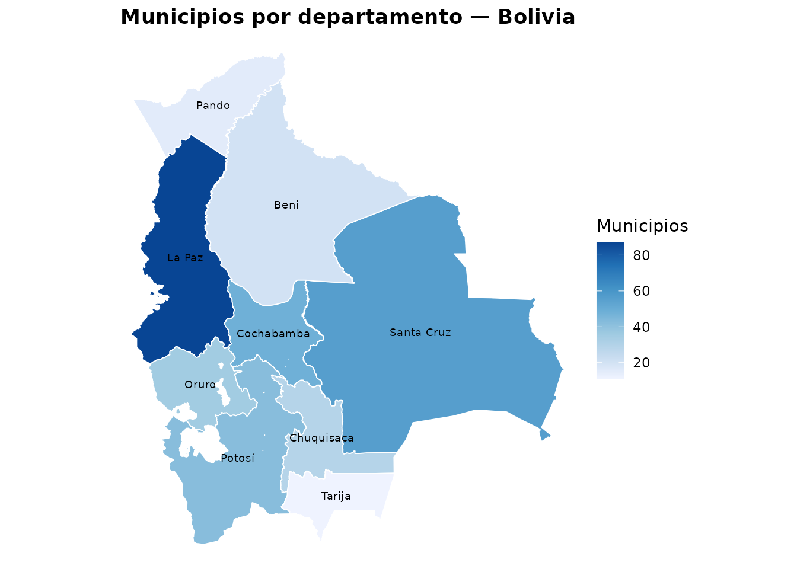
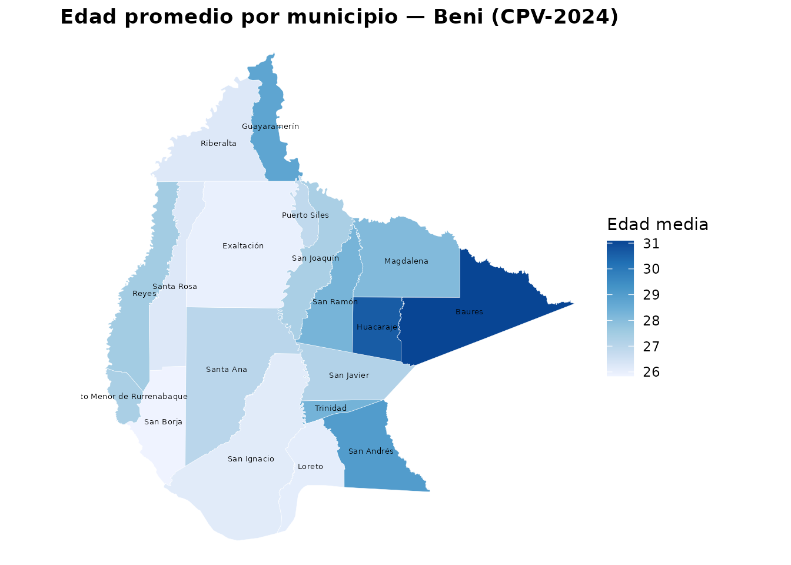
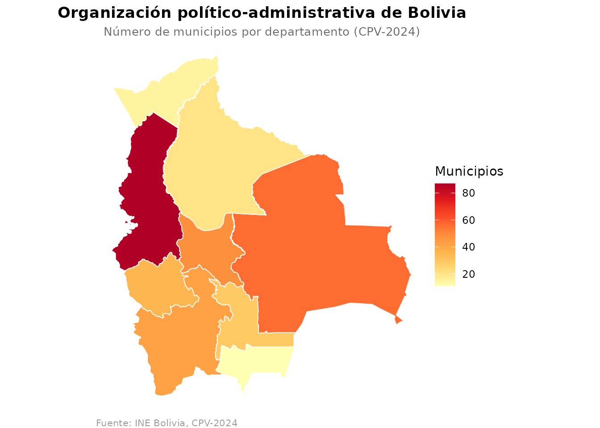
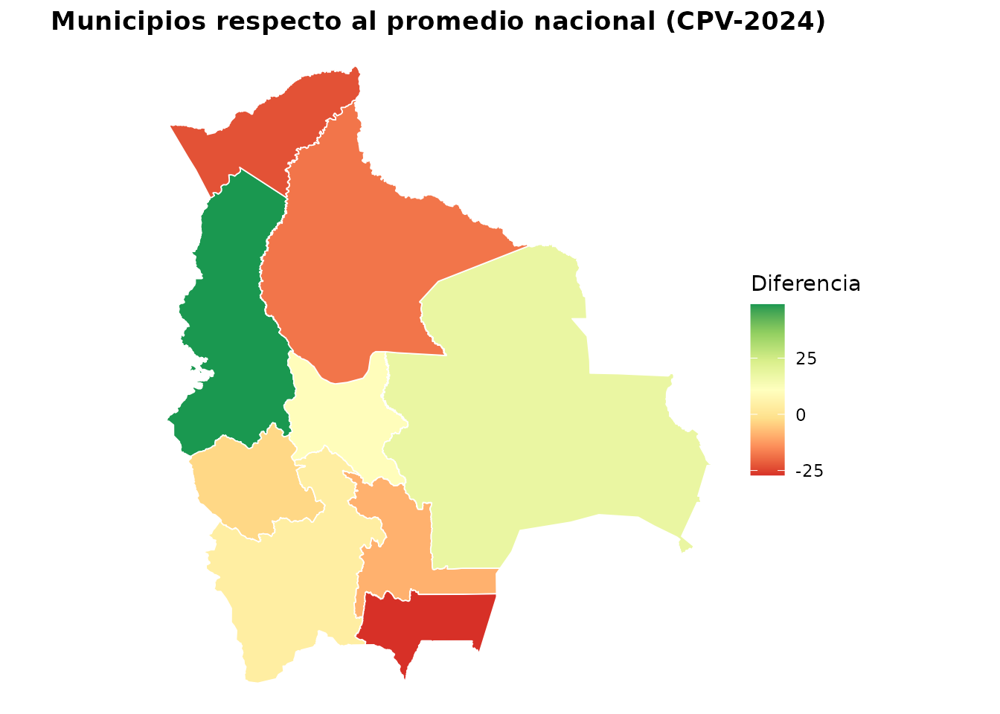

# Visualización en mapas con censosbo

`censosbo` incluye dos funciones para crear **mapas coropléticos** de
Bolivia directamente desde R:

| Función | Nivel | Geometrías incluidas |
|----|----|----|
| [`mapa_dep()`](https://lab-tecnosocial.github.io/censosbo/reference/mapa_dep.md) | 9 departamentos | Sí — `geo_departamentos` |
| [`mapa_mun()`](https://lab-tecnosocial.github.io/censosbo/reference/mapa_mun.md) | 339 de 343 municipios | Sí — `geo_municipios` |

Ambas devuelven un **objeto `ggplot`** que se puede personalizar con
capas y temas adicionales.

## Datos geográficos incluidos en el paquete

El paquete incluye dos objetos `sf` listos para usar sin necesidad de
descargar nada:

``` r

# 9 departamentos (objeto sf)
head(geo_departamentos, 3)
#> Simple feature collection with 3 features and 2 fields
#> Geometry type: MULTIPOLYGON
#> Dimension:     XY
#> Bounding box:  xmin: -69.64504 ymin: -21.51732 xmax: -62.17937 ymax: -11.84968
#> Geodetic CRS:  WGS 84
#>   idep nombre_dep                       geometry
#> 1   01 Chuquisaca MULTIPOLYGON (((-65.34567 -...
#> 2   02     La Paz MULTIPOLYGON (((-68.76707 -...
#> 3   03 Cochabamba MULTIPOLYGON (((-66.79542 -...

# 339 de los 343 municipios del CPV-2024 (objeto sf)
head(sf::st_drop_geometry(geo_municipios), 3)
#>   idep nombre_dep iprov nombre_prov imun nombre_mun
#> 1   01 Chuquisaca    01     Oropeza   01      Sucre
#> 2   01 Chuquisaca    01     Oropeza   02     Yotala
#> 3   01 Chuquisaca    01     Oropeza   03     Poroma
```

La tabla `geo_bolivia` (sin geometrías) tiene los 343 municipios con
nombres y códigos oficiales:

``` r

head(geo_bolivia)
#>   idep nombre_dep iprov nombre_prov imun nombre_mun
#> 1   01 Chuquisaca    01     Oropeza   01      Sucre
#> 2   01 Chuquisaca    01     Oropeza   02     Yotala
#> 3   01 Chuquisaca    01     Oropeza   03     Poroma
#> 4   01 Chuquisaca    02     Azurduy   01    Azurduy
#> 5   01 Chuquisaca    02     Azurduy   02    Tarvita
#> 6   01 Chuquisaca    03     Zudáñez   01    Zudáñez
```

## `mapa_dep()` — nivel departamental

[`mapa_dep()`](https://lab-tecnosocial.github.io/censosbo/reference/mapa_dep.md)
recibe un data.frame con la columna `idep` y la variable a visualizar.
Las geometrías de los 9 departamentos están incluidas en el paquete.

### Número de municipios por departamento

``` r

n_mun <- geo_bolivia |>
  count(idep, name = "n_municipios")

mapa_dep(
  n_mun,
  "n_municipios",
  titulo          = "Municipios por departamento — Bolivia",
  etiqueta_fill   = "Municipios",
  mostrar_nombres = TRUE
)
```



La Paz (87 municipios) y Santa Cruz (56) concentran el 42 % de los
municipios del país, reflejo de su extensión territorial y densidad
histórica de asentamientos.

### Porcentaje de población urbana por departamento (CPV-2024)

``` r

urbano_dep <- get_personas_2024(as = "tibble") |>
  group_by(idep) |>
  summarise(pct_urbano = mean(area == 1, na.rm = TRUE) * 100, .groups = "drop")

mapa_dep(
  urbano_dep,
  "pct_urbano",
  titulo        = "Porcentaje de población urbana por departamento (CPV-2024)",
  etiqueta_fill = "% urbano"
)
```

### Evolución del alfabetismo 1992–2024

``` r

# Cambio en tasa de alfabetismo entre el censo 1992 y el CPV-2024
alfa_92 <- get_temporal(variables = "sabe_leer", anios = 1992) |>
  group_by(departamento) |>
  summarise(alfa_1992 = mean(sabe_leer == 1, na.rm = TRUE) * 100)

alfa_24 <- get_temporal(variables = "sabe_leer", anios = 2024) |>
  group_by(departamento) |>
  summarise(alfa_2024 = mean(sabe_leer == 1, na.rm = TRUE) * 100)

cambio <- inner_join(alfa_92, alfa_24, by = "departamento") |>
  mutate(
    idep   = sprintf("%02d", as.integer(departamento)),
    cambio = alfa_2024 - alfa_1992
  )

mapa_dep(cambio, "cambio",
         titulo        = "Cambio en tasa de alfabetismo 1992–2024 (puntos porcentuales)",
         etiqueta_fill = "Cambio (pp)",
         paleta        = "RdYlGn")
```

## `mapa_mun()` — nivel municipal

[`mapa_mun()`](https://lab-tecnosocial.github.io/censosbo/reference/mapa_mun.md)
requiere las columnas `idep`, `iprov`, `imun` y la variable a
visualizar. El argumento `departamento` limita el mapa a un
departamento.

### Edad promedio por municipio — Beni (CPV-2024)

El departamento del Beni tiene datos pequeños (~12 MB). Con pocas líneas
obtenemos un mapa municipal real con datos del CPV-2024:

``` r

# Descargar personas del Beni (~12 MB, se guarda en caché)
personas_beni <- get_personas_2024(
  departamento = "Beni",
  variables    = c("p26_edad")
) |>
  group_by(idep, iprov, imun) |>
  summarise(edad_prom = mean(p26_edad, na.rm = TRUE), .groups = "drop") |>
  collect()
#> ✔ Usando caché: persona_dep08.parquet

mapa_mun(
  personas_beni,
  "edad_prom",
  departamento    = "Beni",
  titulo          = "Edad promedio por municipio — Beni (CPV-2024)",
  etiqueta_fill   = "Edad media",
  mostrar_nombres = TRUE
)
#> Warning: 1 municipio(s) en los datos no tienen geometría disponible.
#> ℹ Aparecerán como áreas grises en el mapa.
#> ℹ Son los 4 municipios del CPV-2024 sin cobertura cartográfica en la fuente.
```



Los municipios más jóvenes del Beni (San Borja, 25,8 años; Exaltación,
Loreto y San Ignacio, 26) contrastan con Baures y Huacaraje, por encima
de 30.

El aviso que aparece al construir el mapa es esperado: el
TIOC-Territorio Indígena Multiétnico —justamente el municipio más joven
del departamento, con 24,5 años— es uno de los 4 municipios del CPV-2024
sin cobertura en la fuente cartográfica, así que sale en gris.

### Acceso al agua por cañería — Santa Cruz

``` r

agua_sc <- get_viviendas_2024(departamento = "Santa Cruz", as = "tibble") |>
  group_by(idep, iprov, imun) |>
  summarise(
    pct_agua = mean(v07_aguapro == 1, na.rm = TRUE) * 100,
    .groups  = "drop"
  )

mapa_mun(
  agua_sc,
  "pct_agua",
  departamento    = "Santa Cruz",
  titulo          = "Viviendas con agua por cañería — Santa Cruz (CPV-2024)",
  etiqueta_fill   = "% con agua",
  mostrar_nombres = TRUE
)
```

### Tasa de alfabetismo — Oruro

``` r

# `p40_lee` se preguntó a las personas de 5 años o más, pero las tasas oficiales
# de alfabetismo se publican sobre 15 años o más. Se pide `p26_edad` para poder
# aplicar ese umbral y que el mapa sea comparable con las cifras del INE.
alfa_oruro <- get_personas_2024(
  departamento = "Oruro",
  variables    = c("p40_lee", "p26_edad"),
  as           = "tibble"
) |>
  filter(p26_edad >= 15) |>
  group_by(idep, iprov, imun) |>
  summarise(
    alfa    = mean(p40_lee == 1, na.rm = TRUE) * 100,
    .groups = "drop"
  )

mapa_mun(
  alfa_oruro,
  "alfa",
  departamento  = "Oruro",
  titulo        = "Tasa de alfabetismo (15+ años) por municipio — Oruro (CPV-2024)",
  etiqueta_fill = "% sabe leer"
)
```

## Personalización

Las funciones devuelven un **objeto `ggplot` estándar** que se puede
modificar con cualquier capa de ggplot2:

``` r

n_mun <- geo_bolivia |>
  count(idep, name = "n_municipios")

mapa_dep(
  n_mun,
  "n_municipios",
  paleta        = "YlOrRd",
  etiqueta_fill = "Municipios"
) +
  labs(
    title    = "Organización político-administrativa de Bolivia",
    subtitle = "Número de municipios por departamento (CPV-2024)",
    caption  = "Fuente: INE Bolivia, CPV-2024"
  ) +
  theme(
    plot.title    = element_text(hjust = 0.5, face = "bold"),
    plot.subtitle = element_text(hjust = 0.5, size = 10, color = "grey40"),
    plot.caption  = element_text(hjust = 0, size = 8, color = "grey60")
  )
```



### Paletas recomendadas

Las funciones detectan automáticamente si la variable es continua o
categórica y aplican la escala correspondiente. Se puede sobrescribir
con `paleta`:

| Tipo de variable      | Paleta recomendada     | Argumento           |
|-----------------------|------------------------|---------------------|
| Continua, ascendente  | Blues, YlOrRd, Oranges | `paleta = "Blues"`  |
| Continua, divergente  | RdYlGn, PuOr, RdBu     | `paleta = "RdYlGn"` |
| Categórica (≤ 8 cat.) | Set2, Set3, Pastel1    | `paleta = "Set2"`   |

El siguiente ejemplo usa una paleta divergente con una variable derivada
de datos reales: la diferencia entre el número de municipios de cada
departamento y el promedio nacional.

``` r

n_mun_dif <- geo_bolivia |>
  count(idep, name = "n_municipios") |>
  mutate(diferencia = n_municipios - mean(n_municipios))

mapa_dep(
  n_mun_dif,
  "diferencia",
  paleta        = "RdYlGn",
  titulo        = "Municipios respecto al promedio nacional (CPV-2024)",
  etiqueta_fill = "Diferencia"
)
```



## Flujo completo: agregar → mapear

El patrón habitual es: descargar datos → agregar por unidad geográfica →
visualizar en mapa:

``` r

# Porcentaje de personas con educación superior por municipio — Potosí
get_personas_2024(
  departamento = "Potosí",
  variables    = c("nivel_edu")
) |>
  filter(!is.na(nivel_edu)) |>
  count(idep, iprov, imun, nivel_edu) |>
  collect() |>
  group_by(idep, iprov, imun) |>
  mutate(pct = n / sum(n) * 100) |>
  filter(nivel_edu == 4) |>
  mapa_mun(
    datos        = _,
    variable     = "pct",
    departamento = "Potosí",
    titulo       = "% con educación superior — Potosí (CPV-2024)"
  )
```
